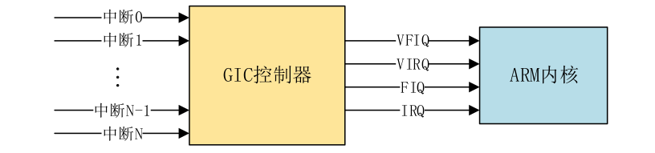
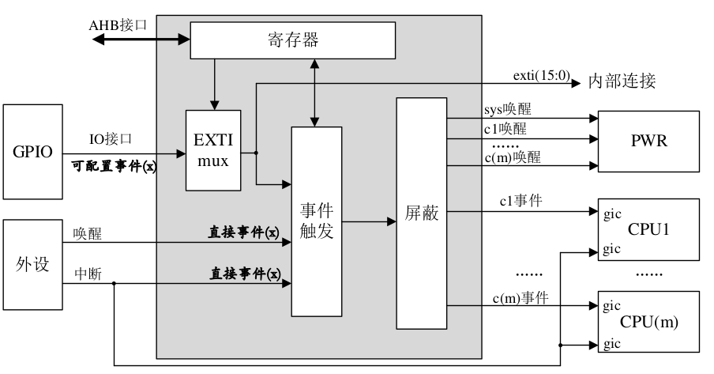
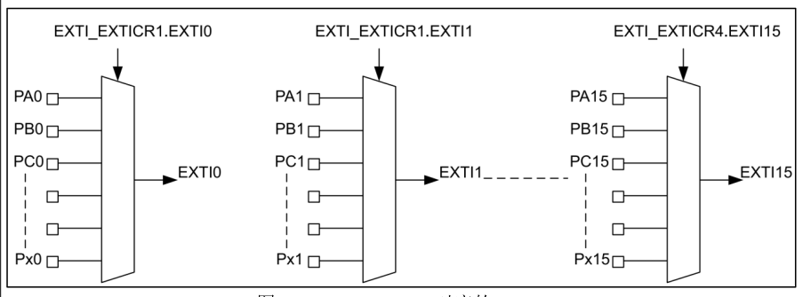

# Interrupt

>0.在裸机中使用中断我们需要做一大堆的工作,比如配置寄存器,使能IRQ等等。但是Linux内核提供了完善的中断框架,我们只需要申请中断,然后注册中断处理函数即可,使用非常方便,不需要一系列复杂的寄存器配置。

### 1.Linux中断

**1.1中断API函数**
1. 裸机实验里面中断的处理方法：
①、使能中断,初始化相应的寄存器。
②、注册中断服务函数,也就是向irqTable数组的指定标号处写入中断服务函数
②、中断发生以后进入IRQ中断服务函数,在IRQ中断服务函数在数组irqTable里面查找
具体的中断处理函数,找到以后执行相应的中断处理函数。
2. Linux内核中也提供了大量的中断相关的API函数,
-中断号
每个中断都有一个中断号,通过中断号即可区分不同的中断,有的资料也把中断号叫做中
断线。在Linux内核中使用一个int变量表示中断号
-request_irq函数
在Linux内核中要想使用某个中断是需要申请的,request_irq函数用于申请中断,request_irq
函数可能会导致睡眠,因此不能在中断上下文或者其他禁止睡眠的代码段中使用request_irq函
数。request_irq函数会激活(使能)中断,所以不需要我们手动去使能中断

<divstyle="text-align:center;font-weight:bold;">
常用的中断标志
</div>

|标志|描述|
|----|----|
|IRQF_SHARED|多个设备共享一个中断线,共享的所有中断都必须指定此标志。|

如果使用共享中断的话,request_irq函数的dev参数就是唯一区分他们的标志。
IRQF_ONESHOT单次中断,中断执行一次就结束。
IRQF_TRIGGER_NONE无触发。
IRQF_TRIGGER_RISING上升沿触发。
IRQF_TRIGGER_FALLING下降沿触发。
IRQF_TRIGGER_HIGH高电平触发。
IRQF_TRIGGER_LOW低电平触发
-free_irq函数
使用中断的时候需要通过request_irq函数申请,使用完成以后就要通过free_irq函数释放
掉相应的中断。如果中断不是共享的,那么free_irq会删除中断处理函数并且禁止中断
-中断处理函数
使用request_irq函数申请中断的时候需要设置中断处理函数,中断处理函数格式如下所示：
irqreturn_t(*irq_handler_t)(int,void*)
第一个参数是要中断处理函数要相应的中断号。第二个参数是一个指向void的指针,也就
是个通用指针,需要与request_irq函数的dev参数保持一致。用于区分共享中断的不同设备,
dev也可以指向设备数据结构。中断处理函数的返回值为irqreturn_t类型,irqreturn_t类型定义
如下所示：
示例代码31.1.1.1irqreturn_t结构
11enumirqreturn{
12IRQ_NONE=(0<<0),
13IRQ_HANDLED=(1<<0),
14IRQ_WAKE_THREAD=(1<<1),
15};
16
17typedefenumirqreturnirqreturn_t;
可以看出irqreturn_t是个枚举类型,一共有三种返回值。一般中断服务函数返回值使用如
下形式：
returnIRQ_RETVAL(IRQ_HANDLED)
-中断使能与禁止函数
常用的中断使用和禁止函数如下所示：
voidenable_irq(unsignedintirq)
voiddisable_irq(unsignedintirq)
enable_irq和disable_irq用于使能和禁止指定的中断,irq就是要禁止的中断号。disable_irq
函数要等到当前正在执行的中断处理函数执行完才返回,因此使用者需要保证不会产生新的中
断,并且确保所有已经开始执行的中断处理程序已经全部退出。在这种情况下,可以使用另外
一个中断禁止函数：
voiddisable_irq_nosync(unsignedintirq)
disable_irq_nosync函数调用以后立即返回,不会等待当前中断处理程序执行完毕。上面三
个函数都是使能或者禁止某一个中断,有时候我们需要关闭当前处理器的整个中断系统,也就
是在学习STM32的时候常说的关闭全局中断,这个时候可以使用如下两个函数：
local_irq_enable()
local_irq_disable()
local_irq_enable用于使能当前处理器中断系统,local_irq_disable用于禁止当前处理器中断
系统。假如A任务调用local_irq_disable关闭全局中断10S,当关闭了2S的时候B任务开始运
行,B任务也调用local_irq_disable关闭全局中断3S,3秒以后B任务调用local_irq_enable函
数将全局中断打开了。此时才过去2+3=5秒的时间,然后全局中断就被打开了,此时A任务要
关闭10S全局中断的愿望就破灭了,然后A任务就“生气了”,结果很严重,可能系统都要被
A任务整崩溃。为了解决这个问题,B任务不能直接简单粗暴的通过local_irq_enable函数来打
开全局中断,而是将中断状态恢复到以前的状态,要考虑到别的任务的感受,此时就要用到下
面两个函数：
local_irq_save(flags)
local_irq_restore(flags)
这两个函数是一对,local_irq_save函数用于禁止中断,并且将中断状态保存在flags中。
local_irq_restore用于恢复中断,将中断到flags状态。

**1.2上半部与下半部**
1. 简介
也称顶半部和底半部,在使用
request_irq申请中断的时候注册的中断服务函数属于中断处理的上半部
电容触摸屏通过中断通知SOC有触摸事件发生,SOC响应中断,然后
通过IIC接口读取触摸坐标值并将其上报给系统。但是我们都知道IIC的速度最高也只有
400Kbit/S,所以在中断中通过IIC读取数据就会浪费时间。我们可以将通过IIC读取触摸数据
的操作暂后执行,中断处理函数仅仅相应中断,然后清除中断标志位即可。这个时候中断处理
过程就分为了两部分：
***上半部***：上半部就是中断处理函数,那些处理过程比较快,不会占用很长时间的处理就可
以放在上半部完成。
***下半部***：如果中断处理过程比较耗时,那么就将这些比较耗时的代码提出来,交给下半部
去执行,这样中断处理函数就会快进快出。
***上下半部使用参考***:
-如果要处理的内容不希望被其他中断打断,那么可以放到上半部。
-如果要处理的任务对时间敏感,可以放到上半部。
-如果要处理的任务与硬件有关,可以放到上半部
-除了上述三点以外的其他任务,优先考虑放到下半部。
2. 软中断
一开始Linux内核提供了“bottomhalf”机制来实现下半部,简称“BH”。后面引入了软中断和tasklet来替代“BH”机制,完全可以使用软中断和tasklet来替代BH,从2.5版本的Linux
内核开始BH已经被抛弃了。Linux内核使用结构体softirq_action表示软中断,softirq_action
结构体定义在文件include/linux/interrupt.h中,
541 struct softirq_action
542 {
543 void (*action)(struct softirq_action *);
544 };
在 kernel/softirq.c 文件中一共定义了 10 个软中断，如下所示：
示例代码 31.1.2.2 softirq_vec 数组
static struct softirq_action softirq_vec[NR_SOFTIRQS];
NR_SOFTIRQS 是枚举类型，定义在文件 include/linux/interrupt.h 中，定义如下：
示例代码 31.1.2.3 softirq_vec 数组
enum
{
 HI_SOFTIRQ=0, /* 高优先级软中断 */
 TIMER_SOFTIRQ, /* 定时器软中断 */
 NET_TX_SOFTIRQ, /* 网络数据发送软中断 */
 NET_RX_SOFTIRQ, /* 网络数据接收软中断 */
 BLOCK_SOFTIRQ, 
 IRQ_POLL_SOFTIRQ, 
 TASKLET_SOFTIRQ, /* tasklet 软中断 */
 SCHED_SOFTIRQ, /* 调度软中断 */
 HRTIMER_SOFTIRQ, /* 高精度定时器软中断 */
 RCU_SOFTIRQ, /* RCU 软中断 */
 NR_SOFTIRQS
};
，一共有 10 个软中断，因此 NR_SOFTIRQS 为 10，因此数组 softirq_vec 有 10 个
元素。softirq_action 结构体中的 action 成员变量就是软中断的服务函数，数组 softirq_vec 是个
全局数组，因此所有的 CPU(对于 SMP 系统而言)都可以访问到，每个 CPU 都有自己的触发和
控制机制，并且只执行自己所触发的软中断。但是各个 CPU 所执行的软中断服务函数确是相同
的，都是数组 softirq_vec 中定义的 action 函数。要使用软中断，必须先使用 open_softirq 函数注
册对应的软中断处理函数，open_softirq 函数原型如下：
void open_softirq(int nr, void (*action)(struct softirq_action *))
函数参数和返回值含义如下
nr：要开启的软中断，在示例代码 31.1.2.3 中选择要开启的软中断。
action：软中断对应的处理函数。
返回值：没有返回值。
注册好软中断以后需要通过 raise_softirq 函数触发，raise_softirq 函数原型如下：
void raise_softirq(unsigned int nr)
函数参数和返回值含义如下：
nr：要触发的软中断，在示例代码 31.1.2.3 中选择要注册的软中断。
返回值：没有返回值。
软中断必须在编译的时候静态注册！Linux 内核使用 softirq_init 函数初始化软中断，
softirq_init 函数定义在 kernel/softirq.c 文件里面，函数内容如下：
示例代码 31.1.2.4 softirq_init 函数内容
575 void __init softirq_init(void)
576 {
577 int cpu;
578
579 for_each_possible_cpu(cpu) {
580 per_cpu(tasklet_vec, cpu).tail =
581 &per_cpu(tasklet_vec, cpu).head;
582 per_cpu(tasklet_hi_vec, cpu).tail =
583 &per_cpu(tasklet_hi_vec, cpu).head;
584 }
585
586 open_softirq(TASKLET_SOFTIRQ, tasklet_action);
587 open_softirq(HI_SOFTIRQ, tasklet_hi_action);
588 }
从示例代码 31.1.2.4 可以看出，softirq_init 函数默认会打开 TASKLET_SOFTIRQ 和
HI_SOFTIRQ。
3. tasklet
tasklet 是利用软中断来实现的另外一种下半部机制，在软中断和 tasklet 之间，建议大家使
用 tasklet。tasklet_struct 结构体如下所示：
示例代码 31.1.2.5 tasklet_struct 结构体
592 struct tasklet_struct
593 {
594 struct tasklet_struct *next; /* 下一个 tasklet */
595 unsigned long state; /* tasklet 状态 */
596 atomic_t count; /* 计数器，记录对 tasklet 的引用数 */
597 void (*func)(unsigned long); /* tasklet 执行的函数 */
598 unsigned long data; /* 函数 func 的参数 */
599 };
第 597 行的 func 函数就是 tasklet 要执行的处理函数，用户实现具体的函数内容，相当于中
断处理函数。如果要使用 tasklet，必须先定义一个 tasklet_struct 变量，然后使用 tasklet_init 函
数对其进行初始化，taskled_init 函数原型如下：
void tasklet_init(struct tasklet_struct *t,void (*func)(unsigned long), 
unsigned long data);
函数参数和返回值含义如下：
t：要初始化的 tasklet
func：tasklet 的处理函数。
data：要传递给 func 函数的参数
返回值：没有返回值。
也 可 以 使 用 宏 DECLARE_TASKLET 来 一 次 性 完 成 tasklet 的 定 义 和 初 始 化 ，
DECLARE_TASKLET 定义在 include/linux/interrupt.h 文件中，定义如下:
DECLARE_TASKLET(name, func, data)
其中 name 为要定义的 tasklet 名字，其实就是 tasklet_struct 类型的变量名，func 就是 tasklet
的处理函数，data 是传递给 func 函数的参数。
在上半部，也就是中断处理函数中调用 tasklet_schedule 函数就能使 tasklet 在合适的时间运
行，tasklet_schedule 函数原型如下：
void tasklet_schedule(struct tasklet_struct *t)
函数参数和返回值含义如下：
t：要调度的 tasklet，也就是 DECLARE_TASKLET 宏里面的 name。
返回值：没有返回值。
关于 tasklet 的参考使用示例如下所示：
```c
示例代码 31.1.2.7 tasklet 使用示例
/* 定义 taselet */
struct tasklet_struct testtasklet;
/* tasklet 处理函数 */
void testtasklet_func(unsigned long data)
{
 /* tasklet 具体处理内容 */
}
/* 中断处理函数 */
irqreturn_t test_handler(int irq, void *dev_id)
{
 ......
 /* 调度 tasklet */
 tasklet_schedule(&testtasklet);
 ......
}
/* 驱动入口函数 */
static int __init xxxx_init(void)
{
 ......
 /* 初始化 tasklet */
 tasklet_init(&testtasklet, testtasklet_func, data);
 /* 注册中断处理函数 */
 request_irq(xxx_irq, test_handler, 0, "xxx", &xxx_dev);
 ......
}
 ```
4. 工作队列
工作队列是另外一种下半部执行方式，工作队列在进程上下文执行，工作队列将要推后的
工作交给一个内核线程去执行，因为工作队列工作在进程上下文，因此工作队列允许睡眠或重
新调度。因此如果你要推后的工作可以睡眠那么就可以选择工作队列，否则的话就只能选择软
中断或 tasklet。
Linux 内核使用 work_struct 结构体表示一个工作，内容如下(省略掉条件编译)：
示例代码 31.1.2.8 work_struct 结构体
struct work_struct {
 atomic_long_t data; 
 struct list_head entry;
 work_func_t func; /* 工作队列处理函数 */
};
这些工作组织成工作队列，工作队列使用 workqueue_struct 结构体表示，内容如下(省略掉
条件编译)：
示例代码 31.1.2.9 workqueue_struct 结构体
struct workqueue_struct {
 struct list_head pwqs; 
 struct list_head list; 
 struct mutex mutex; 
 int work_color;
 int flush_color; 
 atomic_t nr_pwqs_to_flush;
 struct wq_flusher *first_flusher;
 struct list_head flusher_queue; 
 struct list_head flusher_overflow;
 struct list_head maydays; 
 struct worker *rescuer; 
 int nr_drainers; 
 int saved_max_active;
 struct workqueue_attrs *unbound_attrs;
 struct pool_workqueue *dfl_pwq; 
 char name[WQ_NAME_LEN];
 struct rcu_head rcu;
 unsigned int flags ____cacheline_aligned;
 struct pool_workqueue __percpu *cpu_pwqs;
 struct pool_workqueue __rcu *numa_pwq_tbl[];
};
Linux 内核使用工作者线程(worker thread)来处理工作队列中的各个工作，Linux 内核使用
worker 结构体表示工作者线程，worker 结构体内容如下：
示例代码 31.1.2.10 worker 结构体
struct worker {
 union {
 struct list_head entry; 
 struct hlist_node hentry;
 };
 struct work_struct *current_work; 
 work_func_t current_func; 
 struct pool_workqueue *current_pwq;
 struct list_head scheduled; 
 struct task_struct *task; 
 struct worker_pool *pool; 
 struct list_head node; 
 unsigned long last_active; 
 unsigned int flags; 
 int id; 
 int sleeping; 
 char desc[WORKER_DESC_LEN];
 struct workqueue_struct *rescue_wq;
 work_func_t last_func;
};
从示例代码 31.1.2.10 可以看出，每个 worker 都有一个工作队列，工作者线程处理自己工
作队列中的所有工作。在实际的驱动开发中，我们只需要定义工作(work_struct)即可，关于工作
队列和工作者线程我们基本不用去管。简单创建工作很简单，直接定义一个 work_struct 结构体
变量即可，然后使用 INIT_WORK 宏来初始化工作，INIT_WORK 宏定义如下：
#define INIT_WORK(_work, _func)
_work 表示要初始化的工作，_func 是工作对应的处理函数。
也可以使用 DECLARE_WORK 宏一次性完成工作的创建和初始化，宏定义如下：
#define DECLARE_WORK(n, f)
n 表示定义的工作(work_struct)，f 表示工作对应的处理函数。
和 tasklet 一样，工作也是需要调度才能运行的，工作的调度函数为 schedule_work，函数原
型如下所示：
bool schedule_work(struct work_struct *work)
函数参数和返回值含义如下：
work：要调度的工作。
返回值：0 成功，其他值 失败。
关于工作队列的参考使用示例如下所示：
示例代码 31.1.2.11 工作队列使用示例
/* 定义工作(work) */
struct work_struct testwork;
/* work 处理函数 */
void testwork_func_t(struct work_struct *work);
{
 /* work 具体处理内容 */
}
/* 中断处理函数 */
irqreturn_t test_handler(int irq, void *dev_id)
{
 ......
 /* 调度 work */
 schedule_work(&testwork);
 ......
}
/* 驱动入口函数 */
static int __init xxxx_init(void)
{
 ......
 /* 初始化 work */
 INIT_WORK(&testwork, testwork_func_t);
 /* 注册中断处理函数 */
 request_irq(xxx_irq, test_handler, 0, "xxx", &xxx_dev);
 ......
}
**1.3 设备树中断信息节点**
1. GIC中断控制器
STM32MP1 有三个与中断有关的控制器：GIC、EXTI 和 NVIC，其中 NVIC 是 Cortex-M4其中 NVIC 是 Cortex-M4
内核的中断控制器，
本教程只讲解 Cortex-A7 内核，因此就只剩下了 GIC 和 EXTI。
内核的中断控制器

GIC 是 ARM 公司给 Cortex-A/R 内核提供的一个中断控制器，类似 Cortex-M 内核中的
NVIC。

目前 GIC 有 4 个版本:V1~V4，V1 是最老的版本，已经被废弃了。V2~V4 目前正在大
量的使用。GIC V2 是给 ARMv7-A 架构使用的，比如 Cortex-A7、Cortex-A9、Cortex-A15 等，
V3 和 V4 是给 ARMv8-A/R 架构使用的，也就是 64 位芯片使用的。STM32MP1 是 Cortex-A7 内
核，GIC V2 最多支持 8 个核。ARM 会根据 GIC 版本的不同研发
出不同的 IP 核，那些半导体厂商直接购买对应的 IP 核即可，比如 ARM 针对 GIC V2 就开发出
了 GIC400 这个中断控制器 IP 核。当 GIC 接收到外部中断信号以后就会报给 ARM 内核，但是
ARM 内核只提供了四个信号给 GIC 来汇报中断情况：VFIQ、VIRQ、FIQ 和 IRQ，他们之间的
关系如图 31.1.3.1 所示：

GIC 接收众多的外部中断，然后对其进行处理，最终就只通过四个信号
报给 ARM 内核，这四个信号的含义如下：
VFIQ:虚拟快速 FIQ。
VIRQ:虚拟快速 IRQ。
FIQ:快速中断 IRQ。
IRQ:外部中断 IRQ。
VFIQ 和 VIRQ 是针对虚拟化的，我们讨论不虚拟化，剩下的就是 FIQ 和 IRQ 了，本教程
我们只使用 IRQ。所以相当于 GIC 最终向 ARM 内核就上报一个 IRQ 信号。那么 GIC 是如何完
成这个工作的呢？GIC V2 的逻辑图如图 31.1.3.2 所示：


GIC 将众多的中断源分为
分为三类：
①、SPI(Shared Peripheral Interrupt),共享中断，顾名思义，所有 Core 共享的中断，这个是最
常见的，那些外部中断都属于 SPI 中断(注意！不是 SPI 总线那个中断) 。比如 GPIO 中断、串
口中断等等，这些中断所有的 Core 都可以处理，不限定特定 Core。
②、PPI(Private Peripheral Interrupt)，私有中断，我们说了 GIC 是支持多核的，每个核肯定
有自己独有的中断。这些独有的中断肯定是要指定的核心处理，因此这些中断就叫做私有中断。
③、SGI(Software-generated Interrupt)，软件中断，由软件触发引起的中断，通过向寄存器
GICD_SGIR 写入数据来触发，系统会使用 SGI 中断来完成多核之间的通信。
2. 中断ID
中断源有很多，为了区分这些不同的中断源肯定要给他们分配一个唯一 ID，这些 ID 就是
中断 ID。每一个 CPU 最多支持 1020 个中断 ID，中断 ID 号为 ID0~ID1019。这 1020 个 ID 包
含了 PPI、SPI 和 SGI，那么这三类中断是如何分配这 1020 个中断 ID 的呢？这 1020 个 ID 分
配如下：
ID0~ID15：这 16 个 ID 分配给 SGI。
ID16~ID31：这 16 个 ID 分配给 PPI。
ID32~ID1019：这 988 个 ID 分配给 SPI，像 GPIO 中断、串口中断等这些外部中断 ，至于
具体到某个 ID 对应哪个中断那就由半导体厂商根据实际情况去定义了。比如 STM32MP1 系列
总共分配了 265 个中断 ID(有很多并未使用，只是保留着)，加上前面属于 PPI 和 SGI 的 32 个
ID，STM32MP1 的中断源共有 256+32=288 个，这 288 个中断 ID 对应的中断源可以在
《STM32MP157 参考手册》中找到详细的解释。
3. EXTI
外部中断和事件控制器
EXTI 是什么东西呢？全称是：Extended interrupt and event controller，中文一般叫做外部中
断和事件控制器。EXTI 是 ST 自己设计的，用来辅助 GIC 管理 STM32MP1 相应中断的。EXTI
通过可配置的事件输入和直接事件输入来管理唤醒。它可以针对电源控制提供唤醒请求、针对
CPU 事件输入生成事件。EXTI 唤醒请求可让系统从停止模式唤醒，以及让 CPU 从 CSTOP 和
CSTANDBY 模式唤醒。此外，EXTI 还可以在运行模式下生成中断请求和事件请求，这个非常
重要，因为在实际使用中 EXTI 主要是为 STM32 的 GPIO 中断服务的。
EXTI 主要特性如下：
·支持 76 个输入事件
·两个 CPU 内核都支持。
·所有事件输入均可让 CPU 唤醒。
EXTI 的异步输入事件可以分为 2 组：
①、可配置事件（来自能够生成脉冲的 I/O 或外设的信号），这类事件具有以下特性：
– 可选择的有效触发边沿。
– 中断挂起状态寄存器位。
– 单独的中断和事件生成屏蔽。
– 支持软件触发。
②、直接事件（来自其他外设的中断和唤醒源，需要在外设中清除），这类事件具有以下
特性：
– 固定上升沿有效触发。
– EXTI 中无中断挂起状态寄存器位（中断挂起状态由生成事件的外设提供）
。
– 单独的中断和事件生成屏蔽。
– 不支持软件触发。
对于 GPIO 中断来说，就是可配置事件，EXTI 和 GIC 的关系如图

从图 31.1.3.4 可以看出 STM32MP1 的中断处理方式有 5 种：
①、外设直接产生中断到 GIC，然后由 GIC 通知 CPU 内核。
②、GPIO 或外设产生中断到 EXTI，EXTI 将信号提交给 GIC，最终再将中断信号提交给
CPU。
③、GPIO 或外设产生中断到 EXTI，EXTI 直接将中断信号提交给 CPU。
Linux 系统会用到这三种中断方式，一个外设最多可以有两种中断方式，为啥是两种而不
是三种后面会说。
STM32MP1 的所有 GPIO 都有中断功能，而 GPIO 中断是我们最常用的功能。STM32 每一
组 GPIO 最多有 16 个 IO，比如 PA0~PA15，因此每组 GPIO 就有 16 个中断，这 16 个 GPIO 事
件输入对应 EXTI0~15，其中 PA0、PB0 等都对应 EXTI0，如图 31.1.3.5 所示：

4. GIC 控制器节点
打开 stm32mp151.dtsi 文件，其中的 intc 节点就是 GIC 的中断控制器节点，节点内容如下
所示：
示例代码 31.1.3.1 中断控制器 intc 节点
1intc: interrupt-controller@a0021000 {
2compatible = "arm,cortex-a7-gic";
3#interrupt-cells = <3>;
4interrupt-controller;
5reg =
6
7
<0xa0021000 0x1000>,
<0xa0022000 0x2000>;
};
#interrupt-cells 描述了 interrupts 属
性的 cells 大小，也就是一条信息有几个 cells。每个 cells 都是 32 位整形值，对于 ARM 处理的
GIC 来说，一共有 3 个 cells，这三个 cells 的含义如下：
第一个 cells：中断类型，0 表示 SPI 中断，1 表示 PPI 中断。
第二个 cells：中断号，对于 SPI 中断来说中断号的范围为 32~287(256 个)，对于 PPI 中断
来说中断号的范围为 16~31，但是该 cell 描述的中断号是从 0 开始。
第三个 cells：标志，bit[3:0]表示中断触发类型，为 1 的时候表示上升沿触发，为 2 的时候
表示下降沿触发，为 4 的时候表示高电平触发，为 8 的时候表示低电平触发。bit[15:8]为 PPI 中
断的 CPU 掩码。
第 4 行，interrupt-controller 节点为空，表示当前节点是中断控制器。
5. EXTI 控制器节点
对于 GPIO 中断而言，要用到 EXTI，所以我们接下来看一下 EXTI 设备节点。打开
stm32mp151.dtsi 文件，其中的 exti 节点就是 EXTI 的中断控制器节点，节点内容如下所示：
示例代码 51.1.3.3 中断控制器 exti 节点
1
exti: interrupt-controller@5000d000 {
2compatible = "st,stm32mp1-exti", "syscon";
3interrupt-controller;
4#interrupt-cells = <2>;
5reg = <0x5000d000 0x400>;
6hwlocks = <&hsem 1 1>;
7
};
GPIO 用到了 EXTI，因此 GPIO 节点信息里面的 EXTI 相关内容，在
stm32mp151.dtsi 文件中找到如下所示内容：
GPIO 中断控制器节点
1pinctrl: pin-controller@50002000 {
2#address-cells = <1>;
3#size-cells = <1>;
4compatible = "st,stm32mp157-pinctrl";
5ranges = <0 0x50002000 0xa400>;
6interrupt-parent = <&exti>;
7st,syscfg = <&exti 0x60 0xff>;
8hwlocks = <&hsem 0 1>;
9pins-are-numbered;
10
11gpioa: gpio@50002000 {
12gpio-controller;
13#gpio-cells = <2>;
14interrupt-controller;
15#interrupt-cells = <2>;
16reg = <0x0 0x400>;
17clocks = <&rcc GPIOA>;
18st,bank-name = "GPIOA";
19status = "disabled";
20
};
......
120
121gpiok: gpio@5000c000 {
122gpio-controller;
123#gpio-cells = <2>;
124interrupt-controller;
125#interrupt-cells = <2>;
126reg = <0xa000 0x400>;
127clocks = <&rcc GPIOK>;
128st,bank-name = "GPIOK";
129status = "disabled";
130
};
131 };
132
133 pinctrl_z: pin-controller-z@54004000 {
134     #address-cells = <1>;
135     #size-cells = <1>;
136     compatible = "st,stm32mp157-z-pinctrl";
137ranges = <0 0x54004000 0x400>;
138pins-are-numbered;
139interrupt-parent = <&exti>;
140st,syscfg = <&exti 0x60 0xff>;
141hwlocks = <&hsem 0 1>;
142
143gpioz: gpio@54004000 {
144gpio-controller;
145#gpio-cells = <2>;
146interrupt-controller;
147#interrupt-cells = <2>;
148reg = <0 0x400>;
149clocks = <&scmi0_clk CK_SCMI0_GPIOZ>;
150st,bank-name = "GPIOZ";
151st,bank-ioport = <11>;
152status = "disabled";
153
};
154 };
第 1~131 行，pinctrl 节点，此节点有 11 个子节点，gpioa~gpiok，分别对应 GPIOA~GPIOK
这 11 组 IO。第 8 行，通过 interrupt-parent 属性指定 pinctrl 所有子节点的中断父节点为 exti，这
样 GPIO 的中断就和 EXTI 联系起来了。第 11~20 行为 gpioa 节点，第 14 行表明 gpioa 节点也
是个中断控制器，第 15 行设置 interrupt-cells 为 2，那么对于具体的 GPIO 而言，interrupts 属性
第一个 cell 为某个 IO 在所处组的编号，第二个 cell 表示中断触发方式。
第 133~154 行，pinctrl_z 节点，由于 GPIOZ 这一组对应的寄存器地址和 GPIOA~GPIOK 不
是连续的，所以单独使用 pinctrl_z 来描述 GPIOZ，含义和 pinctrl 一样。
看一个具体的应用，打开 stm32mp15xx-dkx.dtsi 文件，找到如下所示内容：
示例代码 31.1.3.6 hdmi 节点信息
1
hdmi-transmitter@39 {
2compatible = "sil,sii9022";
3reg = <0x39>;
4iovcc-supply = <&v3v3_hdmi>;
5cvcc12-supply = <&v1v2_hdmi>;
6reset-gpios = <&gpioa 10 GPIO_ACTIVE_LOW>;
7interrupts = <1 IRQ_TYPE_EDGE_FALLING>;
8interrupt-parent = <&gpiog>;
9#sound-dai-cells = <0>;
10status = "okay";
11
};
interrupt-parent 属性设置中断控制器，这里是有 gpiog 作为中断控制器。结合上面
的 interrupts 属性，这两行的目的就是设置 PG1 为下降沿出触发。可以看出使用起来是非常的
简单，在我们实际编写代码的时候，只需要通过 interrupt-parent 和 interrupts 这两个属性即可设
置某个 GPIO 的中断功能。
#interrupt-cells，指定中断源的信息 cells 个数。
②、interrupt-controller，表示当前节点为中断控制器。
③、interrupts，指定中断号，触发方式等。
④、interrupt-parent，指定父中断，也就是中断控制器。
⑤、interrupts-extended，指定中断控制器、中断号、中断类型和触发方式，这个属性比较特
殊，是新加入的。
前面说了，要通过 interrupts 和 interrupt-parent 一起设置某个 IO 的中断方式。
这里我们也可以只使用 interrupts-extended 属性一次性指定中断父节点，IO 编号，中断方式等。
10
button@1 {
11label = "PA13";
12linux,code = <BTN_1>;
13interrupts-extended = <&gpioa 13 IRQ_TYPE_EDGE_FALLING>;
14status = "okay";
15wakeup-source;
16
};
17 };
=====》》》》》
interrupt-parent = <&gpioa>;
interrupts = <13 IRQ_TYPE_EDGE_FALLING>;
6. 获取中断号
unsigned int irq_of_parse_and_map(struct device_node *dev, int index)
函数参数和返回值含义如下：
dev：设备节点。
index：索引号，interrupts 属性可能包含多条中断信息，通过 index 指定要获取的信息。
返回值：中断号。
如果使用 GPIO 的话，可以使用 gpio_to_irq 函数来获取 gpio 对应的中断号，函数原型如
下：
int gpio_to_irq(unsigned int gpio)
函数参数和返回值含义如下：
gpio：要获取的 GPIO 编号。
返回值：GPIO 对应的中断号。


**Doubt**
1. EXTI 和 I/O 引脚的映射规则
在 STM32 微控制器中，外部中断系统的设计是将每个 I/O 引脚映射到一个特定的 EXTI 线。STM32 的 EXTI 线路通常按照以下规则配置：

每个 EXTI 线对应多个 I/O 引脚：
EXTI0 线对应的引脚可能包括 PA0, PB0, PC0, PD0 等（不同的引脚可能映射到同一条 EXTI 线）。
EXTI1 线对应的引脚可能包括 PA1, PB1, PC1, PD1 等。
这种映射在不同的 STM32 系列微控制器中有所不同，但大体上遵循这个规则。
因此，每条 EXTI 线路可以处理多个不同的 I/O 引脚，这个映射关系通常在微控制器的数据手册或者参考手册中有详细的说明。

2. 是同时处理还是配置使用
虽然一个 EXTI 线可以处理多个 I/O 引脚，但它并不是在硬件层面上同时处理所有引脚的中断。实际的中断处理机制是这样的：

硬件支持多引脚共享同一条 EXTI 线：STM32 的 EXTI 硬件能够接收来自同一条线路的多个中断请求（多个 I/O 引脚触发同一个中断线）。但每个引脚的中断是独立的，也就是说，多个引脚不会同时触发中断，而是一个接一个地被处理中。

中断服务程序（ISR）中对具体引脚的处理：进入中断服务程序后，需要通过检查中断标志来判断是哪一个引脚触发了中断。可以通过 EXTI 中断标志寄存器来确认具体哪个引脚产生了中断。例如，对于 EXTI0，你可以检查 PA0、PB0、PC0 等的中断标志位，判断是哪一个引脚触发了中断。

3. 每个 EXTI 可以同时处理多少 I/O 引脚
每个 EXTI 线可以处理多少个 I/O 引脚，取决于微控制器的具体设计。一般情况下：

STM32 系列的微控制器，每个 EXTI 线通常可以映射多个 I/O 引脚。例如，EXTI0 通常映射到多个引脚，如 PA0, PB0, PC0, PD0 等。
每个 EXTI 线通常有一个标志位，硬件会根据哪一个引脚触发了中断来设置相应的标志位。在软件中，通过读取这些标志位来处理具体的中断源。
4. 多个 I/O 引脚配置为同一个 EXTI 时的处理方式
当多个 I/O 引脚配置为同一个 EXTI 线时，中断的处理方式是基于标志位和引脚状态的。以 EXTI0 为例，PA0, PB0, PC0, PD0 都可能触发同一个 EXTI0 中断线。如果这些引脚中的任何一个发生了中断，STM32 的 EXTI 硬件会设置 EXTI0 线的中断标志位，并且进入中断服务程序。

在中断服务程序中，你需要根据实际情况检查哪个引脚触发了中断。你可以通过以下步骤来判断：

检查 EXTI 中断标志寄存器：每个 EXTI 线有一个标志寄存器，可以检查是哪个引脚触发了中断。

清除中断标志：一旦处理中断后，要手动清除相应的中断标志，防止它被误认为是持续的中断事件。

逐个处理中断：如果多个引脚触发了同一条 EXTI 线的中断，在中断服务程序中逐个检查并处理每个引脚的中断标志。