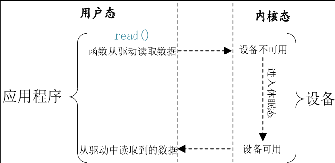
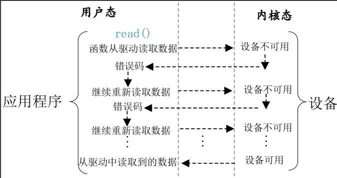
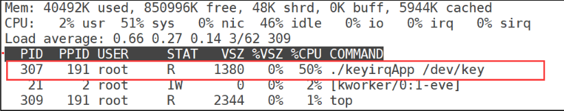

<!--
 * @Date: 2024-12-11
 * @LastEditors: GoKo-Son626
 * @LastEditTime: 2024-12-11
 * @FilePath: /1-STM32MP157/10-BlockorNot_IO.md
 * @Description: 
-->
# Block or Not IO

> 在阻塞IO中，线程会被挂起直到I/O操作完成，这样它在等待的过程中不占用CPU资源。但如果是非阻塞IO，线程会持续轮询I/O状态，导致CPU占用率很高。程序员通常会使用异步IO或多线程处理，通过事件驱动模型或使用如epoll、select等机制，避免不必要的CPU占用。在Linux驱动中，也通过中断处理或异步通知方式来降低CPU占用，避免忙等待。

### 1. Block or not IO

**1.1 intro**

这里的 IO 指的是 Input/Output，也就是输入/输出，是应用程序对驱动设备的输入/输出操作。当应用程序对设
备驱动进行操作的时候，如果不能获取到设备资源，那么阻塞式 IO 就会将应用程序对应的线程
挂起，直到设备资源可以获取为止。对于非阻塞 IO，应用程序对应的线程不会挂起，它要么一
直轮询等待，直到设备资源可以使用，要么就直接放弃。

***阻塞IO访问(defult)***

```c
1 int fd;
2 int data = 0;
3
4 fd = open("/dev/xxx_dev", O_RDWR);/* 阻塞方式打开 */
5 ret = read(fd, &data, sizeof(data));/* 读取数据
*/
```

***非阻塞IO访问***

```c
1 int fd;
2 int data = 0;
3
4 fd = open("/dev/xxx_dev", O_RDWR | O_NONBLOCK);/* 非阻塞方式打开 */
5 ret = read(fd, &data, sizeof(data));/* 读取数据 */
```

**1.2 等待队列**
1. 等待队列头阻塞访问最大的好处就是当设备文件不可操作的时候进程可以进入休眠态，这样可以将CPU 资源让出来。但是，当设备文件可以操作的时候就必须唤醒进程，一般在中断函数里面完成唤醒工作。Linux 内核提供了等待队列(wait queue)来实现阻塞进程的唤醒工作，如果我们要在驱动中使用等待队列，必须创建并初始化一个等待队列头，等待队列头使用结构体wait_queue_head 表示

34 struct wait_queue_head {
35spinlock_tlock;
36struct list_headhead;
37 };
38 typedef struct wait_queue_head wait_queue_head_t;

定义好等待队列头以后需要初始化，使用 init_waitqueue_head 函数初始化等待队列头，数原型如下：
void init_waitqueue_head(struct wait_queue_head *wq_head)
参数 wq_head 就是要初始化的等待队列头。也可以使用宏 DECLARE_WAIT_QUEUE_HEAD 来一次性完成等待队列头的定义的初始化。

2. 等待队列项
等待队列头就是一个等待队列的头部，每个访问设备的进程都是一个队列项，当设备不可
用的时候就要将这些进程对应的队列项添加到等待队列里面。在以前的 linux 版本中使用结构
体 wait_queue_t 表示等待队列项，在 5.4 版本的 linux 内核中已经删除了 wait_queue_t，取而代
之的是 wait_queue_entry 结构体(其实只是换了个名字，结构体内的成员变量还是一样的)
27 struct wait_queue_entry {
28unsigned intflags;
29void*private;
30wait_queue_func_tfunc;
31struct list_headentry;
32 };
使用宏 DECLARE_WAITQUEUE 定义并初始化一个等待队列项，宏的内容如下：
DECLARE_WAITQUEUE(name, tsk)
name 就是等待队列项的名字，tsk 表示这个等待队列项属于哪个任务(进程)，一般设置为
current ， 在 Linux 内 核 中 current 相 当 于 一 个 全 局 变 量 ， 表 示 当 前 进 程 。 因 此 宏
DECLARE_WAITQUEUE 就是给当前正在运行的进程创建并初始化了一个等待队列项。

3. 将队列项添加/移除等待队列头

当设备不可访问的时候就需要将进程对应的等待队列项添加到前面创建的等待队列头中，
只有添加到等待队列头中以后进程才能进入休眠态。当设备可以访问以后再将进程对应的等待
队列项从等待队列头中移除即可，等待队列项添加 API 函数如下：
void add_wait_queue(struct wait_queue_head *wq_head,
struct wait_queue_entry *wq_entry)
函数参数和返回值含义如下：
wq_head：等待队列项要加入的等待队列头。
wq_entry：要加入的等待队列项。
返回值：无。
等待队列项移除 API 函数如下：
void remove_wait_queue(struct wait_queue_head *wq_head,
struct wait_queue_entry *wq_entry)
函数参数和返回值含义如下：
wq_head：要删除的等待队列项所处的等待队列头。
wq_entry：要删除的等待队列项。
返回值：无。

4. 等待唤醒

当设备可以使用的时候就要唤醒进入休眠态的进程，唤醒可以使用如下两个函数：
void wake_up(struct wait_queue_head *wq_head)
void wake_up_interruptible(struct wait_queue_head *wq_head)
参数 wq_head 就是要唤醒的等待队列头，这两个函数会将这个等待队列头中的所有进程都
唤醒。wake_up 函数可以唤醒处于 TASK_INTERRUPTIBLE 和 TASK_UNINTERRUPTIBLE 状
态的进程，而 wake_up_interruptible 函数只能唤醒处于 TASK_INTERRUPTIBLE 状态的进程。

5. 等待事件

除了主动唤醒以外，也可以设置等待队列等待某个事件，当这个事件满足以后就自动唤醒
等待队列中的进程，和等待事件有关的 API 函数如表 32.1.2.1 所示：

<div style="text-align:center;font-weight:bold;">
等待事件API函数
</div>

| 函数                                                          | 描述                                                                                                                                                                                       |
| ------------------------------------------------------------- | ------------------------------------------------------------------------------------------------------------------------------------------------------------------------------------------ |
| wait_event(wq_head, condition)                                | 等待以 wq_head 为等待队列头的等待队列被唤醒，前提是 condition 条件必须满足(为真)，否则一直阻塞。此函数会将进程设置为 TASK_UNINTERRUPTIBLE 状态                                             |
| wait_event_timeout(wq_head, condition, timeout)               | 功能和 wait_event 类似，但是此函数可以添加超时时间，以 jiffies 为单位。此函数有返回值，如果返回 0 的话表示超时时间到，而且 condition 为假。为 1 的话表示condition 为真，也就是条件满足了。 |
| wait_event_interruptible(wq_head, condition                   | 与 wait_event 函数类似，但是此函数将进程设置为 TASK_INTERRUPTIBLE，就是可以被信号打断。                                                                                                    |
| wait_event_interruptible_timeout(wq_head, condition, timeout) | 与 wait_event_timeout 函数类似，此函数也将进程设置为TASK_INTERRUPTIBLE，可以被信号打断。                                                                                                   |

**1.3 轮询**
如果用户应用程序以非阻塞的方式访问设备，设备驱动程序就要提供非阻塞的处理方式，
也就是轮询。poll、epoll 和 select 可以用于处理轮询，应用程序通过 select、epoll 或 poll 函数来
查询设备是否可以操作，如果可以操作的话就从设备读取或者向设备写入数据。当应用程序调
用 select、epoll 或 poll 函数的时候设备驱动程序中的 poll 函数就会执行，因此需要在设备驱动
程序中编写 poll 函数。

1. select 函数
select 函数原型如下：
```c
int select(int          nfds,
        fd_set          *readfds,
        fd_set          *writefds,
        fd_set          *exceptfds,
        struct timeval *timeout
)
```
nfds：所要监视的这三类文件描述集合中，最大文件描述符加 1。
readfds、writefds 和 exceptfds：这三个指针指向描述符集合，这三个参数指明了关心哪些
描述符、需要满足哪些条件等等，这三个参数都是 fd_set 类型的，fd_set 类型变量的每一个位
都代表了一个文件描述符。
readfds监视这些文件是否可以读取大于 0 的值如果没有文件可以读取，那么就会根据 timeout 参数来判断是否超时。可以将 readfs
设置为 NULL，表示不关心任何文件的读变化。writefds 和 readfs 类似，只是 writefs 用于监视
这些文件是否可以进行写操作。exceptfds 用于监视这些文件的异常。
当我们定义好一个 fd_set 变量以后可以使用如下所示几个宏进行操作：
void FD_ZERO(fd_set *set)
void FD_SET(int fd, fd_set *set)
void FD_CLR(int fd, fd_set *set)
int FD_ISSET(int fd, fd_set *set)
FD_ZERO 用于将 fd_set 变量的所有位都清零，FD_SET 用于将 fd_set 变量的某个位置 1，
也就是向 fd_set 添加一个文件描述符，参数 fd 就是要加入的文件描述符。FD_CLR 用户将 fd_set
变量的某个位清零，也就是将一个文件描述符从 fd_set 中删除，参数 fd 就是要删除的文件描述
符。FD_ISSET 用于测试一个文件是否属于某个集合，参数 fd 就是要判断的文件描述符。
timeout:超时时间，当我们调用 select 函数等待某些文件描述符可以设置超时时间，超时时
间使用结构体 timeval 表示，结构体定义如下所示：
struct timeval {
long
tv_sec;
/* 秒
*/
long
tv_usec;
/* 微妙
*/
};
当 timeout 为 NULL 的时候就表示无限期的等待。
返回值：0，表示的话就表示超时发生，但是没有任何文件描述符可以进行操作；-1，发生
错误；其他值，可以进行操作的文件描述符个数。
1void main(void)
2{
3int ret, fd;/* 要监视的文件描述符*/
4fd_set readfds;/* 读操作文件描述符集*/
5
6struct timeval timeout;/* 超时结构体*/
7
8fd = open("dev_xxx", O_RDWR | O_NONBLOCK);9FD_ZERO(&readfds);/* 清除 readfds10
11FD_SET(fd, &readfds);/* 将 fd 添加到 readfds 里面 */
12
13/* 构造超时时间 */
timeout.tv_sec = 0;14timeout.tv_usec = 500000;
/* 500ms
/* 非阻塞式访问 */
*/
*/
15
16ret = select(fd + 1, &readfds, NULL, NULL, &timeout);
17switch (ret) {
18
19
20
21
22
case 0:
/* 超时
printf("timeout!\r\n");
*/
break;
case -1:
/* 错误
printf("error!\r\n");
23
论坛:www.openedv.com
break;
24
/* 可以读取数据 */
default:
if(FD_ISSET(fd, &readfds)) { /* 判断是否为 fd 文件描述符 */
25
/* 使用 read 函数读取数据 */
26
27}
28break;
29
}
30 }

2. poll 函数
在单个线程中，select 函数能够监视的文件描述符数量有最大的限制，一般为 1024，可以
修改内核将监视的文件描述符数量改大，
但是这样会降低效率！
这个时候就可以使用 poll 函数，
poll 函数本质上和 select 没有太大的差别，但是 poll 函数没有最大文件描述符限制，Linux 应用
程序中 poll 函数原型如下所示：
```c
int poll(struct pollfd  *fds,
        nfds_t          nfds,
        int     timeout
)
```
函数参数和返回值含义如下：
fds：要监视的文件描述符集合以及要监视的事件,为一个数组，数组元素都是结构体 pollfd
类型的，pollfd 结构体如下所示：
struct pollfd {
int fd;
/* 文件描述符
*/
short events;
/* 请求的事件
*/
short revents;
/* 返回的事件
*/
};
fd 是要监视的文件描述符，如果 fd 无效的话那么 events 监视事件也就无效，并且 revents
返回 0。events 是要监视的事件，可监视的事件类型如下所示：
POLLIN
有数据可以读取。
POLLPRI
有紧急的数据需要读取。
POLLOUT
可以写数据。
POLLERR
指定的文件描述符发生错误。
POLLHUP
指定的文件描述符挂起。
POLLNVAL
无效的请求。
POLLRDNORM 等同于 POLLIN
revents 是返回参数，也就是返回的事件，由 Linux 内核设置具体的返回事件。
nfds：poll 函数要监视的文件描述符数量。
timeout：超时时间，单位为 ms。
返回值：返回 revents 域中不为 0 的 pollfd 结构体个数，也就是发生事件或错误的文件描述
符数量；0，超时；-1，发生错误，并且设置 errno 为错误类型。
使用 poll 函数对某个设备驱动文件进行读非阻塞访问的操作示例如下所示：
示例代码 32.1.3.2 poll 函数读非阻塞访问示例
1 void main(void)
2 {
3       int ret;
4       int fd;                /* 要监视的文件描述符 */
5       struct pollfd fds;
6
7
8       fd = open(filename, O_RDWR | O_NONBLOCK); /* 非阻塞式访问 */
9
10      /* 构造结构体 */
        fds.fd = fd;11
12      fds.events = POLLIN;13ret = poll(&fds, 1, 500);/* 轮询文件是否可操作，超时 500ms */
14
15      if (ret) {
        ......          /* 数据有效 */
        
        
        /* 监视数据是否可以读取 */
        /* 读取数据 */
        ......
16
17
18
19      } else if (ret == 0) {
        ....../* 超时*/
20
21      } else if (ret < 0) {
        ....../* 错误*/
22      }
23 }

1. epoll 函数
传统的 selcet 和 poll 函数都会随着所监听的 fd 数量的增加，出现效率低下的问题，而且
poll 函数每次必须遍历所有的描述符来检查就绪的描述符，这个过程很浪费时间。为此，epoll
应运而生，epoll 就是为处理大并发而准备的，一般常常在网络编程中使用 epoll 函数。应用程
序需要先使用 epoll_create 函数创建一个 epoll 句柄，epoll_create 函数原型如下：
int epoll_create(int size)
函数参数和返回值含义如下：
`size`：从 Linux2.6.8 开始此参数已经没有意义了，随便填写一个大于 0 的值就可以。
`返回值`：epoll 句柄，如果为-1 的话表示创建失败。
epoll 句柄创建成功以后使用 epoll_ctl 函数向其中添加要监视的文件描述符以及监视的事
件，epoll_ctl 函数原型如下所示：
```c
int epoll_ctl(int        epfd,
        int                     op,
        int                     fd,
        struct epoll_event      *event)
```
函数参数和返回值含义如下：
`epfd`：要操作的 epoll 句柄，也就是使用 epoll_create 函数创建的 epoll 句柄。
`op`：表示要对 epfd(epoll 句柄)进行的操作，可以设置为：
EPOLL_CTL_ADD   向 epfd 添加文件参数 fd 表示的描述符。
EPOLL_CTL_MOD   修改参数 fd 的 event 事件。
EPOLL_CTL_DEL   从 epfd 中删除 fd 描述符。
`fd`：要监视的文件描述符。
event：要监视的事件类型，为 epoll_event 结构体类型指针，epoll_event 结构体类型如下所
示：
struct epoll_event {
uint32_t
events;
/* epoll 事件
*/
epoll_data_t data;
/* 用户数据
*/
};
结构体 epoll_event 的 events 成员变量表示要监视的事件，可选的事件如下所示：
EPOLLIN
有数据可以读取。
EPOLLOUT 可以写数据。
EPOLLPRI 有紧急的数据需要读取。
EPOLLERR 指定的文件描述符发生错误。
EPOLLHUP 指定的文件描述符挂起。
EPOLLET
设置 epoll 为边沿触发，默认触发模式为水平触发。
EPOLLONESHOT 一次性的监视，当监视完成以后还需要再次监视某个 fd，那么就需要将
fd 重新添加到 epoll 里面。
上面这些事件可以进行“或”操作，也就是说可以设置监视多个事件。
返回值：0，成功；-1，失败，并且设置 errno 的值为相应的错误码。
一切都设置好以后应用程序就可以通过 epoll_wait 函数来等待事件的发生，类似 select 函
数。epoll_wait 函数原型如下所示：
int epoll_wait(int
epfd,
struct epoll_event *events,
int
maxevents,
int
timeout)
函数参数和返回值含义如下：
epfd：要等待的 epoll。
events：指向 epoll_event 结构体的数组，当有事件发生的时候 Linux 内核会填写 events，调
用者可以根据 events 判断发生了哪些事件。
maxevents：events 数组大小，必须大于 0。
timeout：超时时间，单位为 ms。
返回值：0，超时；-1，错误；其他值，准备就绪的文件描述符数量。
epoll 更多的是用在大规模的并发服务器上，因为在这种场合下 select 和 poll 并不适合。当
设计到的文件描述符(fd)比较少的时候就适合用 selcet 和 poll
**1.4 Linux 驱动下的 poll 操作函数**
当应用程序调用 select 或 poll 函数来对驱动程序进行非阻塞访问的时候，驱动程序
file_operations 操作集中的 poll 函数就会执行。所以驱动程序的编写者需要提供对应的 poll 函
数，poll 函数原型如下所示：
unsigned int (*poll) (struct file *filp, struct poll_table_struct *wait)
函数参数和返回值含义如下：
`filp`：要打开的设备文件(文件描述符)。
`wait`：结构体 poll_table_struct 类型指针，由应用程序传递进来的。一般将此参数传递给
poll_wait 函数。
`返回值`:向应用程序返回设备或者资源状态，可以返回的资源状态如下：
POLLIN
有数据可以读取。
POLLPRI
有紧急的数据需要读取。
POLLOUT
可以写数据。
POLLERR
指定的文件描述符发生错误。
POLLHUP
指定的文件描述符挂起。
POLLNVAL
无效的请求。
POLLRDNORM 等同于 POLLIN，普通数据可读
我们需要在驱动程序的 poll 函数中调用 poll_wait 函数，poll_wait 函数不会引起阻塞，只是
将应用程序添加到 poll_table 中，poll_wait 函数原型如下：
void poll_wait(struct file * filp, wait_queue_head_t * wait_address, poll_table *p)
参数 wait_address 是要添加到 poll_table 中的等待队列头，参数 p 就是 poll_table，就是
file_operations 中 poll 函数的 wait 参数。
### 2. experience of blocking IO

在上一章 Linux 中断实验中，我们直接在应用程序中通过 read 函数不断的读取按键状态，
当按键有效的时候就打印出按键值。这种方法有个缺点，那就是 keyirqApp 这个测试应用程序
拥有很高的 CPU 占用率，大家可以在开发板中加载上一章的驱动程序模块 keyirq.ko，然后以后
台运行模式打开 keyirqApp 这个测试软件，命令如下：
./keyirqApp /dev/keyirq &
测试驱动是否正常工作，如果驱动工作正常的话输入“top”命令查看 keyirqApp 这个应用
程序的 CPU 使用率，结果如图 32.2.1 所示：

从图 32.2.1 可以看出，keyirqApp 这个应用程序的 CPU 使用率竟然高达 50%，这仅仅是一
个读取按键值的应用程序，这么高的 CPU 使用率显然是有问题的！原因就在于我们是直接在
while 循环中通过 read 函数读取按键值，因此 keyirqApp 这个软件会一直运行，一直读取按键
值，CPU 使用率肯定就会很高。最好的方法就是在没有有效的按键事件发生的时候，keyirqApp
这个应用程序应该处于休眠状态，当有按键事件发生以后 keyirqApp 这个应用程序才运行，打
印出按键值，这样就会降低 CPU 使用率，本小节我们就使用阻塞 IO 来实现此能。
### 3. Experimental code


