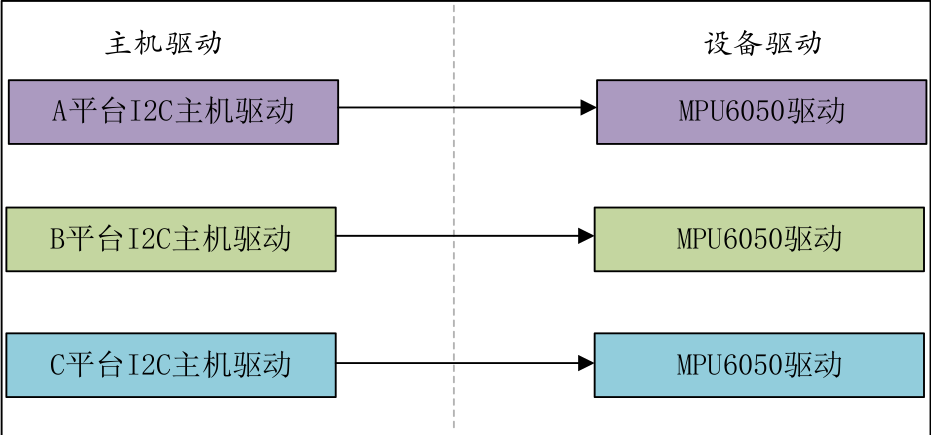
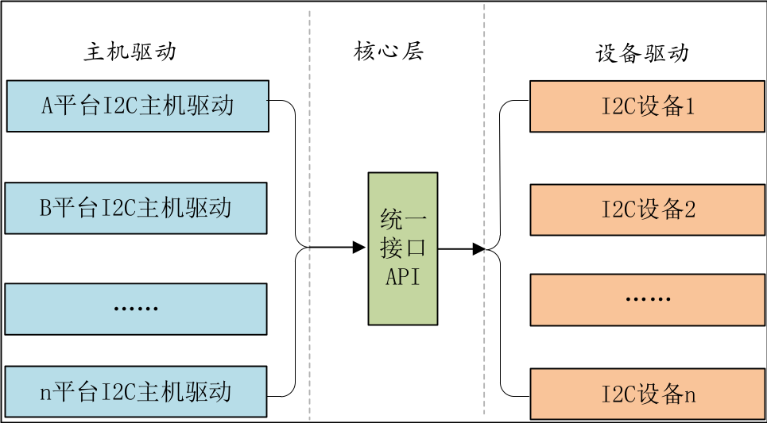

<!--
 * @Date: 2024-12-19
 * @LastEditors: GoKo-Son626
 * @LastEditTime: 2024-12-22
 * @FilePath: /1-STM32MP157/12-platform.md
 * @Description: 
-->
# platform

> 前面几章编写的设备驱动都非常的简单，都是对 GPIO 进行最简单的读写操作。像I2C、SPI、LCD 等这些复杂外设的驱动就不能这么去写了，Linux 系统要考虑到驱动的可重用性，因此提出了驱动的分离与分层这样的软件思路，在这个思路下诞生了我们将来最常打交道的 platform 设备驱动，也叫做平台设备驱动。

### 1. 驱动的分离与分层

假如现在有三个平台 A、B 和 C，这三个平台(这里的平台说的是 SOC)上都有 MPU6050 这
个 I2C 接口的六轴传感器
**传统的IIC驱动框架**

**分隔后的驱动框架**

在实际的驱动开发中，一般 I2C 主机控制器驱动已经由
半导体厂家编写好了，而设备驱动一般也由设备器件的厂家编写好了，我们只需要提供设备信
息即可，比如 I2C 设备的话提供设备连接到了哪个 I2C 接口上，I2C 的速度是多少等等。相当
于将设备信息从设备驱动中剥离开来，驱动使用标准方法去获取到设备信息(比如从设备树中获
取到设备信息)，然后根据获取到的设备信息来初始化设备。 这样就相当于驱动只负责驱动，
设备只负责设备，想办法将两者进行匹配即可。这个就是 Linux 中的总线(bus)、驱动(driver)和
设备(device)模型，也就是常说的驱动分离。

### 2. platform 平台驱动模型简介

在 SOC 中有些外设是没有总线这个概念的，但是又要使用总线、为了解决此问题，Linux 提出了 **platform 这个虚拟总线**，相应的就有 platform_driver 和 platform_device。

##### 1. platform总线
Linux 系统内核使用 bus_type 结构体表示总线
```c
1 struct bus_type {
2 const char *name;
3 const char *dev_name;
4 struct device *dev_root;
5 const struct attribute_group **bus_groups;
6 const struct attribute_group **dev_groups;
7 const struct attribute_group **drv_groups;
8 int (*match)(struct device *dev, struct device_driver *drv);
9 int (*uevent)(struct device *dev, struct kobj_uevent_env *env);
10 int (*probe)(struct device *dev);
11 int (*remove)(struct device *dev);
12 void (*shutdown)(struct device *dev);
13 int (*online)(struct device *dev);
14 int (*offline)(struct device *dev);
15 int (*suspend)(struct device *dev, pm_message_t state);
16 int (*resume)(struct device *dev);
17 int (*num_vf)(struct device *dev);
18 int (*dma_configure)(struct device *dev);
19 const struct dev_pm_ops *pm;
20 const struct iommu_ops *iommu_ops;
21 struct subsys_private *p;
22 struct lock_class_key lock_key;
23 bool need_parent_lock;
24 };
```
8 行，match 函数,总线就是使用 match 函数来根据注册的设备来查找对应的驱
动，或者根据注册的驱动来查找相应的设备，因此每一条总线都必须实现此函数。match 函数有
两个参数：dev 和 drv，这两个参数分别为 device 和 device_driver 类型，也就是设备和驱动。

platform 总线是 bus_type 的一个具体实例 
1
struct bus_type platform_bus_type = {
2.name= "platform",
3.dev_groups= platform_dev_groups,
4.match= platform_match,
5.uevent= platform_uevent,
6.dma_configure
7
8
.pm
= platform_dma_configure,
= &platform_dev_pm_ops,
};

platform_bus_type 就是 platform 平台总线，其中 platform_match 就是匹配函数。            
```c
1 static int platform_match(struct device *dev, struct device_driver *drv)
2 {
3 struct platform_device *pdev = to_platform_device(dev);
4 struct platform_driver *pdrv = to_platform_driver(drv);
5
6 /*When driver_override is set,only bind to the matching driver*/
7 if (pdev->driver_override)
8       return !strcmp(pdev->driver_override, drv->name);
9
10 /* Attempt an OF style match first */
11 if (of_driver_match_device(dev, drv))
12 return 1;
13
14 /* Then try ACPI style match */
15 if (acpi_driver_match_device(dev, drv))
16      return 1;
17
18 /* Then try to match against the id table */
19 if (pdrv->id_table)
20      return platform_match_id(pdrv->id_table, pdev) != NULL;
21
22 /* fall-back to driver name match */
23 return (strcmp(pdev->name, drv->name) == 0);
24 }
```
- 第一种匹配方式，OF 类型的匹配，也就是设备树采用的匹配方式
- 第二种匹配方式，ACPI 匹配方式
- 第三种匹配方式，id_table 匹配，每个 platform_driver 结构体有一个id_table成员变量
- 第四种匹配方式，如果第三种匹配方式的 id_table 不存在的话就直接比较驱动和设备的 name 字段，看看是不是相等，如果相等的话就匹配成功

##### 2. platform驱动

```c
1
struct platform_driver {
2int (*probe)(struct platform_device *);
3int (*remove)(struct platform_device *);
4void (*shutdown)(struct platform_device *);
5int (*suspend)(struct platform_device *, pm_message_t state);
6int (*resume)(struct platform_device *);
7struct device_driver driver;
8const struct platform_device_id *id_table;
9bool prevent_deferred_probe;
10 };
```
- probe 函数，当驱动与设备匹配成功以后 probe 函数就会执行，**非常重要的函数！！**一般驱动的提供者会编写，如果自己要编写一个全新的驱动，那么 probe 就需要自行实现。
- device_driver 相当于基类，提供了最基础的驱动框架。plaform_driver 继承了这个基类，然后在此基础上又添加了一些特有的成员变量。

```c
1struct device_driver {
2const char
*name;
3struct bus_type
*bus;
4struct module
*owner;
5const char
*mod_name;
6bool suppress_bind_attrs;
7enum probe_type probe_type;
8const struct of_device_id *of_match_table;
9const struct acpi_device_id *acpi_match_table;
10int (*probe) (struct device *dev);
11int (*remove) (struct device *dev);
12void (*shutdown) (struct device *dev);
13int (*suspend) (struct device *dev, pm_message_t state);
14int (*resume) (struct device *dev);
15const struct attribute_group **groups;
16const struct attribute_group **dev_groups;
```
of_match_table 就是采用设备树的时候驱动使用的匹配表，同样是数组，每个匹配
项都为 of_device_id 结构体类型
```c
1 struct of_device_id {
2charname[32];
3chartype[32];
4charcompatible[128];
5const void*data;
6 };
```
compatible 非常重要，因为对于设备树而言，就是通过设备节点的 compatible 属
性值和 of_match_table 中每个项目的 compatible 成员变量进行比较，如果有相等的就表示设备
和此驱动匹配成功。

**paltform驱动框架**
```c
/* 设备结构体 */
1 struct xxx_dev{
2        struct cdev cdev;
3       /* 设备结构体其他具体内容 */
4 };
5
6 struct xxx_dev xxxdev;        /* 定义个设备结构体变量 */
7 
8static int xxx_open(struct inode *inode, struct file *filp)
9{
/* 函数具体内容 */
return 0;
10
11
12 }
13
14 static ssize_t xxx_write(struct file *filp, const char __user *buf,
size_t cnt, loff_t *offt)
15 {
/* 函数具体内容 */
return 0;
16
17
18 }
19
20 /*
21
22
* 字符设备驱动操作集
*/
23 static struct file_operations xxx_fops = {
24.owner = THIS_MODULE,
25.open = xxx_open,
26.write = xxx_write,
27 };
28
29 /*
30* platform 驱动的 probe 函数
31
32* 驱动与设备匹配成功以后此函数就会执行
*/
33 static int xxx_probe(struct platform_device *dev)
34 {
35......
36cdev_init(&xxxdev.cdev, &xxx_fops); /* 注册字符设备驱动 */
37
38/* 函数具体内容 */
return 0;
39 }
40
41 static int xxx_remove(struct platform_device *dev)
42 {
43......
44cdev_del(&xxxdev.cdev);/*
45
46/* 函数具体内容 */
return 0;
删除 cdev */
47 }
48
49 /* 匹配列表 */
50 static const struct of_device_id xxx_of_match[] = {
51{ .compatible = "xxx-gpio" },
52{ /* Sentinel */ }
53 };
54
55 /*
56
57
* platform 平台驱动结构体
*/
58 static struct platform_driver xxx_driver = {
59.driver = {
60.name
61.of_match_table = xxx_of_match,
= "xxx",
62},63.probe= xxx_probe,
64.remove= xxx_remove,
65 };
66
67 /* 驱动模块加载 */
68 static int __init xxxdriver_init(void)
69 {
70
return platform_driver_register(&xxx_driver);
71 }
72
73 /* 驱动模块卸载 */
74 static void __exit xxxdriver_exit(void)
75 {
76
platform_driver_unregister(&xxx_driver);
77 }
78
79 module_init(xxxdriver_init);
80 module_exit(xxxdriver_exit);
81 MODULE_LICENSE("GPL");
82 MODULE_AUTHOR("zuozhongkai");
```

##### 3. platform设备

```c
1
struct platform_device {
2const char
*name;
3int
4bool
5struct device
6u64
platform_dma_mask;
7u32
num_resources;
8struct resource *resource;
id;
id_auto;
dev;
9
10const struct platform_device_id *id_entry;
11char *driver_override; /* Driver name to force a match */
12
13/* MFD cell pointer */
14struct mfd_cell *mfd_cell;
15
16/* arch specific additions */
17struct pdev_archdata
archdata;
18 };
```

**platform 设备框架**
```c
1/* 寄存器地址定义*/2#define PERIPH1_REGISTER_BASE(0X20000000) /* 外设 1 寄存器首地址 */
3
4#define PERIPH2_REGISTER_BASE
#define REGISTER_LENGTH(0X020E0068) /* 外设 2 寄存器首地址 */
4
5
6
7
/* 资源 */
static struct resource xxx_resources[] = {
8
[0] = {
9.start= PERIPH1_REGISTER_BASE,
10.end= (PERIPH1_REGISTER_BASE + REGISTER_LENGTH - 1),
11.flags= IORESOURCE_MEM,
12},
13[1] = {
14.start= PERIPH2_REGISTER_BASE,
15.end= (PERIPH2_REGISTER_BASE + REGISTER_LENGTH - 1),
.flags= IORESOURCE_MEM,
16
17
},
18 };
19
20 /* platform 设备结构体 */
21 static struct platform_device xxxdevice = {
22.name = "xxx-gpio",
23.id = -1,
24.num_resources = ARRAY_SIZE(xxx_resources),
25.resource = xxx_resources,
26 };
27
28 /* 设备模块加载 */
29 static int __init xxxdevice_init(void)
30 {
31
return platform_device_register(&xxxdevice);
32 }
33
34 /* 设备模块注销 */
35 static void __exit xxx_resourcesdevice_exit(void)
36 {
37
platform_device_unregister(&xxxdevice);
38 }
39
40 module_init(xxxdevice_init);
41 module_exit(xxxdevice_exit);
42 MODULE_LICENSE("GPL");
43 MODULE_AUTHOR("zuozhongkai");
```


