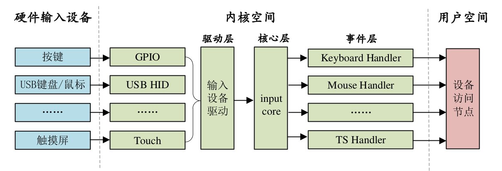

<!--
 * @Date: 2024-12-19
 * @LastEditors: GoKo-Son626
 * @LastEditTime: 2024-12-23
 * @FilePath: /1-STM32MP157/16-Input.md
 * @Description:
-->
# INPUT

> 按键、鼠标、键盘、触摸屏等都属于输入(input)设备，Linux 内核为此专门做了一个叫做 input
子系统的框架来处理输入事件。输入设备本质上还是字符设备，只是在此基础上套上了 input 框
架，用户只需要负责上报输入事件，比如按键值、坐标等信息，input 核心层负责处理这些事件

### 1. INPUT子系统

##### 1. INPUT子系统简介

input 子系统分为 input 驱动层、input 核心层、input 事件处理层，最终给用户空间提供可访问的设备节点



驱动层：输入设备的具体驱动程序，比如按键驱动程序，向内核层报告输入内容。
核心层：承上启下，为驱动层提供输入设备注册和操作接口。通知事件层对输入事件进行
处理。
事件层：主要和用户空间进行交互。

##### 2. INPUT驱动编写流程

input 核心层会向 Linux 内核注册一个字符设备
drivers/input/input.c 这个文件
input.c 就是 input 输入子系统的核心层

1. 注册input_dev
在使用 input 子系统的时候我们只需要注册一个 input 设备即可，input_dev 结构体表示 input
设备
```c
131 struct input_dev {
132 const char *name;
133 const char *phys;
134 const char *uniq;
135 struct input_id id;
136 
137 unsigned long propbit[BITS_TO_LONGS(INPUT_PROP_CNT)];
138 
139 unsigned long evbit[BITS_TO_LONGS(EV_CNT)];/* 事件类型的位图 */
140 unsigned long keybit[BITS_TO_LONGS(KEY_CNT)];/* 按键值的位图 */
141 unsigned long relbit[BITS_TO_LONGS(REL_CNT)];/* 相对坐标的位图*/
142 unsigned long absbit[BITS_TO_LONGS(ABS_CNT)];/* 绝对坐标的位图 */
143 unsigned long mscbit[BITS_TO_LONGS(MSC_CNT)];/* 杂项事件的位图 */
144 unsigned long ledbit[BITS_TO_LONGS(LED_CNT)];/*LED 相关的位图 */
145 unsigned long sndbit[BITS_TO_LONGS(SND_CNT)];/* sound 有关的位*/
146 unsigned long ffbit[BITS_TO_LONGS(FF_CNT)];/* 压力反馈的位图 */
147 unsigned long swbit[BITS_TO_LONGS(SW_CNT)];/*开关状态的位图 */
148
......
201 bool devres_managed;
202
203 ktime_t timestamp[INPUT_CLK_MAX];
204 };
```
`evbit` 表示输入事件类型，可选的事件类型定义在 include/uapi/linux/input.h 文件中
```c
38 #define EV_SYN 0x00/* 同步事件*/
39 #define EV_KEY 0x01/* 按键事件*/
40 #define EV_REL 0x02/* 相对坐标事件*/
41 #define EV_ABS 0x03/* 绝对坐标事件*/
42 #define EV_MSC 0x04/* 杂项(其他)事件*/
43 #define EV_SW 0x05/* 开关事件*/
44 #define EV_LED 0x11/* LED*/
45 #define EV_SND 0x12/* sound(声音)*/
46 #define EV_REP 0x14/* 重复事件*/
47 #define EV_FF 0x15/* 压力事件*/
48 #define EV_PWR 0x16/* 电源事件*/
49 #define EV_FF_STATUS 0x17/* 压力状态事件*/
```

编写input驱动时需 要 先 申 请 一 个 input_dev 结 构 体 变 量 ， 使 用input_allocate_device 函数来申请一个 input_dev，此函数原型如下所示：
struct input_dev *input_allocate_device(void)
函数参数和返回值含义如下：
参数：无。
返回值：申请到的 input_dev。

如果要注销的 input 设备的话需要使用 input_free_device 函数来释放掉前面申请到的input_dev，input_free_device 函数原型如下：
void input_free_device(struct input_dev *dev)
函数参数和返回值含义如下：
dev：需要释放的 input_dev。
返回值：无。

申请好一个 input_dev 以后就需要初始化这个 input_dev，需要初始化的内容主要为事件类
型(evbit)和事件值(keybit)这两种。

input_dev 初始化完成以后就需要向 Linux 内核注册 input_dev
了，需要用到 input_register_device 函数，此函数原型如下：
int input_register_device(struct input_dev *dev)
函数参数和返回值含义如下：
dev：要注册的 input_dev 。
返回值：0，input_dev 注册成功；负值，input_dev 注册失败。

同样的，注销 input 驱动的时候也需要使用 input_unregister_device 函数来注销掉前面注册
的 input_dev，input_unregister_device 函数原型如下：
void input_unregister_device(struct input_dev *dev)
函数参数和返回值含义如下：
dev：要注销的 input_dev 。
返回值：无。

综上所述，input_dev 注册过程如下：
①、使用 input_allocate_device 函数申请一个 input_dev。

②、初始化 input_dev 的事件类型以及事件值。
③、使用 input_register_device 函数向 Linux 系统注册前面初始化好的 input_dev。
④、
卸载 input 驱动的时候需要先使用 input_unregister_device 函数注销掉注册的 input_dev，
然后使用 input_free_device 函数释放掉前面申请的 input_dev。

##### 2. 上报输入事件

向 Linux 内核注册好 input_dev 以后还不能高枕无忧的使用 input 设备，input 设备都
是具有输入功能的，但是具体是什么样的输入值 Linux 内核是不知道的，我们需要获取到具体
的输入值，或者说是输入事件，然后将输入事件上报给 Linux 内核。


常
用的事件上报 API 函数。
首先是 input_event 函数，此函数用于上报指定的事件以及对应的值，函数原型如下：
void input_event(struct input_dev
*dev,
unsigned int
type,
unsigned int
code,
int
value)
函数参数和返回值含义如下：
dev：需要上报的 input_dev。
type: 上报的事件类型，比如 EV_KEY。
code：事件码，也就是我们注册的按键值，比如 KEY_0、KEY_1 等等。
value：事件值，比如 1 表示按键按下，0 表示按键松开。
返回值：无。
input_event 函数可以上报所有的事件类型和事件值，Linux 内核也提供了其他的针对具体
事 件 的 上 报 函 数 ， 这 些 函 数 其 实 都 用 到 了 input_event 函 数 。
例如：
```c
static inline void input_report_key(struct input_dev *dev, unsigned int code, int value)
{
        input_event(dev, EV_KEY, code, !!value);
}
```
input_report_key 函数的本质就是 input_event 函数，如果
要上报按键事件的话还是建议大家使用 input_report_key 函数。

上报事件以后还需要使用 input_sync 函数来告诉 Linux 内核 input 子系统上报结束，
input_sync 函数本质是上报一个同步事件，此函数原型如下所示：
void input_sync(struct input_dev *dev)
函数参数和返回值含义如下：
dev：需要上报同步事件的 input_dev。
返回值：无。

上报事件参考代码：
```c
1 /* 用于按键消抖的定时器服务函数 */
2 void timer_function(unsigned long arg)
3 {
4       unsigned char value;
5
6       value = gpio_get_value(keydesc->gpio);/* 读取 IO 值*/
7       if(value == 0){/* 按下按键*/
8       /* 上报按键值 */
9               input_report_key(inputdev, KEY_0, 1);   /* 最后一个参数 1，按下 */
10              input_sync(inputdev);                   /*同步事件*/
11      } else {                        /* 按键松开*/
12              input_report_key(inputdev, KEY_0, 0); /* 最后一个参数 0，松开 */
13              input_sync(inputdev);                   /*同步事件*/
14      }
15 }
```
##### 3. input_event结构体

Linux 内核使用 input_event 这个结构体来表示所有的输入事件,input_envent 结构体定义在include/uapi/linux/input.h 文件中，结构体内容如下：
**input_event 结构体**
```c
28 struct input_event {
29 #if (__BITS_PER_LONG != 32 || !defined(__USE_TIME_BITS64))&& !defined(__KERNEL__)
30      struct timeval time;    // 也就是此事件发生的时间
31 #define input_event_sec time.tv_sec
32 #define input_event_usec time.tv_usec
33 #else
34      __kernel_ulong_t __sec;
35 #if defined(__sparc__) && defined(__arch64__)
36      unsigned int __usec;
37      unsigned int __pad;
38 #else
39      __kernel_ulong_t __usec;
40 #endif
41 #define input_event_sec __sec
42 #define input_event_usec __usec
43 #endif
44      __u16 type;
45      __u16 code;
46      __s32 value;
47 };
```


