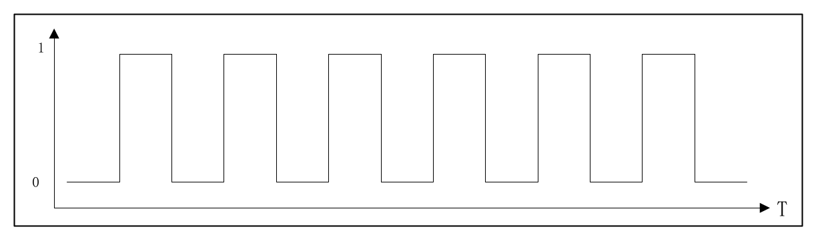

<!--
 * @Date: 2024-12-19
 * @LastEditors: GoKo-Son626
 * @LastEditTime: 2024-12-23
 * @FilePath: /1-STM32MP157/17-PWM.md
 * @Description: 
-->
# PWM

> PWM 是很常用到功能 ,我们可以通过 PWM 来控制电机速度 ,也可以使用 PWM 来控制
LCD 的背光亮度

### 1. 简介

Pulse Width Modulation ,也就是脉冲宽度调制
**PWM信号**


`频率`就是开关速度 ,把一次开关算作一个周期 ,那么频率就是 1 秒内进行了多少次开关
`占空比`就是一个周期内高电平时间和低电平时间的比例

##### 1. 设备树下的 PWM 控制器节点

1. 定时器节点
STM32MP157 有很多路 PWM ,这些 PWM 都是由定时器产生的：
`TIM1/TIM8`：这 2 个是 16 位高级定时器 ,主要用于电机控制 这两个定时器支持 PWM 型号 ,每个定时器支持 4 通道 PWM 信号 
`TIM2/TIM3/TIM4/TIM5`：这 4 个是通用定时器 ,TIM3/TIM4 是 16 位定时器 ,TIM2/TIM5是 32 位定时器 这 4 个定时器也支持 PWM 输出 ,每个定时器支持 4 通道 PWM 信号 
`TIM12/TIM13/TIM14`：这 3 个都是 16 位的通用定时器 ,TIM12 支持 2 通道的 PWM 信号 ,
TIM13/TIM14 这两个定时器每个只支持 1 个通道的 PWM 信号 
`TIM15/TIM16/TIM17`：这 3 个也都是 16 位的通用定时器 ,TIM15 支持 2 通道的 PWM 信号 ,TIM16/TIM17 每个定时器支持 1 通道的 PWM 信号 

2. TIM1简介
PA10 可以作为 TIM1 的通道3 ,TIM1 主要特性如下：
①、16 位的向上、向下自动加载计数器 
②、16 位可编程的预分频器 
③、6 个独立的通道 ,这些通道的功能如下：
- 输入捕获(只有通道 5 和 6 支持) 
- 输出比较
- PWM 波形生成(边缘和中间对齐模式) 
- 单脉冲模式 
④、带有死区的可编程互补输出 
⑤、以下事件可以生成中断或者 DMA：
- 更新事件 ,计数器溢出 
- 触发事件 ,计数器开始、停止、初始化等 
- 输入捕获 
- 输出比较 

3. TIM1设备节点

①、必须的参数：
`compatible`：必须是“st,stm32-timers”
`reg`：定时器控制器物理寄存器基地址 ,对于 TIM1 来说 ,这个地址为 0x44000000 ,这个可以在 STM32MP157 的数据手册上找到 
`clock-names`：时钟源名字 ,设置为“int”
`clocks`：时钟源 
②、可选的参数：
`resets`：复位句柄 ,用来复位定时器控制器 ,可以参考文档 reset/st,stm32-rcc.txt 
`dmas`：DMA 通道 ,最多 7 通道的 DMA 
`dma-names`：DMA 名字列表 ,必须和“dmas”属性匹配 ,可选的名字有：“ch1”、“ch2”、“ch3”、“ch4”、“up”、
“trig”、“com”
③、可选的子节点：
STM32 定时器有多种功能 ,比如及时、PWM、计数器等 ,不同的功能需要用不同的子节点
来表示 ,可选子节点有三种 ,分别对应不同的功能：
`pwm`: pwm 子节点描述定时器的 PWM 功能 ,关于 PWM 的详细信息请参考绑定文档pwm/pwm-stm32.txt ,稍微我们会讲解 
`timer`: timer 子节点描述定时器的定时功能 ,定时相关信息请参考绑定文档 iio/timer/stm32-timer-trigger.txt 
`counter`: counter 子节点描述定时器的计数功能 ,相关信息请参考绑定文档 counter/stm32-timer-cnt.txt 

**TIM1实际的定时器节点**
```c
1 timers1: timer@44000000 {
2       #address-cells = <1>;
3       #size-cells = <0>;
4       compatible = "st,stm32-timers";
5       reg = <0x44000000 0x400>;
6       clocks = <&rcc TIM1_K>;
7       clock-names = "int";
8       dmas =   <&dmamux1 11 0x400 0x80000001>,
9               <&dmamux1 12 0x400 0x80000001>,
10              <&dmamux1 13 0x400 0x80000001>,
11              <&dmamux1 14 0x400 0x80000001>,
12              <&dmamux1 15 0x400 0x80000001>,
13              <&dmamux1 16 0x400 0x80000001>,
14              <&dmamux1 17 0x400 0x80000001>;
15      dma-names = "ch1", "ch2", "ch3", "ch4",
16              "up", "trig", "com";
17      status = "disabled";
18
19      pwm {
20              compatible = "st,stm32-pwm";
21              #pwm-cells = <3>;
22              status = "disabled";
23      };
24
25      timer@0 {
26              compatible = "st,stm32h7-timer-trigger";
27              reg = <0>;
28              status = "disabled";
29      };
30
31      counter {
32              compatible = "st,stm32-timer-counter";
33              status = "disabled";
34      };
35 };
```
4. PWM设备子节点
PWM 作为定时器的子节点，
PWM 子节点绑定文档：Documentation/devicetree/bindings/pwm/pwm-stm32.txt

简单总结 PWM 子节点属性信息：
`compatible`：必须为“st,stm32-pwm”
`pinctrl-name`s：设置为“default”，也可以添加“sleep”，这样当进入低功耗的时候 PWM 引脚引入 sleep 模式。
`pinctrl-n`：PWM 引脚 pinctrl 句柄，用来指定 PWM 信号输出引脚。
`#pwm-cells`：应该设置为 3。
STM32MP157 的 PWM 节点的 compatible 属性为“st,stm32-pwm”，我们可以在 linux 内核源码中搜索这个字符串找到 PWM 驱动文件，这个文件为：drivers/pwm/pwm-stm32.c

##### 2. PWM子系统

Linux 内核提供了个 PWM 子系统框架，编写 PWM 驱动的时候一定要符合这个框架。PWM子系统的核心是 pwm_chip 结构体，定义在文件 include/linux/pwm.h 中
```c
290 struct pwm_chip {
291     struct device *dev;
292     const struct pwm_ops *ops;
293     int base;
294     unsigned int npwm;
295     
296     struct pwm_device * (*of_xlate)(struct pwm_chip *pc,
297     const struct of_phandle_args *args);
298     unsigned int of_pwm_n_cells;
299     
300     /* only used internally by the PWM framework */
301     struct list_head list;
302     struct pwm_device *pwms;
303 };
```
`pwm_ops` 结构体就是 PWM 外设的各种操作函数集合，编写 PWM 外设驱动的时候需要开发人员实现。pwm_ops 结构体也定义在 pwm.h 头文件中
```c
259 struct pwm_ops {
260     int (*request)(struct pwm_chip *chip, struct pwm_device *pwm);/* 请求 PWM */
261     void (*free)(struct pwm_chip *chip, struct pwm_device *pwm);/* 释放 PWM */
262     int (*capture)(struct pwm_chip *chip, struct pwm_device *pwm,
263                         struct pwm_capture *result, unsigned long timeout);/* 捕获 PWM 信号 */
264     int (*apply)(struct pwm_chip *chip, struct pwm_device *pwm,
265                         const struct pwm_state *state);
                            /* 新的 PWM 配置方法，配置 PWM 周期和占空比 */
266     void (*get_state)(struct pwm_chip *chip, struct pwm_device *pwm, struct pwm_state *state);
167     
268     struct module *owner;
269     
270     /* Only used by legacy drivers */
271     int (*config)(struct pwm_chip *chip, struct pwm_device *pwm, int duty_ns, int period_ns);
272                         /* 配置 PWM 周期和占空比 */
273     
274     int (*set_polarity)(struct pwm_chip *chip,struct pwm_device *pwm,enum pwm_polarity polarity);               /* 设置 PWM 极性 */
275     int (*enable)(struct pwm_chip *chip, struct pwm_device *pwm);       /* 使能 PWM */
276     void (*disable)(struct pwm_chip *chip, struct pwm_device *pwm);     /* 关闭 PWM */
277 };
```
- 函数不一定全部实现，但是配置函数一定实现，apply or config and so on,
- 第 264 行的 applay 函数是最新的 PWM 配置函数，通过此函数来配置 PWM 的周期以及占空比，老的内核里面会使用第 271 行的 config 函数来配置 PWM。其中第 271~276 行的config、set_polarity、enable 和 disable 都是老版本内核所使用的函数。
- PWM 子系统驱动的核心初始化 pwm_chip 结构体，然后向内核注册初始化完成以后的pwm_chip。这里就要用到 pwmchip_add 函数，函数原型如下：
```c
        int pwmchip_add(struct pwm_chip*chip)
```
`chip`：要向内核注册的 pwm_chip。
`return`：0 成功；负数 失败。
- 卸 载 PWM 驱 动 的 时 候 需 要 将 前 面 注 册 的 pwm_chip 从 内 核 移 除 掉 ， 这 里 要 用 到pwmchip_remove 函数，函数原型如下：
```c
        int pwmchip_remove(struct pwm_chip *chip)
```
`chip`：要移除的 pwm_chip。
`return`：0 成功；负数 失败。

##### 3. PWM驱动源码分析

### 2. PWM驱动编写

##### 1. 修改设备树

##### 2. 使能PWM驱动

##### 3. PWM驱动测试


