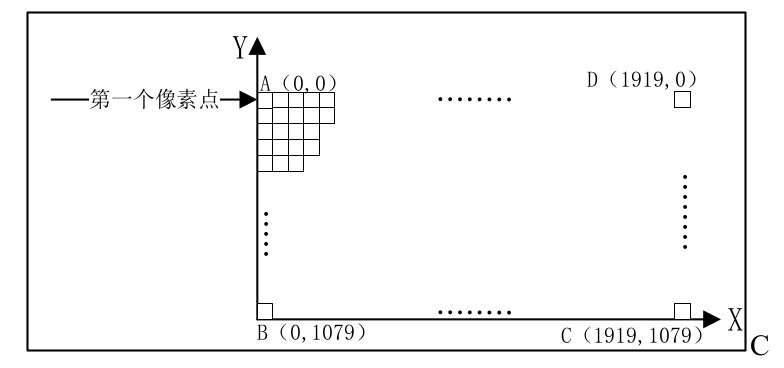
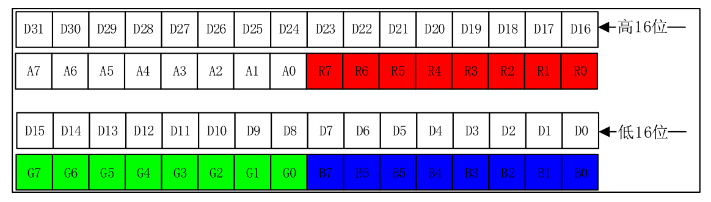
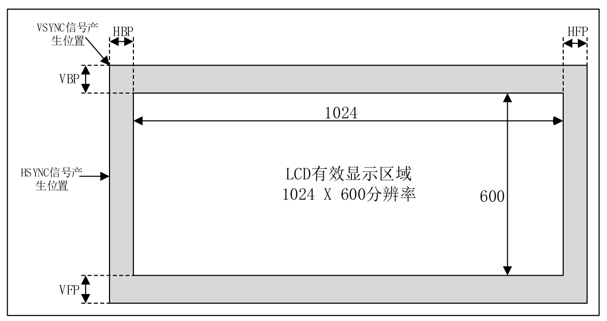

<!--
 * @Date: 2024-12-24
 * @LastEditors: GoKo-Son626
 * @LastEditTime: 2024-12-24
 * @FilePath: /1-STM32MP157/18-LCD.md
 * @Description: 
-->
# LCD

> LCD 是很常用的一个外，通过 LCD 可以显示绚丽的图片、界面等，提交人机交互的效率。STM32MP1 提供了一个 **LTDC** 接口用于连接 **RGB接口的液晶屏**

### 1. LCD和LTDC

##### 1. LCD

LCD 全称是 Liquid Crystal Display，也就是液晶显示器，是现在最常用到的显示器。手机、电脑、各种人机交互设备等基本都用到了 LCD，最常见就是手机和电脑显示器了。
LCD 的构造是在两片平行的玻璃基板当中放置液晶盒，下基板玻璃上设置 TFT（薄膜晶体管），上基板玻璃上设置彩色滤光片，通过 TFT 上的信号与电压改变来控制液晶分子的转动方向，从而达到控制每个像素点偏振光出射与否而达到显示目的。

1. 分辨率
1080P 的意思就是 LCD 屏幕上的像素数量是 1920*1080个，也就是这个屏幕一列 1080 个像素点，一共 1920 列
**LCD像素点排布**

- 左上角的 A 点是第一个像素点，右下角的 C 点就是最后一个像素点。2K 就是 2560*1440 个像素点，4K 是3840*2160 个像素点。很明显，在 LCD 尺寸不变的情况下，分辨率越高越清晰。同样的，分辨
率不变的情况下，LCD 尺寸越小越清晰。比如我们常用的 24 寸显示器基本都是 1080P 的，而我们现在使用的 5 寸的手机基本也是 1080P 
- LCD 显示器的分辨率是一个很重要的参数，但是并不是分辨率越高的 LCD 就越好。衡量一款 LCD 的好坏，分辨率只是其中的一个参数，还有色彩还原程度、色彩偏离、亮度、可视角度、屏幕刷新率等其他参数。

2. 像素格式

一个像素点相当于一个RGB灯，如何控制 R、G、B 这三种颜色的显示亮度呢？
一般一个像素点的 R、G、B 这三部分分别使用 8bit 的数据，那么一个像素点就是 8bit*3=24bit，也就是说一个像素点 3 个字节，这种像素格式称为 RGB888。如果再加入 8bit 的 Alpha(透明)通道的话一个
像素点就是 32bit，也就是 4 个字节，这种像素格式称为 ARGB8888。如果学习过 STM32 的话
应该还听过 RGB565 这种像素格式，在本章实验中我们使用 ARGB8888 这种像素格式，一个像
素占用 4 个字节的内存，这四个字节每个位的分配如图:
**ARGB8888 数据格式**

3. LCD

