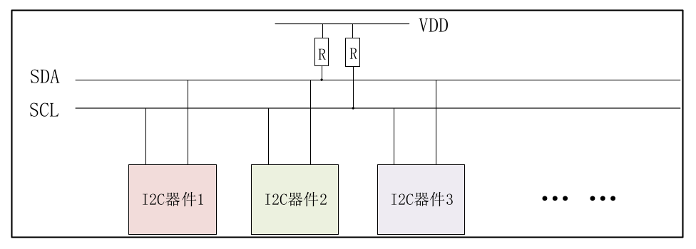
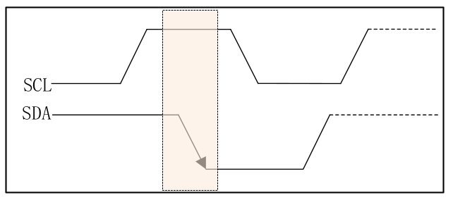
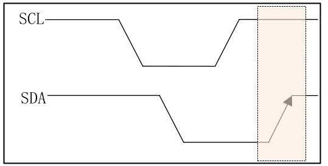
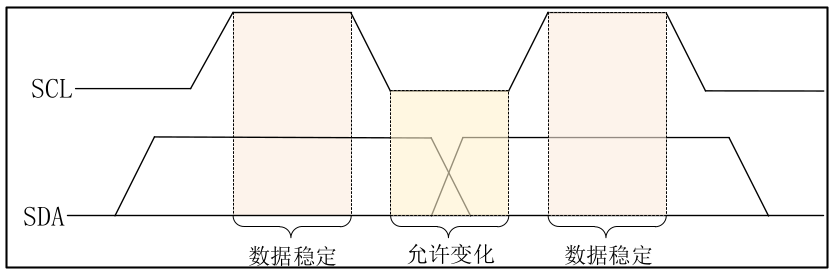
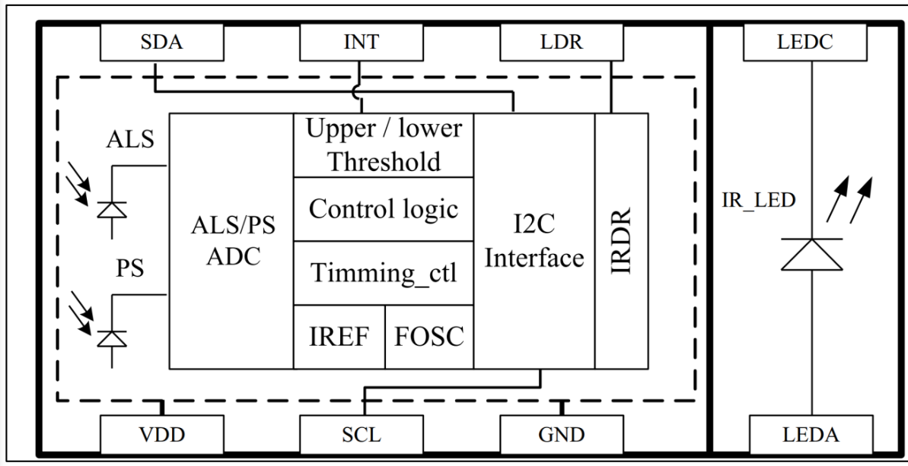
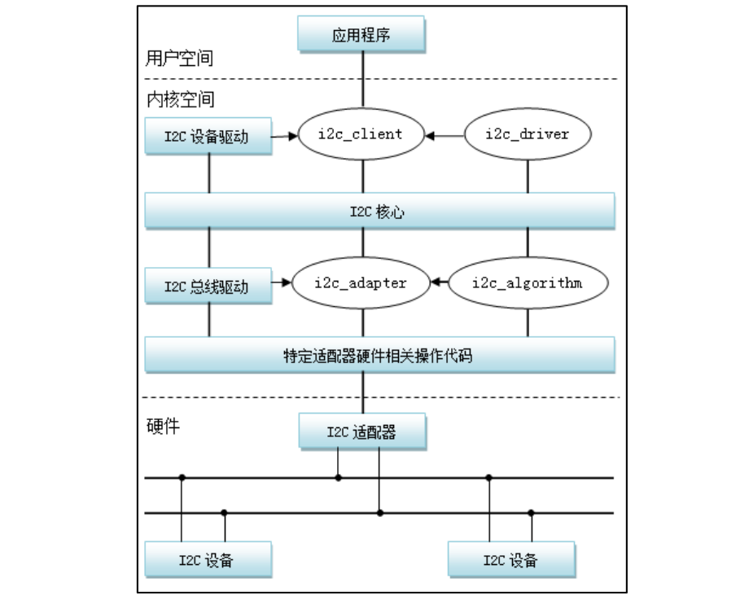
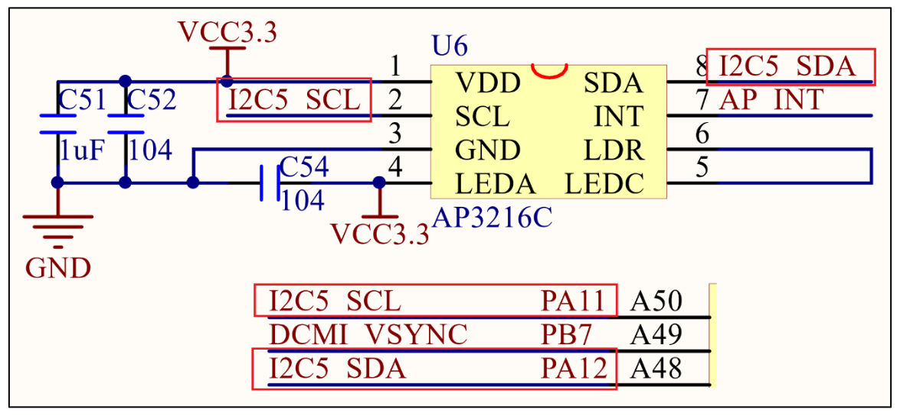

<!--
 * @Date: 2024-12-24
 * @LastEditors: GoKo-Son626
 * @LastEditTime: 2024-12-25
 * @FilePath: /1-STM32MP157/19-IIC.md
 * @Description: 
-->
# I2C

> - 在电子产品硬件设计当中，I2C 是一种很常见的同步、串行、低速、近距离通信接口，用于连接各种 IC、传感器等器件，它们都会提供 I2C 接口与 SoC 主控相连，比如陀螺仪、加速度计、触摸屏等，其最大优势在于可以在总线上扩展多个外围设备的支持。
> - Linux 内核开发者为了让驱动开发工程师在内核中方便的添加自己的 I2C 设备驱动程序，更容易的在 linux 下驱动自己的 I2C 接口硬件，进而引入了 I2C 总线框架。与 Linux 下的platform 虚拟总线不同的是，I2C 是实际的物理总线，所以 I2C 总线框架也是 Linux 下总线、设备、驱动模型的产物。

### 1. I2C & PA3216C

##### 1. I2CC

I2C 使用两条线在主控制器和从
机之间进行数据通信。一条是 SCL(串行时钟线)，另外一条是 SDA(串行数据线)，这两条数据
线需要接上拉电阻，总线空闲的时候 SCL 和 SDA 处于高电平。I2C 总线标准模式下速度可以
达到 100Kb/S，快速模式下可以达到 400Kb/S。I2C 总线工作是按照一定的协议来运行的

2C 是支持多从机的，也就是一个 I2C 控制器下可以挂多个 I2C 从设备，这些不同的 I2C
从设备有不同的器件地址，这样 I2C 主控制器就可以通过 I2C 设备的器件地址访问指定的 I2C
设备了，一个 I2C 总线连接多个 I2C 设备如图



图中 SDA 和 SCL 这两根线必须要接一个上拉电阻，一般是 4.7K。其余的 I2C 从
器件都挂接到 SDA 和 SCL 这两根线上，这样就可以通过 SDA 和 SCL 这两根线来访问多个 I2C
设备。
接下来看一下 I2C 协议有关的术语：
1. 起始位
在 SCL 为高电平的时候，SDA 出现下降沿就表示为起始位，如图：
**I2C通信起始位**

2. 停止位
在 SCL 位高电平的时候，SDA
出现上升沿就表示为停止位，如图所示：
**I2C通信停止位**

3. 数据传输
I2C 总线在数据传输的时候要保证在 SCL 高电平期间，SDA 上的数据稳定，因此 SDA 上
的数据变化只能在 SCL 低电平期间发生，如图所示：

4. 应答信号
当 I2C 主机发送完 8 位数据以后会将 SDA 设置为输入状态，等待 I2C 从机应答，也就是
等待 I2C 从机告诉主机它接收到数据了。应答信号是由从机发出的，主机需要提供应答信号所
需的时钟，主机发送完 8 位数据以后紧跟着的一个时钟信号就是给应答信号使用的。从机通过
将 SDA 拉低来表示发出应答信号，表示通信成功，否则表示通信失败。
5. I2C写时序
主机通过 I2C 总线与从机之间进行通信不外乎两个操作：写和读，I2C 总线单字节写时序
如图所示：

1)、开始信号。
2)、发送 I2C 设备地址，每个 I2C 器件都有一个设备地址，通过发送具体的设备地址来决定访问哪个 I2C 器件。这是一个 8 位的数据，其中高 7 位是设备地址，最后 1 位是读写位，为
1 的话表示这是一个读操作，为 0 的话表示这是一个写操作。
3)、 I2C 器件地址后面跟着一个读写位，为 0 表示写操作，为 1 表示读操作。
4)、从机发送的 ACK 应答信号。
5)、重新发送开始信号。
6)、发送要写写入数据的寄存器地址。
7)、从机发送的 ACK 应答信号。
8)、发送要写入寄存器的数据。
9)、从机发送的 ACK 应答信号。
10)、停止信号。

6. I2C读时序
I2C 总线单字节读时序如图所示:

I2C 单字节读时序比写时序要复杂一点，读时序分为 4 大步，第一步是发送设备地址，第
二步是发送要读取的寄存器地址，第三步重新发送设备地址，最后一步就是 I2C 从器件输出要
读取的寄存器值，我们具体来看一下这步。
1)、主机发送起始信号。
2)、主机发送要读取的 I2C 从设备地址。
3)、读写控制位，因为是向 I2C 从设备发送数据，因此是写信号。
4)、从机发送的 ACK 应答信号。
5)、重新发送 START 信号。
6)、主机发送要读取的寄存器地址。
7)、从机发送的 ACK 应答信号。
8)、重新发送 START 信号。
9)、重新发送要读取的 I2C 从设备地址。
10)、读写控制位，这里是读信号，表示接下来是从 I2C 从设备里面读取数据。
11)、从机发送的 ACK 应答信号。
12)、从 I2C 器件里面读取到的数据。
13)、主机发出 NO ACK 信号，表示读取完成，不需要从机再发送 ACK 信号了。
14)、主机发出 STOP 信号，停止 I2C 通信。

7. I2C多字节读写时序

有时候我们需要读写多个字节，多字节读写时序和单字节的基本一致，只是在读写数据的
时候可以连续发送多个自己的数据，其他的控制时序都是和单字节一样的。

##### 2. PA3216C

STM32MP157D 有 6 个 I2C 接口，其中 I2C4 和 I2C6 可以在 A7 安全模式或者 A7
非安全模式下使用，M4 无法使用，STM32MP157 的 I2C 部分特性如下：
①、兼容 I2C 总线规范第 03 版。
②、支持从模式和主模式，支持多主模式功能。
③、支持标准模式 (Sm)、快速模式 (Fm) 和超快速模式 (Fm+)，其中，标准模式100kHz，快速模式 400 kHz，超快速模式可以到 1 MHz。
④、7 位和 10 位寻址模式。
⑤、多个 7 位从地址，所有 7 位地址应答模式。
⑥、软件复位。
⑦、带 DMA 功能的 1 字节缓冲。
⑧、广播呼叫。

##### 3. PA3216C
STM32MP1 开发板上通过 I2C5 连接了一个三合一环境传感器：AP3216C，AP3216C 是由敦南科技推出的一款传感器，其支持环境光强度(ALS)、接近距离(PS)和红外线强度(IR)这三个环境参数检测。该芯片可以通过 IIC 接口与主控制相连，并且支持中断，AP3216C 的特点如下：
①、I2C 接口，快速模式下波特率可以到 400Kbit/S
②、多种工作模式选择：ALS、PS+IR、ALS+PS+IR、PD 等等。
③、内建温度补偿电路。
④、宽工作温度范围(-30°C ~ +80°C)。
⑤、超小封装，4.1mm x 2.4mm x 1.35mm
⑥、环境光传感器具有 16 位分辨率。
⑦、接近传感器和红外传感器具有 10 位分辨率。
- AP3216C 常被用于手机、平板、导航设备等，其内置的接近传感器可以用于检测是否有物体接近，比如手机上用来检测耳朵是否接触听筒，如果检测到的话就表示正在打电话，手机就会关闭手机屏幕以省电。也可以使用环境光传感器检测光照强度，可以实现自动背光亮度调节。AP3216C 结构如图所示：
**AP3216结构图**

- AP3216 的设备地址为 0X1E，同几乎所有的 I2C 从器件一样，AP3216C 内部也有一些寄存器，通过这些寄存器我们可以配置 AP3216C 的工作模式，并且读取相应的数据。

### 2. I2C总线框架

使用裸机方式编写需要实现主机驱动和设备驱动

I2C 主机驱动也就是 SoC 的 I2C 控制器对应的驱动程序，I2C 设备驱动其实就是挂在
I2C 总线下的具体设备对应的驱动程序，例如 eeprom、触摸屏 IC、传感器 IC 等；对于主机驱
动来说，一旦编写完成就不需要再做修改，其他的 I2C 设备直接调用主机驱动提供的 API 函
数完成读写操作即可。这个正好符合 Linux 的驱动分离与分层的思想，因此 Linux 内核也将
I2C 驱动分为两部分。
Linux 内核开发者为了让驱动开发工程师在内核中方便的添加自己的 I2C 设备驱动程序，
方便大家更容易的在 linux 下驱动自己的 I2C 接口硬件，进而引入了 I2C 总线框架，我们一般
也叫作 I2C 子系统，Linux 下 I2C 子系统总体框架如下所示：



由图可知，I2C子系统分为三大部分：
1. **I2C 核心(I2C-core)**
I2C 核心提供了 I2C 总线驱动（适配器）和设备驱动的注册、注销方法，I2C 通信方法
(algorithm)与具体硬件无关的代码，以及探测设备地址的上层代码等；
2. **I2C 总线驱动(I2C adapter)**
I2C 总线驱动是 I2C 适配器的软件实现，提供 I2C 适配器与从设备间完成数据通信的能力。
I2C 总线驱动由 i2c_adapter 和 i2c_algorithm 来描述。I2C 适配器是 SoC 中内置 i2c 控制器的软
件抽象，可以理解为他所代表的是一个 I2C 主机；
3. **I2C 设备驱动(I2C client driver)**
包括两部分：设备的注册和驱动的注册。
I2C 子系统帮助内核统一管理 I2C 设备，让驱动开发工程师在内核中可以更加容易地添加
自己的 I2C 设备驱动程序。

##### 1. I2C总线驱动

对于 I2C 而言，不需要虚拟出一条总线，直接使用 I2C
总线即可。I2C 总线驱动重点是 I2C 适配器(也就是 SoC 的 I2C 接口控制器)驱动，这里要用到
两个重要的数据结构：i2c_adapter 和 i2c_algorithm，I2C 子系统将 SoC 的 I2C 适配器(控制器)抽
象成一个 i2c_adapter 结构体，i2c_adapter 结构体定义在 include/linux/i2c.h 文件中

```c
685 struct i2c_adapter {
686     struct module *owner;
687     unsigned int class;
688     const struct i2c_algorithm *algo;
689     void *algo_data;
690     ..........
713     struct irq_domain *host_notify_domain;
714 };
```
- 688 行，i2c_algorithm 类型的指针变量 algo，对于一个 I2C 适配器，肯定要对外提供
读写 API 函数，设备驱动程序可以使用这些 API 函数来完成读写操作。i2c_algorithm 就是
I2C 适配器与 IIC 设备进行通信的方法。
```c
526 struct i2c_algorithm {
        ......
536     int (*master_xfer)(struct i2c_adapter *adap,
                        struct i2c_msg *msgs, 
537                     int num);
538     int (*master_xfer_atomic)(struct i2c_adapter *adap,
539                     struct i2c_msg *msgs, int num);
540     int (*smbus_xfer)(struct i2c_adapter *adap, u16 addr,
541                     unsigned short flags, char read_write,
542                     u8 command, int size, union i2c_smbus_data *data);
543     int (*smbus_xfer_atomic)(struct i2c_adapter *adap, u16 addr,
544                     unsigned short flags, char read_write,
545                     u8 command, int size, union i2c_smbus_data *data);
        ......
```
- 536 行，master_xfer 就是 I2C 适配器的传输函数，可以通过此函数来完成与 IIC 设备之
间的通信。
- 540 行，smbus_xfer 就是 SMBUS 总线的传输函数。smbus 协议是从 I2C 协议的基础上
发展而来的，他们之间有很大的相似度，SMBus 与 I2C 总线之间在时序特性上存在一些差别，
应用于移动 PC 和桌面 PC 系统中的低速率通讯
- 综上所述，I2C 总线驱动，或者说 I2C 适配器驱动的主要工作就是初始化 i2c_adapter 结构
体变量，然后设置 i2c_algorithm 中的 master_xfer 函数。完成以后通过 i2c_add_numbered_adapter
或 i2c_add_adapter 这两个函数向 I2C 子系统注册设置好的 i2c_adapter，
这两个函数的原型如下：
int i2c_add_adapter(struct i2c_adapter *adapter)
int i2c_add_numbered_adapter(struct i2c_adapter *adap)
这 两 个 函 数 的 区 别 在 于 i2c_add_adapter 会 动 态 分 配 一 个 总 线 编 号 ， 而
i2c_add_numbered_adapter 函数则指定一个静态的总线编号。函数参数和返回值含义如下：
adapter 或 adap：要添加到 Linux 内核中的 i2c_adapter，也就是 I2C 适配器。
返回值：0，成功；负值，失败。
如果要删除 I2C 适配器的话使用 i2c_del_adapter 函数即可，函数原型如下：
void i2c_del_adapter(struct i2c_adapter * adap)
函数参数和返回值含义如下：
adap：要删除的 I2C 适配器。
返回值：无。

##### 2. I2C总线设备

I2C 设备驱动重点关注两个数据结构：i2c_client 和 i2c_driver，根据总线、设备和驱动模型，
I2C 总线上一小节已经讲了。还剩下设备和驱动，i2c_client 用于描述 I2C 总线下的设备，
i2c_driver 则用于描述 I2C 总线下的设备驱动，类似于 platform 总线下的 platform_device 和
platform_driver。

1. i2c_client 结构体
i2c_client 结构体：
```c
313 struct i2c_client {
314     unsigned short flags;/* div., see below */
        ......
328     struct i2c_adapter *adapter;/* the adapter we sit on */
329     struct device dev;/* the device structure */
330     int init_irq;/* irq set at initialization */
331     int irq;/* irq issued by device */
332     struct list_head detected;
333 #if IS_ENABLED(CONFIG_I2C_SLAVE)
334     i2c_slave_cb_t slave_cb;
335 #endif
336 };
```
2. i2c_driver 结构体
i2c_driver 类似 platform_driver，是我们编写 I2C 设备驱动重点要处理的内容
```c
253
254
struct i2c_driver {
unsigned int class;
255
256/* Standard driver model interfaces */
257int (*probe)(struct i2c_client *client,
const struct i2c_device_id *id);
258
int (*remove)(struct i2c_client *client);
259
260/* New driver model interface to aid the seamless removal of
261* the current probe()'s, more commonly unused than used
262second parameter.*/
263int (*probe_new)(struct i2c_client *client);
264
265
266
/* driver model interfaces that don't relate to enumeration
void (*shutdown)(struct i2c_client *client);
267
268/* Alert callback, for example for the SMBus alert protocol.
269* The format and meaning of the data value depends on the
270* protocol. For the SMBus alert protocol, there is a single
271* bit of data passed as the alert response's low bit ("event
272* flag"). For the SMBus Host Notify protocol, the data
273* corresponds to the 16-bit payload data reported by the
274slave device acting as master.*/
275void (*alert)(struct i2c_client *client,
enum i2c_alert_protocol protocol,
276
unsigned int data);
277
278/* a ioctl like command that can be used to perform specific
279* functions with the device.
280*/
281int (*command)(struct i2c_client *client, unsigned int cmd,
void *arg);
282
283struct device_driver driver;
284const struct i2c_device_id *id_table;
285
286/* Device detection callback for automatic device creation */
287int (*detect)(struct i2c_client *client,
struct i2c_board_info *info);
288const unsigned short *address_list;
289struct list_head clients;
290
291
292
bool disable_i2c_core_irq_mapping;
};
第 257 行，当 I2C 设备和驱动匹配成功以后 probe 函数就会执行，和 platform 驱动一样。
第 283 行，device_driver 驱动结构体，如果使用设备树的话，需要设置 device_driver 的
of_match_table 成员变量，也就是驱动的兼容(compatible)属性。
第 284 行，id_table 是传统的、未使用设备树的设备匹配 ID 表。
对于我们 I2C 设备驱动编写人来说，重点工作就是构建 i2c_driver，构建完成以后需要向
I2C 子系统注册这个 i2c_driver。i2c_driver 注册函数为 int i2c_register_driver，此函数原型如下：
int i2c_register_driver(struct module   *owner,
                        struct i2c_driver       *driver)
函数参数和返回值含义如下：
owner：一般为 THIS_MODULE。
driver：要注册的 i2c_driver。
返回值：0，成功；负值，失败。
另外 i2c_add_driver 也常常用于注册 i2c_driver，i2c_add_driver 是一个宏


844     #define i2c_add_driver(driver) \
845             i2c_register_driver(THIS_MODULE, driver)
i2c_add_driver 就是对 i2c_register_driver 做了一个简单的封装，只有一个参数，就是要注册的 i2c_driver。
注销 I2C 设备驱动的时候需要将前面注册的 i2c_driver 从 I2C 子系统中注销掉，需要用到i2c_del_driver 函数，此函数原型如下：
void i2c_del_driver(struct i2c_driver *driver)
函数参数和返回值含义如下：
driver：要注销的 i2c_driver
返回值：无
```

##### 3. I2C设备和驱动匹配过程
I2C 设备和驱动的匹配过程是由 I2C 子系统核心层来完成的

I2C 核心提供了一些与具体硬件无关的 API 函数，比如前面讲过的：
1、i2c_adapter 注册/注销函数
int i2c_add_adapter(struct i2c_adapter *adapter)
int i2c_add_numbered_adapter(struct i2c_adapter *adap)
void i2c_del_adapter(struct i2c_adapter * adap)
2、i2c_driver 注册/注销函数
int i2c_register_driver(struct module *owner, struct i2c_driver *driver)
int i2c_add_driver (struct i2c_driver *driver)
void i2c_del_driver(struct i2c_driver *driver)
设备和驱动的匹配过程也是由核心层完成的，I2C 总线的数据结构为 i2c_bus_type，
```c
492 struct bus_type i2c_bus_type = {
493     .name = "i2c",
494     .match = i2c_device_match,
495     .probe = i2c_device_probe,
496     .remove = i2c_device_remove,
497     .shutdown = i2c_device_shutdown,
498 };
```
.match即I2C总线的设备和驱动匹配函数
```c
93 static int i2c_device_match(struct device *dev,
struct device_driver *drv)
94
{
95struct i2c_client*client = i2c_verify_client(dev);
96struct i2c_driver*driver;
97
98
99/* Attempt an OF style match */
100if (i2c_of_match_device(drv->of_match_table, client))
101
return 1;
102
103/* Then ACPI style match */
104if (acpi_driver_match_device(dev, drv))
105
return 1;
106
107
driver = to_i2c_driver(drv);
108
109/* Finally an I2C match */
110if (i2c_match_id(driver->id_table, client))
111
return 1;
112
113
return 0;
114 }
- 100行，i2c_of_match_device 函数用于完成设备树中定义的设备与驱动匹配过程。比较I2C 设备节点的 compatible 属性和 of_device_id 中的 compatible 属性是否相等，如果相当的话就表示 I2C 设备和驱动匹配。
- 104 行，acpi_driver_match_device 函数用于 ACPI 形式的匹配。
- 110 行，i2c_match_id 函数用于传统的、无设备树的 I2C 设备和驱动匹配过程。比较 I2C设备名字和 i2c_device_id 的 name 字段是否相等，相等的话就说明 I2C 设备和驱动匹配成功。
```

### 3. STM32MP1 I2C 适配器驱动分析

I2C 适配器驱动就是 SoC 的 I2C 控制器驱动,在内核源码 arch/arm/boot/dts/stm32mp151.dtsi 设备树文件中找到STM32MP1 的 I2C 控制器节点

STM32MP1 的 I2C 适配器驱动是个标准的 platform 驱动，由
此可以看出，虽然 I2C 总线为别的设备提供了一种总线驱动框架，但是 I2C 适配器却是 platform
驱动。就像你的部门老大是你的领导，你是他的下属，但是放到整个公司，你的部门老大却也
是老板的下属。

所以，同样是先匹配comptible，然后执行probe函数

- stm32f7_i2c_probe 函数主要的工作就是一下两点：
①、初始化 i2c_adapter，设置 i2c_algorithm 为 stm32f7_i2c_algo，最后向 Linux 内核注
册 i2c_adapter。
②、初始化 I2C1 控制器的相关寄存器。stm32f7_i2c_algo 包含 I2C1 适配器与 I2C 设备
的通信函数 master_xfer，stm32f7_i2c_algo 结构体定义如下：

### 4. I2C设备驱动编写流程

1. 设备信息
- 未使用设备树
定义一个设备结构体描述设备信息，type 和 addr 这两个成员变量是必须要设置的

- 使用设备树
使用设备树的时候 I2C 设备信息通过创建相应的节点就行了，比如在我们的 STM32MP1 的
开发板上有一个 I2C 器件 AP3216C，这是三合一的环境传感器，并且该器件挂在 STM32MP1
I2C5 总线接口上，因此必须在 i2c5 节点下创建一个子节点来描述 AP3216C 设备，节点示例如
下所示：
```c
1 &i2c5 {
2pinctrl-names = "default", "sleep";
3pinctrl-0 = <&i2c5_pins_a>;
4pinctrl-1 = <&i2c5_pins_sleep_a>;
5status = "okay";
6
7
ap3216c@1e {
8compatible = " alientek,ap3216c";
9reg = <0x1e>;
10
11
};
}；
```
第 2~4 行，设置了 i2c5 的 pinmux 的配置。
第 7~10 行，向 i2c5 添加 ap3216c 子节点，第 7 行“ap3216c@1e”是子节点名字，
“@”后
面的“1e”就是 ap3216c 的 I2C 器件地址。第 8 行设置 compatible 属性值为“alientek,ap3216c”
第 9 行的 reg 属性也是设置 ap3216c 的器件地址的，因此值为 0x1e。I2C 设备节点的创建重点
是 compatible 属性和 reg 属性的设置，一个用于匹配驱动，一个用于设置器件地址。

2. 设备数据收发处理流程
2C 设备驱动首先要做的就是初始化 i2c_driver 并向 Linux 内核
注册。当设备和驱动匹配以后 i2c_driver 里面的 probe 函数就会执行，probe 函数里面所做的就
是字符设备驱动那一套了。一般需要在 probe 函数里面初始化 I2C 设备，要初始化 I2C 设备就
必须能够对 I2C 设备寄存器进行读写操作，这里就要用到 i2c_transfer 函数了。i2c_transfer 函数
最终会调用 I2C 适配器中 i2c_algorithm 里面的 master_xfer 函数，对于 STM32MP1 而言就是
stm32f7_i2c_xfer 这个函数。i2c_transfer 函数原型如下：
int i2c_transfer(struct i2c_adapter
*adap,
struct i2c_msg
*msgs,
int
num)
函数参数和返回值含义如下：
adap：所使用的 I2C 适配器，i2c_client 会保存其对应的 i2c_adapter。
msgs：I2C 要发送的一个或多个消息。
num：消息数量，也就是 msgs 的数量。
返回值：负值，失败，其他非负值，发送的 msgs 数量。

### 5. 硬件原理图分析

**AP3216C原理图**


### 6. 实验编写

##### 1. 设备树修改
1. IO口的修改或添加
2. 在i2c5节点追加ap3216子节点
- /sys/bus/i2c/devices下0-001e就是ap3216的设备目录

##### 2. 驱动编写


