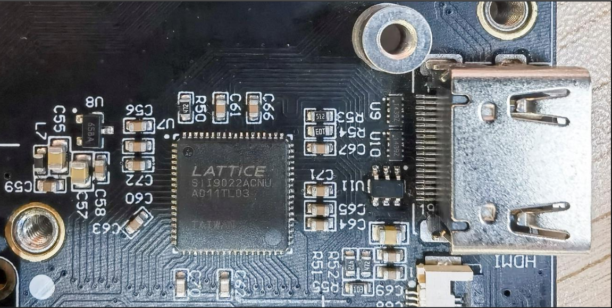
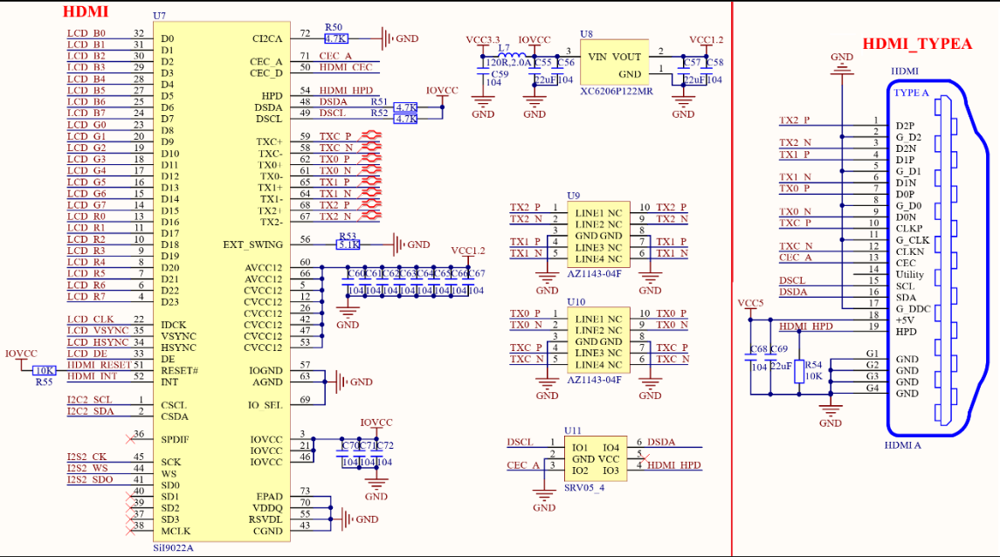

<!--
 * @Date: 2024-12-26
 * @LastEditors: GoKo-Son626
 * @LastEditTime: 2024-12-27
 * @FilePath: /1-STM32MP157/20-RGB_to_HDMI.md
 * @Description: 
-->
# RGB_to_HDMI

> 通过 RGB 转 HDMI 芯片将 RGB信号转为 HDMI 信号，这样就可以连接 HDMI 显示器

### 1. RGB转HMDI
- STM32MP157 这颗 SOC 没有 HDMI 外设，只有 RGB 屏幕接口，因此只能通过 RGB 转HDMI 的芯片来实现 HDMI 连接。效果肯定是没法和原生支持 HDMI 接口的 SOC 比，当个玩具来玩一下还是可以的。因此本质上来讲还是 RGB 驱动，并非原生的 HDM 驱动。
- 正点原子的 STM32MP1 开发板提供了 RGB 转 HDM 模块，如图 42.1.1 所示：

- SiI9022A 是一款 HDMI 传输芯片，适用于高清便携相机、数字相机和个人移动设备，可以灵活的将其他音视频接口转换为 HDMI 或者 DVI 格式。SiI9022A 支持预编程 HDCP 键码，可以完全自动进行 HDCP 检测和鉴定。SiI9022A 是一个视频转换芯片，支持输入视频格式有：xvYCC、BTA-T1004、ITU-R.656，内置 DE 发生器支持 SYNC 格式(RGB 格式)。输出格式支持：HDMI、HDCP 和 DVI、最高支持 1080P 视频输出、支持 HDMI A、HDMI C 和 Micro-D 连接器。SiI9022A 功能非常多，具体使用什么功能需要进行配置，因此 SiI9022A 提供了一个 I2C 接口用于配置。

### 2. 硬件原理图分析

**SiI9022A原理图**

- 上图就是板载的 HDMI 接口，在图中可以看出 HDMI 模块分为 4 部分：RGB 接口、I2C2接口、I2S2 音频接口和 HDMI_CEC 接口。主要还是使用 RGB 接口引脚获取显示数据，SiI9022A使用 I2C 来进行配置，这里使用 STM32MP1 的 I2C2 接口，使用到了到 PH4 和 PH5 这两个引脚。另外还有一个中断 INT 一个复位 HDMI_RESET 分别连接到 PH6 和 PA3 引脚上。在本章节里主要是实现 HDMI 的显示功能，其它接口就不用管它。

### 3. 驱动编写

- 修改设备树
1. 设置 I2C2 的 pinmux
2. 添加HDMI的电源节点
3. 在i2c2节点追加HDMI子节点
- 使能自带的SiI9022A驱动
> -> Device Drivers
>       -> Graphics support
>               -> Display Interface Bridges
>                       -> <*> Silicon Image sii902x RGB/HDMI bridge //选中

