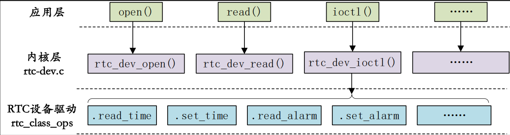

<!--
 * @Date: 2024-12-27
 * @LastEditors: GoKo-Son626
 * @LastEditTime: 2024-12-27
 * @FilePath: /1-STM32MP157/21-RTC.md
 * @Description: 
-->
# RTC

> RTC 也就是实时时钟，用于记录当前系统时间，对于 Linux 系统而言时间是非常重要的，就和我们使用 Windows 电脑或手机查看时间一样，我们在使用 Linux 设备的时候也需要查看时间

### 1. RTC驱动

RTC 设备驱动是一个标准的字符设备驱动，应用程序通过 open、release、read、write 和 ioctl等函数完成对 RTC 设备的操作，本章我们主要学习如何使用 STM32MP1 内部自带的 RTC 外设。

Linux 内核将 RTC 设备抽象为 rtc_device 结构体，因此 RTC 设备驱动就是申请并初始化
rtc_device，最后将 rtc_device 注册到 Linux 内核里面，这样 Linux 内核就有一个 RTC 设备的。
至于 RTC 设备的操作肯定是用一个操作集合(结构体)来表示的，我们先来看一下 rtc_device 构
体，此结构体定义在 include/linux/rtc.h 文件中

```c
struct rtc_device {
    struct device dev;                 /* RTC 设备基本信息 */
    struct module *owner;              /* 模块所有者 */
    
    int id;                            /* 设备 ID */
    const struct rtc_class_ops *ops;   /* RTC 操作函数 */
    struct mutex ops_lock;             /* 用于同步访问 RTC 操作函数的锁 */
    
    struct cdev char_dev;              /* 字符设备 */
    unsigned long flags;               /* 字符设备标志位 */
    
    unsigned long irq_data;            /* 中断数据 */
    spinlock_t irq_lock;               /* 中断锁 */
    wait_queue_head_t irq_queue;       /* 中断等待队列 */
    struct fasync_struct *async_queue; /* 异步 I/O 请求队列 */
    
    int irq_freq;                      /* 中断频率 */
    int max_user_freq;                 /* 用户可设置的最大频率 */
    
    struct timerqueue_head timerqueue; /* RTC 定时器队列 */
    struct rtc_timer aie_timer;        /* 自动中断事件定时器 */
    struct rtc_timer uie_rtctimer;     /* 用户中断事件定时器 */
    struct hrtimer pie_timer;          /* 高精度定时器用于子秒事件 */
    
    int pie_enabled;                   /* 是否启用子秒事件定时器 */
    
    struct work_struct irqwork;        /* 中断处理工作队列 */
    
    int uie_unsupported;               /* 硬件不支持 UIE 模式标志 */

    ......
};
```
**ops成员变量**:操作函数集合
```c
75 struct rtc_class_ops {
76      int (*ioctl)(struct device *, unsigned int, unsigned long);
77      int (*read_time)(struct device *, struct rtc_time *);
78      int (*set_time)(struct device *, struct rtc_time *);
79      int (*read_alarm)(struct device *, struct rtc_wkalrm *);
80      int (*set_alarm)(struct device *, struct rtc_wkalrm *);
81      int (*proc)(struct device *, struct seq_file *);
82      int (*alarm_irq_enable)(struct device *, unsigned int enabled);
83      int (*read_offset)(struct device *, long *offset);
84      int (*set_offset)(struct device *, long offset);
85 };
```
tc_class_ops 中 的 这 些 函 数 只 是 最 底 层 的 RTC 设 备 操 作 函 数 ， 并 不 是 提 供 给 应 用 层 的
file_operations 函数操作集。RTC 是个字符设备，那么肯定有字符设备的 file_operations 函数操
作集，Linux 内核提供了一个 RTC 通用字符设备驱动文件
```c
431 static const struct file_operations rtc_dev_fops = {
432 .owner = THIS_MODULE,
433 .llseek = no_llseek,
434 .read = rtc_dev_read,
435 .poll = rtc_dev_poll,
436 .unlocked_ioctl = rtc_dev_ioctl,
437 .open = rtc_dev_open,
438 .release = rtc_dev_release,
439 .fasync = rtc_dev_fasync,
440 };
```
标准的字符设备操作集。应用程序可以通过 ioctl 函数来设置/读取时间、设置/读取闹钟的操作，对应的 rtc_dev_ioctl 函数就会执行。 rtc_dev_ioctl最终会通过操作 rtc_class_ops 中的 read_time、set_time 等函数来对具体 RTC 设备的读写操作。我们简单来看一下 rtc_dev_ioctl 函数
```c
static long rtc_dev_ioctl(struct file *file, unsigned int cmd, unsigned long arg)
{
    int err = 0;
    struct rtc_device *rtc = file->private_data;        /* 获取 RTC 设备 */
    const struct rtc_class_ops *ops = rtc->ops;        /* 获取 RTC 操作函数 */
    struct rtc_time tm;                                /* RTC 时间结构 */
    struct rtc_wkalrm alarm;                           /* RTC 报警结构 */
    void __user *uarg = (void __user *)arg;            /* 用户空间指针 */

    err = mutex_lock_interruptible(&rtc->ops_lock);    /* 获取锁 */
    if (err) {
        return err;                                   /* 如果获取锁失败，返回错误 */
    }

    /* Handle the ioctl commands */
    switch (cmd) {

    case RTC_RD_TIME:
        /* 读取时间 */
        mutex_unlock(&rtc->ops_lock);                  /* 解锁 */
        err = rtc_read_time(rtc, &tm);                  /* 读取 RTC 时间 */
        if (err < 0) {
            return err;                               /* 读取失败返回错误 */
        }

        if (copy_to_user(uarg, &tm, sizeof(tm))) {      /* 将时间数据复制到用户空间 */
            err = -EFAULT;                             /* 如果复制失败，返回 EFAULT 错误 */
        }
        return err;

    case RTC_SET_TIME:
        /* 设置时间 */
        mutex_unlock(&rtc->ops_lock);                  /* 解锁 */
        if (copy_from_user(&tm, uarg, sizeof(tm))) {    /* 从用户空间获取时间 */
            return -EFAULT;                            /* 如果复制失败，返回 EFAULT 错误 */
        }
        return rtc_set_time(rtc, &tm);                  /* 设置 RTC 时间 */

    /* Other ioctl commands can be added here */

    default:
        /* 默认处理：尝试调用驱动程序的 ioctl 接口 */
        if (ops->ioctl) {
            err = ops->ioctl(rtc->dev.parent, cmd, arg);/* 调用 RTC 操作函数 */
            if (err == -ENOIOCTLCMD) {
                err = -ENOTTY;                        /* 不支持的命令，返回 ENOTTY 错误 */
            }
        } else {
            err = -ENOTTY;                             /* 如果没有 ioctl 接口，返回 ENOTTY 错误 */
        }
        break;
    }

done:
    mutex_unlock(&rtc->ops_lock);                      /* 解锁 */
    return err;                                        /* 返回结果 */
}
```

- RTC_RD_TIME 为时间读取命令
- 如果是读取时间命令的话就调用 rtc_read_time 函数获取当前 RTC 时钟，rtc_read_time 会调用
 **__rtc_read_time 函数**
```c
static int __rtc_read_time(struct rtc_device *rtc, struct rtc_time *tm)
{
    int err;

    if (!rtc->ops) {
        err = -ENODEV;   /* 如果没有 RTC 操作函数，返回设备未找到错误 */
    } else if (!rtc->ops->read_time) {
        err = -EINVAL;   /* 如果没有实现 read_time 操作，返回无效参数错误 */
    } else {
        memset(tm, 0, sizeof(struct rtc_time));  /* 清空时间结构 */
        err = rtc->ops->read_time(rtc->dev.parent, tm);  /* 调用驱动程序的 read_time 函数 */
        if (err < 0) {
            dev_dbg(&rtc->dev, "read_time: fail to read: %d\n", err);  /* 调试日志，读取失败 */
            return err;
        }

        rtc_add_offset(rtc, tm);  /* 如果读取成功，添加 RTC 偏移量 */
        
        err = rtc_valid_tm(tm);  /* 验证时间是否合法 */
        if (err < 0) {
            dev_dbg(&rtc->dev, "read_time: rtc_time isn't valid\n");  /* 调试日志，时间无效 */
        }
    }
    return err;
}
```
- 94 行可以看出，__rtc_read_time 函数会通过调用 rtc_class_ops 中的 read_time 成员变量来从 RTC 设备中获取当前时间。rtc_dev_ioctl 函数对其他的命令处理都是类似的，比如RTC_ALM_READ 命令会通过 rtc_read_alarm 函数获取到闹钟值，而 rtc_read_alarm 函数经过层层调用，最终会调用 rtc_class_ops 中的 read_alarm 函数来获取闹钟值

**Linux 内核中 RTC 驱动调用流程**


当 rtc_class_ops 准备好以后需要将其注册到 Linux 内核中，这里我们可以使用rtc_device_register函数完成注册工作。此函数会申请一个rtc_device并且初始化这个rtc_device，
最后向调用者返回这个 rtc_device，此函数原型如下：
```c
struct rtc_device *rtc_device_register(const char *name, 
        const struct rtc_class_ops *ops,
        struct module *owner)
        struct device *dev,
```
函数参数和返回值含义如下：
name：设备名字。
dev：设备。
ops：RTC 底层驱动函数集。
owner：驱动模块拥有者。
返回值：注册成功的话就返回 rtc_device，错误的话会返回一个负值。
当卸载 RTC 驱动的时候需要调用 rtc_device_unregister 函数来注销注册的 rtc_device，函数
原型如下：
void rtc_device_unregister(struct rtc_device *rtc)
函数参数和返回值含义如下：
rtc：要删除的 rtc_device。
返回值：无。
还有另外一对 rtc_device 注册函数 devm_rtc_device_register 和 devm_rtc_device_unregister，
分别为注册和注销 rtc_device。

### 2. 内部RTC驱动分析
```c
1746 rtc: rtc@5c004000 {
1747    compatible = "st,stm32mp1-rtc";
1748    reg = <0x5c004000 0x400>;
1749    clocks = <&scmi0_clk CK_SCMI0_RTCAPB>,
1750            <&scmi0_clk CK_SCMI0_RTC>;
1751    clock-names = "pclk", "rtc_ck";
1752    interrupts-extended = <&exti 19 IRQ_TYPE_LEVEL_HIGH>;
1753    status = "disabled";
1754 };
```
- 驱动也是使用标准的platform框架

### 3. RTC时间查看与设置

1. 使能内部RTC
```c
&rtc {
        status = "okay";
};
```
2. 查看时间
> date
3. 相关命令
> date --help
4. 设置时间"2021年5月2号 18:53:00"
> date -s "2021-05-02 18:53:00"
5. 将系统时间写入到RTC里面
> hwclock -w