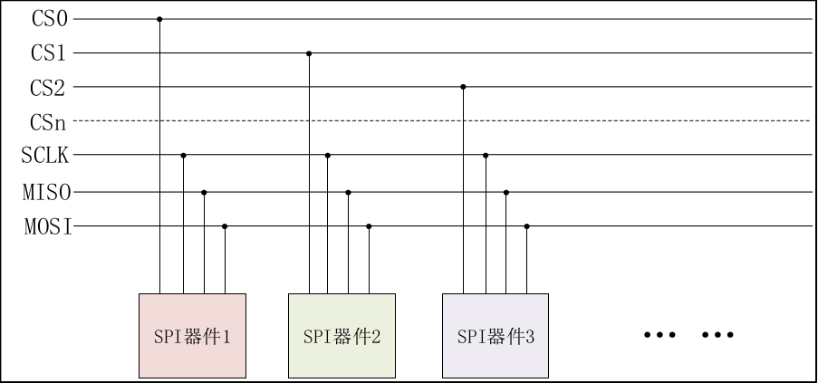
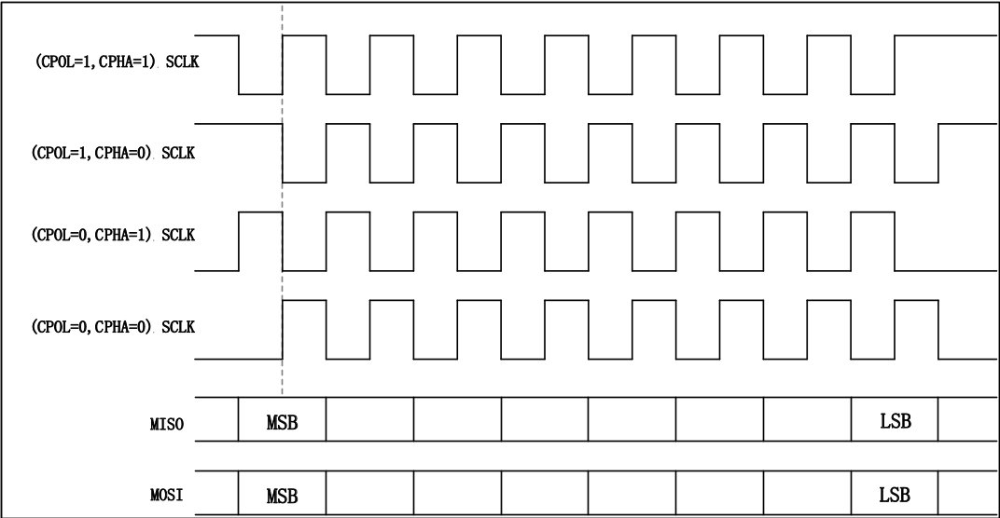
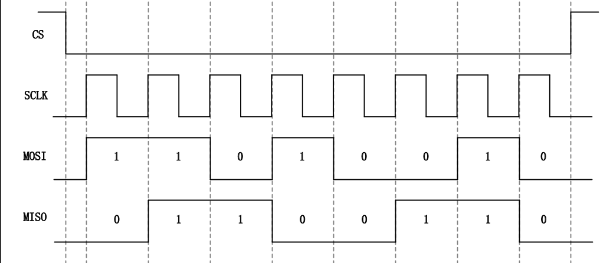
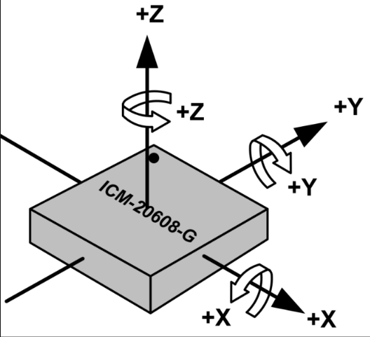
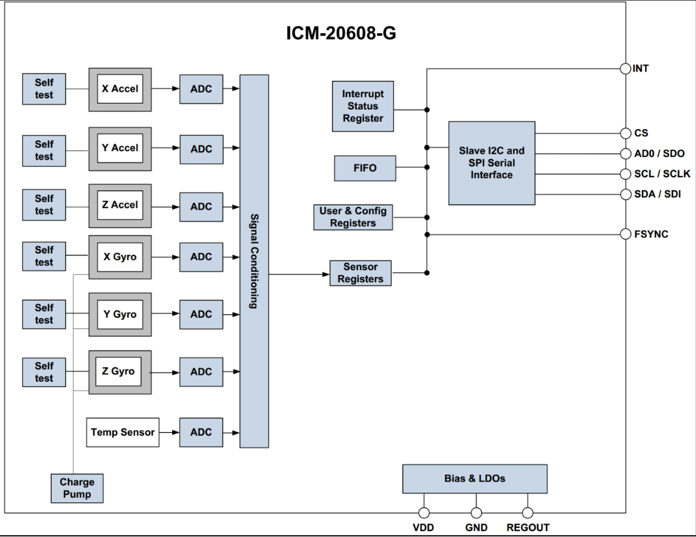

<!--
 * @Date: 2024-12-27
 * @LastEditors: GoKo-Son626
 * @LastEditTime: 2024-12-29
 * @FilePath: /1-STM32MP157/23-SPI.md
 * @Description: 
-->
# SPI

> 已经了解了Linux 下的 platform 总线框架、I2C 总线框架,本章节将学习Linux下的 SPI 总线框架。与 I2C 总线一样,SPI 是物理总线,也是一种很常用的串行通信协议；本章我们就来学习如何在 Linux 下编写 SPI 总线接口的设备驱动。本章实验的最终目的就是驱动 STM32MP1 开发板上的 **ICM-20608** 这个 SPI 接口的六轴传感器,可以在应用程序中读取 ICM-20608 的原始传感器数据。

### 1. SPI & ICM-20608

##### 1. SPI

**标准的4线SPI**
1. I2C 是串行通信的一种,只需要两根线就可以完成主机和从机之间的通信,但是 I2C 的速度最高只能到400KHz,如果对于访问速度要求比价高的话 I2C 就不适合了。本章我们就来学习一下另外一个和 I2C 一样广泛使用的串行通信:SPI,SPI 全称是 SerialPerripheral Interface,也就是串行外围设备接口。SPI 是 Motorola 公司推出的一种同步串行接口技术,是一种高速、全双工的同步通信总线,SPI 时钟频率相比 I2C 要高很多,最高可以工作在上百 MHz。SPI 以主从方式工作,通常是有一个主设备和一个或多个从设备,一般 SPI 需要4 根线,但是也可以使用三根线(单向传输),本章我们讲解标准的 4 线 SPI,这四根线如下:①、CS/SS,Slave Select/Chip Select,这个是片选信号线,用于选择需要进行通信的从设备。I2C 主机是通过发送从机设备地址来选择需要进行通信的从机设备的,SPI 主机不需要发送从机设备,直接将相应的从机设备片选信号拉低即可。
2. SCK,Serial Clock,串行时钟,和 I2C 的 SCL 一样,为 SPI 通信提供时钟。
3. MOSI/SDO,Master Out Slave In/Serial Data Output,简称主出从入信号线,这根数据线只能用于主机向从机发送数据,也就是主机输出,从机输入。
4. MISO/SDI,Master In Slave Out/Serial Data Input,简称主入从出信号线,这根数据线只能用户从机向主机发送数据,也就是主机输入,从机输出。

**SPI 通信都是由主机发起的**,主机需要提供通信的时钟信号。主机通过 SPI 线连接多个从设备的结构如图 45.1.1.1 所示:

SPI 有四种工作模式,通过串行时钟极性(CPOL)和相位(CPHA)的搭配来得到四种工作模式:
1. CPOL=0,串行时钟空闲状态为低电平。
2. CPOL=1,串行时钟空闲状态为高电平,此时可以通过配置时钟相位(CPHA)来选择具体的传输协议。
3. CPHA=0,串行时钟的第一个跳变沿(上升沿或下降沿)采集数据。
4. CPHA=1,串行时钟的第二个跳变沿(上升沿或下降沿)采集数据。
**SPI四种工作模式**

以 CPOL=0,CPHA=0 这个工作模式为例,SPI 进行全双工通信的时序如图
**SPI时序图**

- SPI 的时序图很简单,不像 I2C 那样还要分为读时序和写时序,因为 SPI 是全双工的,所以读写时序可以一起完成。图 45.1.1.3 中,CS 片选信号先拉低,选中要通信的从设备,然后通过 MOSI 和 MISO 这两根数据线进行收发数据,MOSI 数据线发出了0XD2 这个数据给从设备,同时从设备也通过 MISO 线给主设备返回了 0X66 这个数据。这个就是 SPI 时序图。

##### 2. STM32MP1 SPI 简介
STM32MP1 自带的 SPI 全称为:Serial peripheral interface。SPI 特性如下:
- 全双工同步串口接口。
- 半双工模式。
- 可配置的主/从模式。
- 支持 I2S 协议。
- 在达到 FIFO 阈值、超时、操作完成以及发生访问错误时产生中断。
- 允许 16 位,24 位或者 32 位数据长度。
- 支持软件片选和硬件片选。
STM32MP1 的 SPI 可以工作在主模或从模式,本章我们使用主模式,此芯片有 6 个 SPI,
其中 SPI1~3 是支持 I2S 协议。在主模式下,可以选择硬件片选和软件片选,如果使用了硬件片
选,那么每一个 SPI 只支持一个外设,软件片选就可以支持无数个外设,本章实验我们不使用
硬件片选信号,因为硬件片选信号只能使用指定的片选 IO,软件片选的话可以使用任意的 IO。

##### 3. ICM-20608 简介
ICM-20608 是 InvenSense 出品的一款 6 轴 MEMS 传感器,包括 3 轴加速度和 3 轴陀螺仪。
ICM-20608 尺寸非常小,只有 3x3x0.75mm,采用 16P 的 LGA 封装。ICM-20608 内部有一个 512
字节的 FIFO。陀螺仪的量程范围可以编程设置,可选择±250,±500,±1000 和±2000°/s,
加速度的量程范围也可以编程设置,可选择±2g,±4g,±4g,±8g 和±16g。陀螺仪和加速度
计都是 16 位的 ADC,并且支持 I2C 和 SPI 两种协议,使用 I2C 接口的话通信速度最高可以达
到 400KHz,使用 SPI 接口的话通信速度最高可达到 8MHz。开发板上的 ICM-20608 通过 SPI 接
口和 STM32MP157 连接在一起。ICM-20608 特性如下:
①、陀螺仪支持 X,Y 和 Z 三轴输出,内部集成 16 位 ADC,测量范围可设置:±250,±
500,±1000 和±2000°/s。
②、加速度计支持 X,Y 和 Z 轴输出,内部集成 16 位 ADC,测量范围可设置:±2g,±4g,
±4g,±8g 和±16g。
③、用户可编程中断。
④、内部包含 512 字节的 FIFO。
⑤、内部包含一个数字温度传感器。
⑥、耐 10000g 的冲击。
⑦、支持快速 I2C,速度可达 400KHz。
⑧、支持 SPI,速度可达 8MHz。
ICM-20608 的 3 轴方向如图

**ICM-20608-结构框图**

如果使用 IIC 接口的话，ICM-20608 的 AD0 引脚决定 I2C 设备从地址的最后一位，如果
AD0 为 0 的话 ICM-20608 从设备地址是 0X68，如果 AD0 为 1 的话 ICM-20608 从设备地址为
0X69。本章我们使用 SPI 接口，跟上一章使用 AP3216C 一样，ICM-20608 也是通过读写寄存器
来配置和读取传感器数据，使用 SPI 接口读写寄存器需要 16 个时钟或者更多(如果读写操作包
括多个字节的话)，第一个字节包含要读写的寄存器地址，寄存器地址最高位是读写标志位，如
果是读的话寄存器地址最高位要为 1，如果是写的话寄存器地址最高位要为 0，剩下的 7 位才是
实际的寄存器地址，寄存器地址后面跟着的就是读写的数据。表 45.1.3.1 列出了本章实验用到
的一些寄存器和位，关于 ICM-20608 的详细寄存器和位的介绍请参考 ICM-20608 的寄存器手
册

### 2. SPI驱动框架

- SPI 总线框架和 I2C 总线框架很类似，都采用了主机控制器驱动和设备驱动分离的思想；

