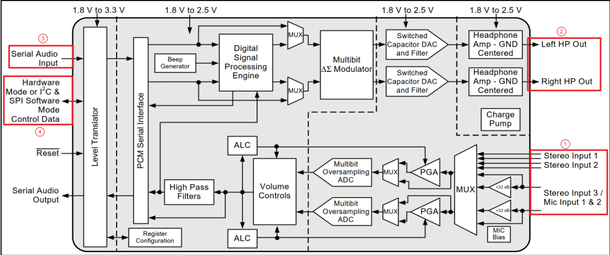
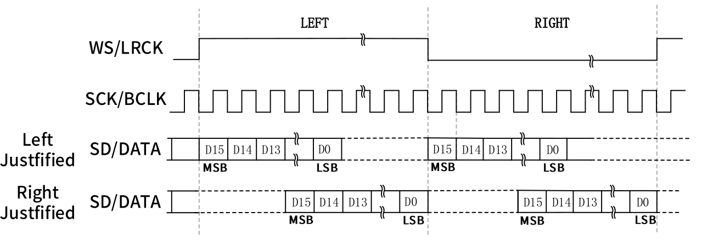
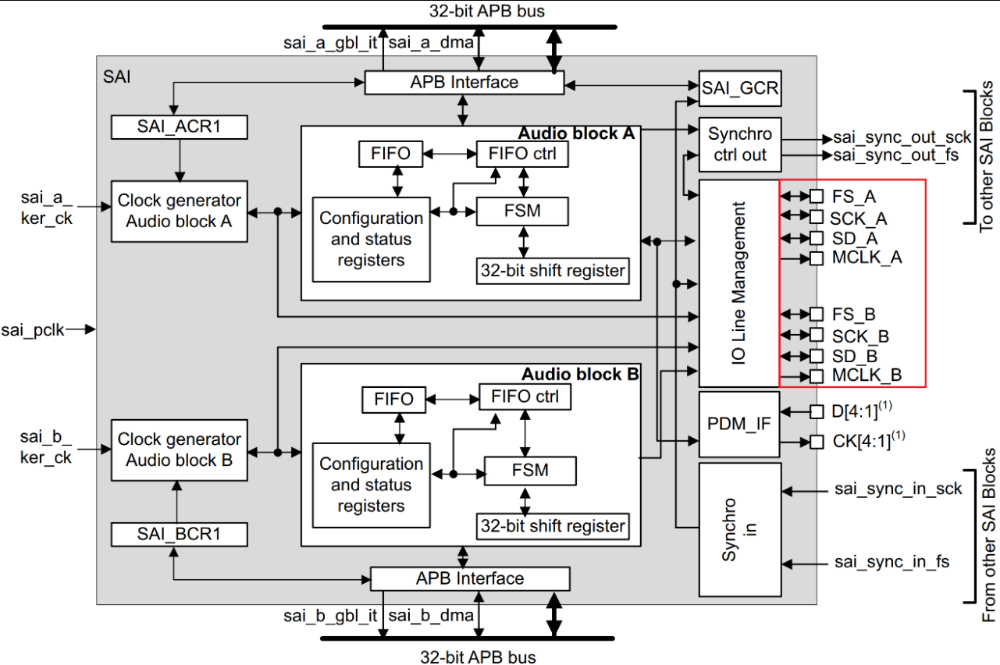
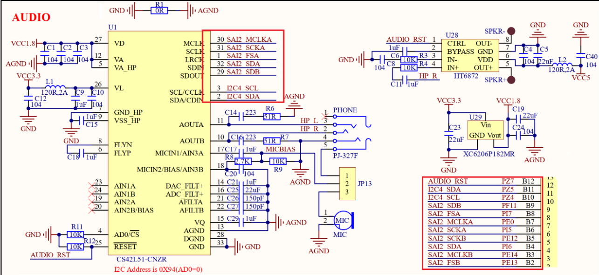

<!--
 * @Date: 2024-12-29
 * @LastEditors: GoKo-Son626
 * @LastEditTime: 2024-12-30
 * @FilePath: /1-STM32MP157/26-audio.md
 * @Description: 
-->
# Audio

> 音频是我们最常用到的功能，音频也是 linux 和安卓的重点应用场合。STM32MP1 带有 SAI接口，正点原子的 STM32MP1 开发板通过此接口外接了一个 CS42L51 音频 DAC 芯片，本章我们就来学习一下如何使能 CS42L51 驱动，并且 CS42L51 

### 1. 音频接口

##### 1. 为何需要音频解码芯片

- 处理器要想“听到”外界的声音必须要把外界的声音转化为自己能够理解的“语言”，处理器能理解的就是 0 和 1，也就是二进制数据。所以我们需要先把外界的声音转换为处理器能理解的 0 和 1，在信号处理领域，外界的声音是模拟信号，处理器能理解的是数字信号，因此这里就涉及到一个模拟信号转换为数字信号的过程，而完成这个功能的就是 ADC 芯片
- 同理，如果处理器要向外界传达自己的“心声”，也就是放音，那么就涉及到将处理器能理解的 0 和 1 转化为外界能理解的连续变化的声音，这个过程就是将数字信号转化为模拟信号，而完成这个功能的是 DAC 芯片

- 我们往往需要听到的声音动听、
录进去的语音贴近真实、可以调节音效、对声音能够进行一些处理(需要 DSP 单元)、拥有统一
的标准接口，方便开发等等。将这些针对声音的各种要求全部叠加到 DAC 和 ADC 芯片上，那
么就会得到一个专门用于音频的芯片，也就是音频编解码芯片，英文名字就是 Audio CODEC，
所以我们在手机或者电脑的介绍中看到“CODEC”这个词语，一般说的都是音频编解码。
- 既然音频 CODEC 的本质是 ADC 和 DAC，那么采样率和采样位数就是衡量一款音频
CODEC 最重要的指标。比如常见音频采样率有 8K、44.1K、48K、192K 甚至 384K 和 768K，
采样位数常见的有 8 位、16 位、24 位、32 位。采样率和采样位数越高，那么音频 CODEC 越
能真实的还原声音，也就是大家说的 HIFI。因此大家会看到高端的音频播放器都会有很高的采
样率和采样位数，同样的价格也会越高。当然了，实际的效果还与其他部分有关，采样率和采
样位数只是其中重要的指标之一。

##### 2. CS42L51

以正点原子 STM32MP157 开发板所使用的 CS42L51 这颗芯片为例，看一下专用的音频编解码芯片都有哪些特性。
CS42L51 是一颗由 Cirrus 公司出品的音频编解码芯片，是一颗低功耗、高质量的立体声音频 CODEC。
CS42L51 的最主要特点在于它只需要 1.8V 的低电压供电，但是却可以输出立体声，可以为 16Ω耳机提供 46mW 的输出能量。在 2.5V 的时候可以 16Ω耳机提供 88mW 的输出能量

CS42L51 主要特性如下所示：
- 24 位转换器。
- 支持 4kHz~96kHz 的采样率。
- 多位 Delta Sigma 架构。
- 低功耗，立体声播放的时候 1.8V 电压下功耗为 12.93mW。录音与播放一起工作时为20.18mW。
- 数字信号处理引擎。
- 3:1 立体声输入选择器。
- 带有溢漫的自动水平监控。
……
**CS42L51整体框架如图**

- ①.此部分是 CS42L51 提供的输入接口，作为立体声音频输入源，一共提供了三路，分别为 Stereo Input1、Stereo Input2、Stereo Input3/Mic INPUT1&2。麦克风或线路输入就连接到那个接口上，这部分是需要硬件工程师重点关心的，因为音频选择从哪一路进入需要在画 PCB 的时候就应该定好。
- ②.此部分是 CS42L51 提供的输出接口，只支持耳机输出接口。如果要实现功放就要外接其他电路。
- ③.此部分是数字音频接口，用于和主控器连接，使用的接口为 I2S。
- ④.此部分为控制接口，是一个标准的 I2C 接口， CS42L51 要想工作必须对其进行配置，这个 I2C 接口就是用于配置 CS42L51 的。

##### 3. IIS总线接口

**I2S**(Inter-IC Sound)总线有时候也写作 IIS，I2S 是飞利浦公司提出的一种用于数字音频设备
之间进行音频数据传输的总线。和 I2C、SPI 这些常见的通信协议一样，I2S 总线用于主控制器
和音频 CODEC 芯片之间传输音频数据。因此，要想使用 I2S 协议，主控制器和音频 CODEC 都
得支持 I2S 协议，STM32MP1 的 SAI 外设就支持 I2S 协议，CS42L51 同样也支持 I2S，所以本
章实验就是使用 I2S 协议来完成的。I2S 接口需要 3 根信号线(如果需要实现收和发，那么就要
4 根信号线，收和发分别使用一根信号线)：
**SCK**：串行时钟信号，也叫做位时钟(BCLK)，音频数据的每一位数据都对应一个 SCK，立
体声都是双声道的，因此 SCK=2×采样率×采样位数。比如采样率为 44.1KHz、16 位的立体声
音频，那么 SCK=2×44100×16=1411200Hz=1.4112MHz。
**WS**：字段(声道)选择信号，也叫做 LRCK，也叫做帧时钟，用于切换左右声道数据，WS 为
“1”表示正在传输左声道的数据，WS 为“0”表示正在传输右声道的数据。WS 的频率等于采
样率，比如采样率为 44.1KHz 的音频，WS=44.1KHz。
**SD**：串行数据信号，也就是我们实际的音频数据，如果要同时实现放音和录音，那么就需
要 2 根数据线，比如 CS42L51 的 SDOUT 和 SDIN，就是分别用于放音和录音。不管音频数据
是多少位的，数据的最高位都是最先传输的。数据的最高位总是出现在一帧开始后(LRCK 变化)
的第 2 个 SCK 脉冲处。
**MCLK**：有时候为了使音频 CODEC 芯片与主控制器之间能够更好的同步，会引入另外一个叫做 MCLK 的信号，也叫做主时钟或系统时钟，一般是采样率的 256 倍或 384 倍。
- 随着技术的发展，在统一的 I2S 接口下，出现了不同的数据格式，根据 DATA 数据相
对于 LRCK 和 SCLK 位置的不同，出现了 Left Justified(左对齐)和 Right Justified(右对齐)两种格
式

##### 4. STM32MP1 SAI 总线接口
SAI 接口(串行音频接口)灵活性高、配置多样，可支持多种音频协议。该接口适用许多立体
声或单声道应用。支持 I2S 标准、LSB 或 MSB 对齐、PCM/DSP、TDM 等等协议。全称为
Synchronous Audio Interface，SAI的特性：
- ①有两个独立的音频子模块，子模块可以用作接收和发送功能，并且带有自身的 FIFO。
- ②每个音频子模块集成多达 8 个字，每个字 32 位的 FIFO。
- ③两个音频子模块间可以是同步或异步模式。
- ④多个 SAI k之间看实现同步。
- ⑤两个音频子模块的主/从配置相互独立。
- ⑥数据大小可配置：8 位、10 位、16 位、20 位、24 位或 32 位。
……
**SAI框架如图**

- 图中可以看出 SAI 是由两个各自带有时钟发生器的音频子模块组成。在红色框架里标明
了每个子模块都有 4 个专用引脚控制(SD、SCK、FS、MCLK)。如果将两个子模块声明为同步
模块，那么 SCK、FS 和 MCLK 就可以共用引脚，不相同的只有数据 SD 引脚

### 2. 硬件原理图分析

**音频原理图**

①、SAI 接口一共用到了 5 根数据线，这个 5 根数据线用于 STM32MP1 与 CS42L51 之间的音频数据收发。
②、CS42L51 在使用的时候需要进行配置，配置接口为 I2C，连接到 STM32MP1 的 I2C4上。
③、CS42L51 是没有功放接口的，我们就要提供一个 HT6872 把 HP_R 耳机数据放大。最后音频的耳机和 MIC 录音功能是有 JP13 来控制的，如果 1-2 连接就使用耳机进行录音，2-3 连接就使用板载 MIC 录音

### 3. 音频驱动使能

##### 1. 修改设备树

