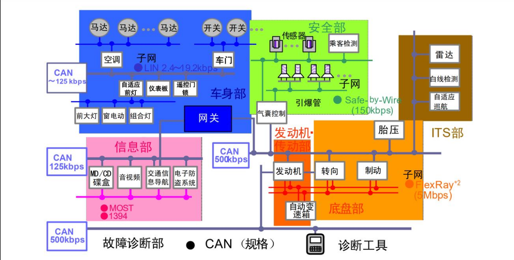

<!--
 * @Date: 2024-12-30
 * @LastEditors: GoKo-Son626
 * @LastEditTime: 2024-12-30
 * @FilePath: /1-STM32MP157/27-CAN.md
 * @Description: 
-->
# CAN

> CAN 是目前应用非常广泛的现场总线之一，主要应用于汽车电子和工业领域，尤其是汽车
领域，汽车上大量的传感器与模块都是通过 CAN 总线连接起来的。CAN 总线目前是自动化领
域发展的热点技术之一，由于其高可靠性，CAN 总线目前广泛的应用于工业自动化、船舶、汽
车、医疗和工业设备等方面。STM32MP1 自带了 CAN 外设，因此可以开发 CAN 相关的设备

### 1. CAN协议

##### 1. CAN

- 全称为**C**ontroller **A**rea **N**etwork，也就是控制局域网络，简称***CAN***
- 以汽车电子为例，汽车上有空调、车门、发动机、大量传感器等，这些部件都是通过CAN总线连在一起形成一个网络
**车载网络结构如图**

- 图中各个单元通过 CAN 总线连接在一起，每个单元都是独立的 CAN 节点。同一个 CAN 网络中所有单元的通信速度必须一致，不同的网络之间通信速度可以不同。比如图中 125Kbps 的 CAN 网络下所有的节点速度都是 125Kbps 的，整个网络由一个网关与其他的网络连接。

**CAN特点：**
1. 多主控制
在总线空闲时，所有单元都可以发送消息（多主控制），而两个以上的单元同时开始发送消息时，根据标识符（Identifier 以下称为 ID）决定优先级。ID 并不是表示发送的目的地址，而是表示访问总线的消息的优先级。两个以上的单元同时开始发送消息时，对各消息 ID 的每个位进行逐个仲裁比较。仲裁获胜（被判定为优先级最高）的单元可继续发送消息，仲裁失利的单元则立刻停止发送而进行接收工作。
2. 系统的柔软性
与总线相连的单元没有类似于“地址”的信息。因此在总线上增加单元时，连接在总线上的其它单元的软硬件及应用层都不需要改变。
3. 通信速度快，距离远
最高 1Mbps（距离小于 40M），最远可达 10KM（速率低于 5Kbps），最新的 CAN FD 速度可以到 5Mbps。
4. 具有错误检测、错误通知和错误恢复功能
所有单元都可以检测错误（错误检测功能），检测出错误的单元会立即同时通知其他所有单元（错误通知功能），正在发送消息的单元一旦检测出错误，会强制结束当前的发送。强制结束发送的单元会不断反复地重新发送此消息直到成功发送为止（错误恢复功能）
5. 故障封闭功能
CAN 可以判断出错误的类型是总线上暂时的数据错误（如外部噪声等）还是持续的数据错误（如单元内部故障、驱动器故障、断线等）。由此功能，当总线上发生持续数据错误时，可将引起此故障的单元从总线上隔离出去。
6. 连接节点多
CAN 总线是可同时连接多个单元的总线。可连接的单元总数理论上是没有限制的。但实际上可连接的单元数受总线上的时间延迟及电气负载的限制。降低通信速度，可连接的单元数增加；提高通信速度，则可连接的单元数减少。

##### 2. CAN电气属性

