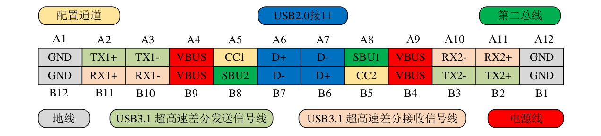
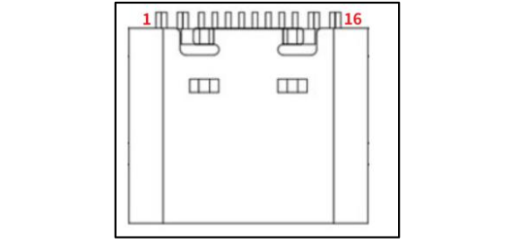

<!--
 * @Date: 2025-01-04
 * @LastEditors: GoKo-Son626
 * @LastEditTime: 2025-01-09
 * @FilePath: /1-STM32MP157/28-USB.md
 * @Description: 
-->
# USB

> USB 是很常用的接口，目前大多数的设备都是 USB 接口的，比如鼠标、键盘、USB 摄像头等，我们在实际开发中也常常遇到 USB 接口的设备，本章我们就来学习一下如何使能 Linux内核自带的 USB 驱动。

### 1. USB接口

##### 1. USB？

- USB全称为Universal_Serial_Bus，翻译过来就是通用串行总线。
- USB3.0引入了全双工通信5Gbps，USB2.0 的 480Mbps 为半双工
[images]
**USB A插头和插座**
**USB B插头和插座**
**Mini USB插头和插座**
**Micro A插头和插座**
**USB Typec插头和插座**

##### 2. USB 电气特性

**Mini USB 电气属性**
我们先以 Mini USB 为例讲解一下 USB 的基本电气属性。
Mini USB 线一般都是一头为 USB A 插头，一头为 Mini USB 插头。一共有四个触点，也就是 4 根线，这四根线的顺序如图 50.1.2.1
所示：
[images]
- USB A 插头从左到右线序依次为 1,2,3,4，第 1 根线为 VBUS，电压为
5V，第 2 根线为 D-，第 3 根线为 D+，第 4 根线为 GND。USB 采用差分信号来传输数据，因
此有 D-和 D+两根差分信号线。大家仔细观察的话会发现 USB A 插头的 1 和 4 这两个触点比较
长，2 和 3 这两个触点比较短。1 和 4 分别为 VBUS 和 GND，也就是供电引脚，当插入 USB 的
时候会先供电，然后再接通数据线。拔出的时候先断开数据线，然后再断开电源线。
- 大家再观察一下 Mini USB 插头，会发现 Mini USB 插头有 5 个触点，也就是 5 根线，线序
从左往右依次是 1~5。第 1 根线为 VCC(5V)，第 2 根线为 D-，第 3 根线为 D+，第 4 根线为 ID，
第 5 根线为 GND。可以看出 Mini USB 插头相比 USB A 插头多了一个 ID 线，这个 ID 线用于
实现 OTG 功能，通过 ID 线来判断当前连接的是主设备(HOST)还是从设备(SLAVE)。
- USB 是一种支持热插拔的总线接口，使用差分线(D-和 D+)来传输数据，USB 支持两种供
电模式：总线供电和自供电，总线供电就是由 USB 接口为外部设备供电，在 USB2.0 下，总线
供电最大可以提供 500mA 的电流。

##### 3. USB拓扑结构

USB 是主从结构的，也就是分为主机和从机两部分，一般主机叫做 Host，从机叫做 Device。
主机通过 USB A 插座来连接外部的设备，比如电脑作为主机，对外提供 USB A 插座，我们可
以通过 USB 线来连接一些 USB 设备，比如声卡、手机等。因此电脑带的 USB A 插座数量就决
定了你能外接多少个 USB 设备，如果不够用的话我们可以购买 USB 集线器来扩展电脑的 USB
插口，USB 集线器也叫做 USB HUB

STM32MP1 就有两个原生的 USB 主控制器，因此 STM32MP1
对外提供两个 USB 接口，这两个接口肯定不够用，正点原子的 STM32MP1 开发板上有 6 个
HOST 接口，六路都是 USB2 通过 USB HUB 芯片扩展出来的

虽然我们可以对原生的 USB 口数量进行扩展，但是我们不能对原生 USB 口的带宽进行扩
展，比如 STM32MP1 的两个原生 USB 口都是 USB2.0 的，带宽最大为 480Mbps，因此接到下
面的所有 USB 设备总带宽最大为 480Mbps。

USB 只能主机与设备之间进行数据通信，USB 主机与主机、设备与设备之间是不能通信的。
因此两个正常通信的 USB 接口之间必定有一个主机，一个设备。为此使用了不同的插头和插座
来区分主机与设备，比如主机提供 USB A 插座，从机提供 Mini USB、Micro USB 等插座。在
一个 USB 系统中，仅有一个 USB 主机，但是可以有多个 USB 设备，包括 USB 功能设备和 USB
HUB，最多支持 127 个设备。一个 USB 主控制器支持 128 个地址，地址 0 是默认地址，只有在
设备枚举的时候才会使用，地址 0 不会分配给任何一个设备。所以一个 USB 主控制器最多可以
分配 127 个地址。整个 USB 的拓扑结构就是一个分层的金字塔形，如图 50.1.3.2 所示(参考自
USB2.0 协议中文版.pdf)：
[images]
图 50.1.3.2 中可以看出从 Root Hub 开始，一共有 7 层，金字塔顶部是 Root Hub，这个是
USB 控制器内部的。图中的 Hub 就是连接的 USB 集线器，Func 就是具体的 USB 设备。
USB 主机和从机之间的通信通过管道(Pipe)来完成，管道是一个逻辑概念，任何一个 USB
设备一旦上电就会存在一个管道，也就是默认管道，USB 主机通过管道来获取从机的描述符、
配置等信息。在主机端管道其实就是一组缓冲区，用来存放主机数据，在设备端管道对应一个
特定的端点。

##### 4. 什么是USB_OTG

前面我们讲了，USB 分为 HOST(主机)和从机(或 DEVICE)，有些设备可能有时候需要做
HOST，有时候又需要做 DEVICE，配两个 USB 口当然可以实现，但是太浪费资源了。如果一
个 USB 接口既可以做 HOST 又可以做 DEVICE 那就太好了，使用起来就方便很多。为此，USB
OTG 应运而生，OTG 是 On-The-Go 的缩写，支持 USB OTG 功能的 USB 接口既可以做 HOST，
也可以做 DEVICE。那么问题来了，一个 USB 接口如何知道应该工作在 HOST 还是 DEVICE
呢？这里就引入了 ID 线这个概念，前面讲解 USB 电气属性的时候已经说过了，Mini USB 插头
有 5 根线，其中一条就是 ID 线。ID 线的高低电平表示 USB 口工作在 HOST 还是 DEVICE 模
式：
ID=1：OTG 设备工作在从机模式。
ID=0：OTG 设备工作在主机模式。
支持 OTG 模式的 USB 接口一般都是 Mini USB、Micro USB 等这些带有 ID 线的接口。正
点原子的 STM32MP1 开发板 OTG 模式是使用 USB Type C 做接口，没有 ID 线。USB Type C 有
自己的识别方法，
稍后会讲解 TypeC 接口电气属性。正点原子的 STM32MP157 开发板 USB_OTG
连接到了 STM32MP1 的 USB1 接口上。如果要使用 OTG 的主机模式，那么就需要一根 OTG
线，TypeC 接口的 OTG 线如图 50.1.4.1 所示：


[images]
可以看出，TypeC OTG 线一头是 USB A 插座，一头是 Typec 插头，将 TypeC 插头插入机
器的 TypeC 口上，需要连接的 USB 设备插到另一端的 USB A 插座上，比如 U 盘啥的。TypeC
的 CC 引脚检查到 USB 设备已经接入，就会建立 USB 设备为主模式，机器就知道自己要做为
一个主机，用来连接外部的从机设备(U 盘)。

##### 5. STM32MP1 USB 接口简介
STM32MP157 提供了两个 USB2.0 接口，这两个 USB 接口**都是支持高速模式**，也就是
480Mbit/S，这两个 USB 接口**都内置了高速 PHY**。其中 **USB2 支持 OTG** 功能，正点原子
STM32MP157 开发板上的 **USB OTG 接口就是链接到 USB2 接口上的**。**USB1 接口连接了一个HUB 芯片**，实现了 USB Host 接口扩展。
STM32MP1 内部集成了三个跟 USB 相关的控制器名字分别为：**USB OTG 控制器**、**USBHost 控制器**和 **USB HS PHY 控制器**，提供一个简称方便书写：OTG、USBH 和 PHY。接着我们
分析一下这三个控制器是如何工作的。
**1. PHY 控制器**
PHY（英语：Port Physical Layer），中文可称之为端口物理层，是一个对 OSI 模型物理层的共同简称。PHY 控制器主要是提供两个端口，端口 1 已经规定分配给 USB Host 控制器，端口2 可以分配给 USB OTG 和 USB Host。
**2. OTG 控制器**
此控制器是支持 OTG 功能，它的内部特性如下所示：
- 此控制器有一个独立的内核 USB OTG HS。
- 该控制器支持 HS、FS 和 LS 模式，不管是主机还是从机模式都支持 HS/FS/LS，硬件支持 OTG 信号、会话请求协议和主机协商协议，支持 8 个双向端点，还支持 PHY 接口。
- 内嵌一个 DMA。
- 支持片上全速 PHY、连接外部全速 PHY 的 I2C 接口和连接外部高速 PHY 的 ULPL 接口。
- 具有采用高级 FIFO 控制的 4 KB 专用 RAM。OTG 控制器有两个模式：正常模式(normal mode)和低功耗模式(low power mode)。 OTG 控制器都可以运行在高速模式(HS 480Mbps)、全速模式(LS 12Mbps)和低速模式(1.5Mbps)。正常模

OTG 控制器有两个模式：正常模式(normal mode)和低功耗模式(low power mode)。 OTG 控
制器都可以运行在高速模式(HS 480Mbps)、全速模式(LS 12Mbps)和低速模式(1.5Mbps)。正常模式下每个 OTG 控制器都可以工作在主机(HOST)或从机(DEVICE)模式下，每个 USB 控制器都
有其对应的接口。低功耗模式顾名思义就是为了节省功耗，USB2.0 协议中要求，设备在上行端
口检测到空闲状态以后就可以进入挂起状态。在从机(DEVICE)模式下，端口停止活动 3ms 以后
OTG 控制器内核进入挂起状态。在主机(HOST)模式下，OTG 控制器内核不会自动进入挂起状
态，但是可以通过软件设置。不管是本地还是远端的 USB 主从机都可以通过产生唤醒序列来重
新开始 USB 通信。
**3. USBH控制器**
- **USBH 控制器**这是一个主机控制器，此控制器由 ***EHCI 控制器***和 ***OHCI 控制器***组成。USBH控制器只能做主机模式。
- **OHCI**：全称为 Open Host Controller Interface，这是一种 USB 控制器标准，厂商在设计 USB控制器的时候需要遵循此标准，用于 USB1.1 标准。OHCI 不仅仅用于 USB，也支持一些其他的接口，比如苹果的 Firewire 等，OHCI 由于硬件比较难，所以软件要求就降低了，软件相对来说比较简单。OHCI 主要用于非 X86 的 USB，比如扩展卡、嵌入式 USB 控制器。
- **UHCI**：全称是 Universal Host Controller Interface，UHCI 是 Inter 主导的一个用于 USB1.0/1.1的标准，与 OHCI 不兼容。与 OHCI 相比 UHCI 硬件要求低，但是软件要求相应就高了，因此硬件成本上就比较低。
- **EHCI**：全称是 Enhanced Host Controller Interface，是 Inter 主导的一个用于 USB2.0 的 USB控制器标准。EHCI 仅提供 USB2.0 的高速功能，至于全速和低速功能就由 OHCI 或 UHCI 来提供。
- **xHCI**：全称是 eXtensible Host Controller Interface，是目前最流行的 USB3.0 控制器标准，在速度、能效和虚拟化等方面比前三个都有较大的提高。xHCI 支持所有速度种类的 USB 设备，xHCI 出现的目的就是为了替换前面三个。
- 通俗来讲，OHCI 就是 FS 模式，也就是低速模式，EHCI 是 HS 模式，也就是高速模式

##### 6. USB_Typec 电气属性
1. **USB TypeC 接口引脚定义**
- STM32MP157 有两个 USB2 接口，所以可以直接使用 Mini USB 或者 Micro USB。但是目前 USB TypeC 接口非常普及，大家一般都有很多 USB TypeC 线材，相反，Mini USB 或者 MicroUSB 的线材基本上都没有了，所以为了方便大家使用，正点原子 STM32MP157 开发板上的 USB接口采用了 TypeC。
- 接下来就看一下 USB TypeC 接口(根据 USB 协议，也叫做 USB3.1 接口)电气属性，由于TypeC 功能比较复杂，比如支持 PD 充电、显示、音频等，这里我们只讲解一下 TypeC 的**数据通信部分**。首先来看一下 TypeC 的接口定义，这里我们只看母头的引脚定义，如图所示：
**标准 USB TypeC 母头引脚**

- 从图 50.1.6.1 中可以看出，标准的 USB TypeC 有 24 根线，分为上下两部分，明显比前面讲的 Mini USB 要多不少引脚，这些引脚按照功能分类：

- **A1、A12、B1、B12**：这 4 个引脚为 GND。
- **A2、A3、B2、B3**：这 4 个引脚是 USB3.1 特有的，为超高速差分发送信号线，这是 USB2.0 和 USB1.0 所没有的。
- **A10、A11、B10、B11**：这 4 个引脚也是 USB3.1 特有的，为超高速差分接收信号线，这个也是 USB2.0 和 USB1.0 所没有的。
- **A4、A9、B4、B9**：VBUS 引脚，这个 USB2.0 也有。
- **A5、B5**：CC1 和 CC2 这 2 个引脚为 USB3.1 特有的配置通道引脚。Type-C 的插座中有两个 CC 脚，USB 通信中的角色检测都是通过 CC 脚进行的。对于 Type-C 插头或者线缆，正常情况下只有一个 CC 引脚，两个端口连接在一起之后，只存在一个 CC 引脚连接。通过检测哪一个 CC 引脚有连接，可以判断连接的方向。  
    如果 USB 线缆中有需供电的器件，其中一个 CC 引脚将作为 VCONN 供电。  
    对于本章教程来说，我们主要使用 CC1 和 CC2 引脚来实现 USB OTG 功能，稍后会讲解 USB3.1 下的设备类型。
- **A8、B8**：SBU1 和 SBU2 引脚，这两个并不是 USB 信号，而是用作其他功能的，比如 Type-C 作为 DP 接口使用时，SBU 用作音频传输通道。
- **A6、A7、B6、B7**：这 4 个引脚大家应该就很熟悉了，就是 USB2.0 的 D+ 和 D-，因为 USB3.1 要兼容 USB2.0 和 USB1.0 接口，所以必须要有 D+ 和 D-。
- 大家仔细观察图 50.1.3.1 会发现，上下两排引脚是对应的，比如 (A1, B1)、(A2, B2) 等，一直到 (A12, B12)。这是因为 USB3.1 要有能够正反插的功能，因此上下两排引脚肯定要是一样的，这样才能在正反插的时候都能正常工作。
图 50.1.3.1 是 TypeC 接口标准的 24P 母头引脚，大家在进行 TypeC 母头选型的时候会发现
也有 16P 甚至 6P 封装的接口。比如正点原子 STM32MP157 开发板上使用的就是 16P 的 TypeC
母座，16P 的母座引脚结构如图 50.1.3.2 所示：
- 
```markdown
| 编号 | USB3.1 引脚功能 | 编号 | USB3.1 引脚功能 |
|------|-----------------|------|-----------------|
| 1    | A1 GND          | 9    | A7 D-           |
| 2    | B12 GND         | 10   | B6 D+           |
| 3    | A4 VBUS         | 11   | A8 SBU1         |
| 4    | B9 VBUS         | 12   | B5 CC2          |
| 5    | B8 SBU2         | 13   | B4 VBUS         |
| 6    | A5 CC1          | 14   | A9 VBUS         |
| 7    | B7 D-           | 15   | B1 GND          |
| 8    | A6 D+           | 16   | A12 GND         |
```
- 可以看出，相比于标准的 24P 引脚定义，16P 的母座少了 8 根 USB3.1 高速差分收发数据线。
2. **USB TypeC 的 Data Role**
- USB2.0 根据数据传输方向定义了 HOST/Device/OTG 这三种类型的设备角色，其中 OTG 既可以做 HOST 也可以做 Device，USB2.0 的 OTG 设备接口通过 ID 线来区分 HOST 还是 Device。
在 TypeC 领域，也有类似的概念，但是名字变了：
  1. DFP
DFP 全称是 Downstream Facing Port，也就是下行端口，
可以理解为 HOST，
DFP 提供 VBUS、
VCONN，可以接收数据。
  1. UFP
UFP 全称是 Upstream Facing Port，也就是上行端口，可以理解为 Device，UFP 从 VBUS 中
取电源，UFP 设备也可以传输数据，比如 U 盘，键盘鼠标等。
  1. DRP
DRP 全称是 Dual Role Port，也就是双角色端口，可以理解为 OTG，DRP 既可以做 DFP，
也可以做 UFP。也可以在 DFP 和 UFP 之间进行动态切换。这个切换过程就用到了 CC 引脚，
具体识别过程比较复杂，这里就不讲解了。如果要在 USB TypeC 接口上实现 DRP 功能，那么
就需要使用到外置的 TypeC 芯片！正点原子 STM32MP157 开发板使用了 STUSB1600 或
FUSB302MPX 这两种 TypeC 芯片。这两种芯片都有一个 IIC 配置接口，也就是我们需要编写驱
动程序，否则的话 DRP 功能无法实现。

### 2. 硬件原理图分析

- 正点原子的 STM32MP1 开发板 USB 部分原理图可以分为两部分：USB HUB 以及 USB
OTG


