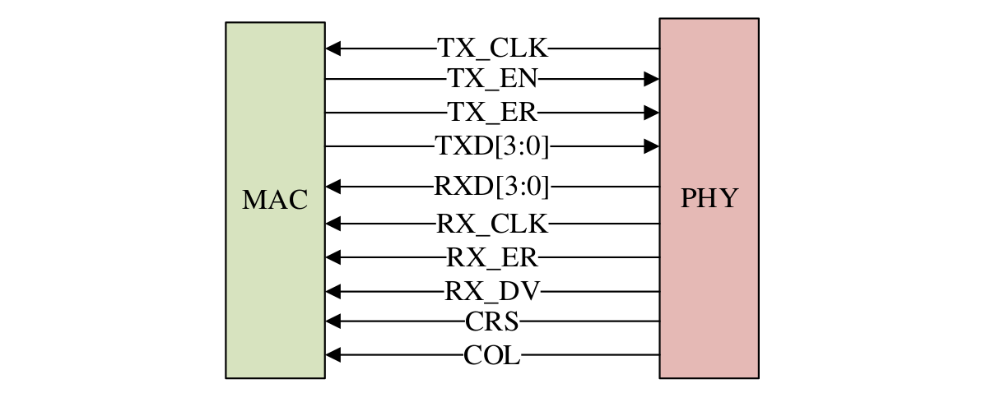
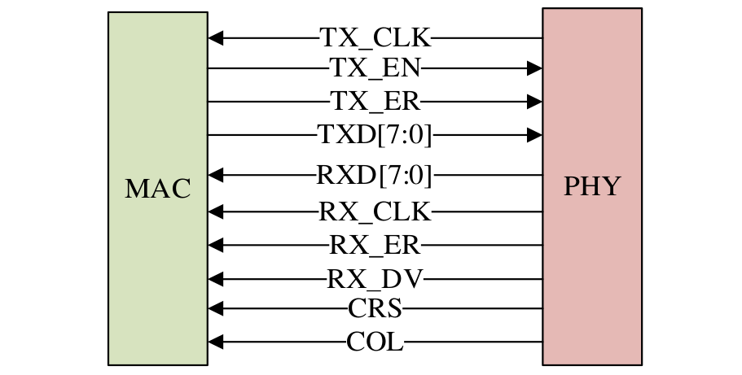
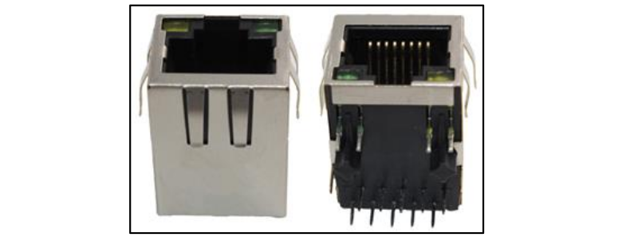
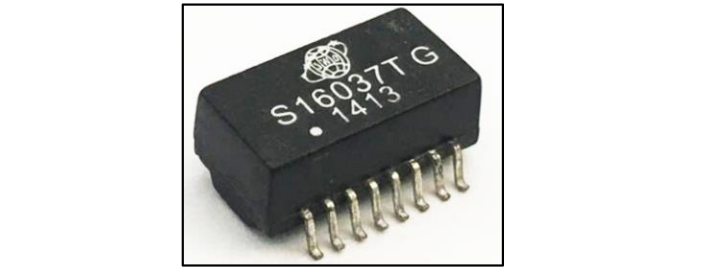
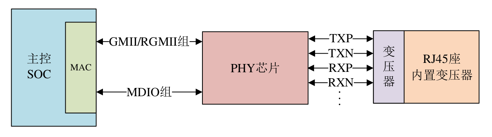
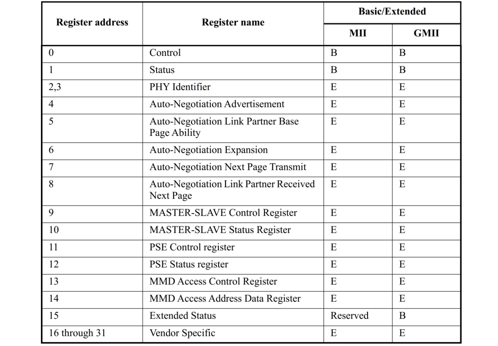
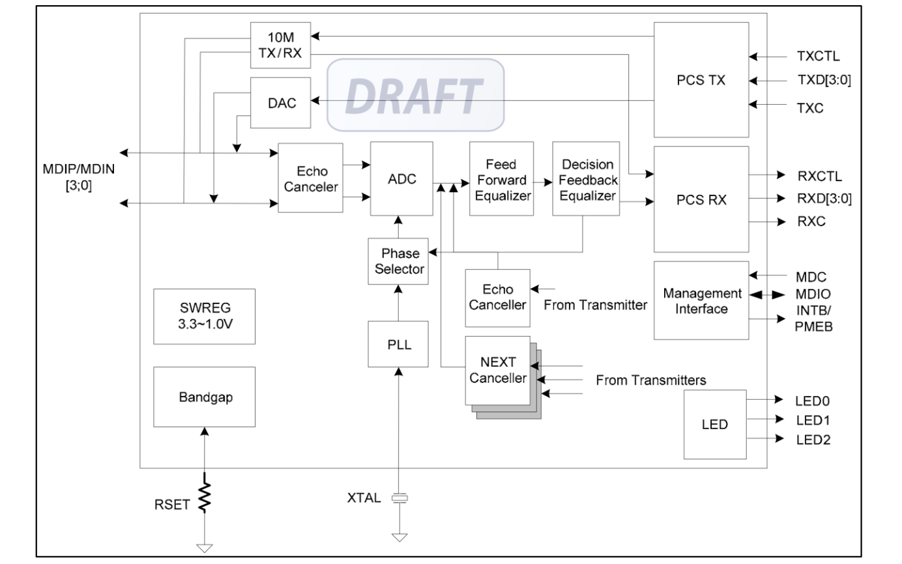

<!--
 * @Date: 2025-01-18
 * @LastEditors: GoKo-Son626
 * @LastEditTime: 2025-01-29
 * @FilePath: /1-STM32MP157/30-Internet_driver.md
 * @Description: 
-->
# 网络设备驱动(有线网络)

> 网络驱动是 linux 里面驱动三巨头之一，linux 下的网络功能非常强大，嵌入式 linux 中也常常用到网络功能。前面我们已经讲过了字符设备驱动和块设备驱动，本章我们就来学习一下linux 里面的网络设备驱动。

### 1. 嵌入式网络

##### 1. 硬件接口

嵌入式中的网络硬件方案。首先，嵌入式网络硬件分为两部分：MAC 和 PHY，大家都是通
过看数据手册来判断一款 SoC 是否支持网络，如果一款芯片数据手册说自己支持网络，一般都
是说的这款 SoC 内置 MAC，MAC 类似 I2C 控制器、SPI 控制器一样的外设。但是光有 MAC
还不能直接驱动网络，还需要另外一个芯片：PHY，因此对于内置 MAC 的 SoC，其外部必须
搭配一个 PHY 芯片。但是有些 SoC 内部没有 MAC，那也就没法搭配 PHY 芯片了，这些内部
没有网络 MAC 的芯片如何上网呢？这里就要牵扯出常见的两个嵌入式网络硬件方案了

1. 没有内部 MAC，那么可以找个外置的 MAC 芯片啊，不过一般这种外
置的网络芯片都是 MAC+PHY 一体的。比如三星 linux 开发板里面用的最多的 DM9000，因为
三星的芯片基本没有内部 MAC(比如 S3C2440、S5PV210，4412 等)，所以三星的开发板都是通
过外置的 DM9000 来完成有线网络功能的，DM9000 对 SoC 提供了一个 SRAM 接口，SOC 会
以 SRAM 的方式操作 DM9000。
有些外置的网络芯片更强大，内部甚至集成了硬件 TCP/IP 协议栈，对外提供一个 SPI 接
口，比如 W5500。这个一般用于单片机领域，单片机通过 SPI 接口与 W5500 进行通信，由于
W5500 内置了硬件 TCP/IP 协议栈，因此单片机就不需要移植负责的软件协议栈，直接通过 SPI
来操作 W5500，简化了单片机联网方案。
这种方案的优点就是让不支持网络的 SoC 能够另辟蹊径，实现网络功能，但是缺点就是网
络效率不高，因为一般芯片内置的 MAC 会有网络加速引擎，比如网络专用 DMA，网络处理效
率会很高。而且此类芯片网速都不快，基本就是 10/100M。另外，相比 PHY 芯片而言，此类芯
片的成本也比较高，可选择比较少。
SoC 与外部 MAC+PHY 芯片的连接如图 52.1.1.1 所示：

2. PHY 芯片不能也集成进 SoC 吗？笔者目前还
没见过将 PHY 也集成到芯片里面的 SoC。
一般常见的通用 SoC 都会集成网络 MAC 外设，比如 STM32F4/F7/H7 系列、NXP 的 I.MX
系列以及 STM32MP1 系列，内部集成网络 MAC 的优点如下：
①、内部 MAC 外设会有专用的加速模块，比如专用的 DMA，加速网速数据的处理。
②、网速快，可以支持 10/100/1000M 网速。
③、外接 PHY 可选择性多，成本低。
**内部的 MAC 外设会通过相应的接口来连接外部 PHY 芯片**，根据数据传输模式不同，大致
可以分为以下两类：
①、MII/RMII 接口：支持 10Mbit/s 和 100Mbit/s 数据传输模式；
②、GMII/RGMII 接口：支持 10Mbit/s、100Mbit/s 以及 1000Mbit/s 数据传输模式。
所以笔者一般把 MII/RMII 称为百兆以太网接口，而把 GMII/RGMII 称
为千兆以太网接口。
主控 SoC 需要配置或读取 PHY 芯片，也就是**读写 PHY 的内部寄存器，所以还需要一个控制接口**，叫做 MIDO，MDIO 很类似 IIC，也是两根线，一根数据线叫
做 MDIO，一根时钟线叫做 MDC。
SoC 内部 MAC 外设与外部 PHY 芯片的连接如图

##### 2. MII/RMII、GMII/RGMII 接口

1. MII（Media Independent Interface） 接口
MII 全称是 Media Independent Interface，直译过来就是介质独立接口，它是 IEEE-802.3 定义的以太网标准接口，MII 接口用于以太网 MAC 连接 PHY 芯片，连接示意图如图：

MII 接口一共有 16 根信号线，含义如下：
TX_CLK：发送时钟，如果网速为 100M 的话时钟频率为 25MHz，10M 网速的话时钟频率
为 2.5MHz，此时钟由 PHY 产生并发送给 MAC。
TX_EN：发送使能信号。
TX_ER：发送错误信号，高电平有效，表示 TX_ER 有效期内传输的数据无效。10Mpbs 网
速下 TX_ER 不起作用。
TXD[3:0]：发送数据信号线，一共 4 根。
RXD[3:0]：接收数据信号线，一共 4 根。
RX_CLK：接收时钟信号，如果网速为 100M 的话时钟频率为 25MHz，10M 网速的话时钟
频率为 2.5MHz，RX_CLK 也是由 PHY 产生的。
RX_ER：接收错误信号，高电平有效，表示 RX_ER 有效期内传输的数据无效。10Mpbs 网
速下 RX_ER 不起作用。
RX_DV：接收数据有效，作用类似 TX_EN。
CRS：载波侦听信号。
COL：冲突检测信号。
MII 接口的缺点就是所需信号线太多，这还没有算 MDIO 和 MDC 这两根管理接口的数据
线，因此 MII 接口使用已经越来越少了。

2. RMII（Reduced...） 接口
RMII 接口只需要 7 根数据线，相比 MII 直接减少了 9 根，极大的
方便了板子布线，RMII 接口连接 PHY 芯片的示意图如图

TX_EN：发送使能信号。
TXD[1:0]：发送数据信号线，一共 2 根。
RXD[1:0]：接收数据信号线，一共 2 根。
CRS_DV：相当于 MII 接口中的 RX_DV 和 CRS 这两个信号的混合。
REF_CLK：参考时钟，由外部时钟源提供，频率为 50MHz。这里与 MII 不同，MII 的接
收和发送时钟是独立分开的，而且都是由 PHY 芯片提供的。

3. GMII（Gigabit...） 接口
GMII 采用 8 位接口数据，工
作时钟 125MHz，因此传输速率可达 1000Mbps；同时兼容 MII 所规定的 10/100Mbps 工作方式。
GMII 接口数据结构符合 IEEE 以太网标准，该接口定义见 IEEE 802.3-2000。信号定义如下:

GTX_CLK：1000M 工作模式下的发送时钟（125MHz）。
TX_EN：发送使能信号。
TX_ER：发送错误信号，高电平有效，表示 TX_ER 有效期内传输的数据无效。
TXD[7:0]：发送数据信号线，一共 8 根。
RXD[7:0]：接收数据信号线，一共 8 根。
RX_CLK：接收时钟信号。
RX_ER：接收错误信号，高电平有效，表示 RX_ER 有效期内传输的数据无效。
RX_DV：接收数据有效，作用类似 TX_EN。
CRS：载波侦听信号。
COL：冲突检测信号。
与 MII 接口相比，GMII 的数据宽度由 4 位变为 8 位，GMII 接口中的控制信号如 TX_ER、
TX_EN、RX_ER、RX_DV、CRS 和 COL 的作用同 MII 接口中的一样，发送参考时钟 GTX_CLK
和接收参考时钟 RX_CLK 的频率均为 125MHz(在 1000Mbps 工作模式下)。
在实际应用中，绝大多数 GMII 接口都是兼容 MII 接口的，所以，一般的 GMII 接口都有
两个发送参考时钟：TX_CLK 和 GTX_CLK(两者的方向是不一样的，前面已经说过了)，在用作
MII 模式时，使用 TX_CLK 和 8 根数据线中的 4 根。
4. RGMII 接口
RGMII(Reduced Gigabit Media Independant Interface),精简版 GMII 接口。将接口信号线数量
从 24 根减少到 14 根(COL/CRS 端口状态指示信号，这里没有画出)，时钟频率仍旧为 125MHz，
TX/RX 数据宽度从 8 为变为 4 位，为了保持 1000Mbps 的传输速率不变，RGMII 接口在时钟的
上升沿和下降沿都采样数据，在参考时钟的上升沿发送 GMII 接口中的 TXD[3:0]/RXD[3:0]，在
参考时钟的下降沿发送 GMII 接口中的 TXD[7:4]/RXD[7:4]。RGMII 同时也兼容 100Mbps 和
10Mbps 两种速率，此时参考时钟速率分别为 25MHz 和 2.5MHz。
TX_EN 信号线上传送 TX_EN 和 TX_ER 两种信息，在 TX_CLK 的上升沿发送 TX_EN，下
降沿发送 TX_ER；同样的，RX_DV 信号线上也传送 RX_DV 和 RX_ER 两种信息，在 RX_CLK
的上升沿发送 RX_DV，下降沿发送 RX_ER。
RGMII 接口定义如下所示：

除了上面说到 4 种接口以外，还有其他
接口，比如 SMII、SSMII 和 SGMII 等，关于其他接口基本都是大同小异的，这里就不做讲解
了。**正点原子的 STM32MP1 开发板上的网口是采用 RGMII 接口来连接 MAC 与外部 PHY 芯片**。

##### 3. MDIO 接口

MDIO 全称是 Management Data Input/Output，直译过来就是管理数据输入输出接口，是一
个简单的两线串行接口，一根 MDIO 数据线，一根 MDC 时钟线。驱动程序可以通过 MDIO 和
MDC 这两根线访问 PHY 芯片的任意一个寄存器。MDIO 接口支持多达 32 个 PHY。同一时刻
内只能对一个 PHY 进行操作，那么如何区分这 32 个 PHY 芯片呢？和 IIC 一样，使用**器件地址**
即可。同一 MDIO 接口下的所有 PHY 芯片，其器件地址不能冲突，必须保证唯一，具体器件
地址值要查阅相应的 PHY 数据手册。
因此，MAC 和外部 PHY 芯片进行连接的时候主要是 MII/RMII（百兆网）或 GMII/RGMII
（千兆网）和 MDIO 接口，另外可能还需要复位、中断等其他引脚。

##### 4. RJ45 接口

网络设备是通过网线连接起来的，插入网线的叫做 RJ45 座，如图

RJ45 座要与 PHY 芯片连接在一起，但是中间需要一个**网络变压器**，网络编译器用于隔离
以及滤波等，网络变压器也是一个芯片，外形一般如图

但是现在很多 RJ45 座子内部已经集成了网络变压器，比如正点原子的 STM32MP1 开发板
所使用的 ATK911130A 就是内置网络变压器的 RJ45 座。内置网络变压器的 RJ45 座和不内置的
引脚一样，但是一般不内置的 RJ45 座会短一点。因此，大家在画板的时候一定要考虑你所使用
的 RJ45 座是否内置网络变压器，如果不内置的话就要自行添加网络变压器部分电路！同理，如
果你所设计的硬件是需要内置网络变压器的 RJ45 座，肯定不能随便焊接一个不内置变压器的
RJ45 座，否则网络工作不正常！
内部 MAC+外部 PHY+RJ45 座(内置网络变压器)就组成了一个完整的嵌入式网络接口硬件，如图

##### 5. STM32MP1 GMAC 接口简介

STM32MP1 内核集成了一个 10M/100M/1000M 的网络 MAC，符合 IEEE802.3-2002 标准,MAC 层支持双工或者半双工模式下运行。MAC 可编程，有直接存储器接口的专用 DMA，介
质访问控制器(MAC)和支持多种格式的 PHY 接口模块。
STM32MP1 内部 ENET 外设主要特性如下：
①、支持全工和半双工操作。
②、全双工流控制操作(IEEE 802.3X 暂停包和优先级流控制)
③、报头和帧起始数据(SFD)在发送模式下自动插入、在接收中自动删除。
④、可逐帧控制 CRC 和 pad 自动生成
⑤、可编程数据包长度，支持标准以太网数据包或高达 16KB 的巨型以太网数据包
⑥、可编程数据包间隙
⑦、两组 FIFO：一个具有可编程阈值功能的 4096 字节发送 FIFO 和一个具有可配置阈值
功能的 4096 字节接收 FIFO。
……
STM32MP1 的 GMAC 外设内容比较多，详细的介绍请查阅《STM32MP1 参考手册》的
“Ethernet (ETH): Gigabit media access control(GMAC) with DMA controller”章节。我们在编写
驱动的时候其实并不需要关注 GMAC 控制器外设的具体内容，因为这部分驱动是 SoC 厂商写
的，我们重点关注的是更换 PHY 芯片以后哪里需要调整。

### 2. PHY 芯片详解

##### 1. PHY 基础知识简介

PHY 是 IEEE 802.3 规定的一个标准模块，前面说了，SoC 可以对 PHY 进行配置或者读取
PHY 相关状态，这个就需要 PHY 内部寄存器去实现了。PHY 芯片寄存器地址空间为 5 位，地
址 0~31 共 32 个寄存器，IEEE 定义了 0~15 这 16 个寄存器的功能，16~31 这 16 个寄存器由厂
商自行实现。也就是说不管你用的哪个厂家的 PHY 芯片，其中 0~15 这 16 个寄存器是一模一
样的。仅靠这 16 个寄存器是完全可以驱动起 PHY 芯片的，至少能保证基本的网络数据通信，
因此 Linux 内核有通用 PHY 驱动，按道理来讲，不管你使用的哪个厂家的 PHY 芯片，都可以
使用 Linux 的这个通用 PHY 驱动来验证网络工作是否正常。事实上在实际开发中可能会遇到一
些其他的问题导致 Linux 内核的通用 PHY 驱动工作不正常，这个时候就需要驱动开发人员去调
试了。但是，随着现在的 PHY 芯片性能越来越强大，32 个寄存器可能满足不了厂商的需求，
因此很多厂商采用分页技术来扩展寄存器地址空间，以求定义更多的寄存器。这些多出来的寄
存器可以用于实现厂商特有的一些技术，因此 Linux 内核的通用 PHY 驱动就无法驱动这些特色
功能了，这个时候就需要 PHY 厂商提供相应的驱动源码了，所以大家也会在 Linux 内核里面看
到很多具体的 PHY 芯片驱动源码。不管你的 PHY 芯片有多少特色功能，按道理来讲，Linux 内
核的通用 PHY 驱动是绝对可以让你这 PHY 芯片实现基本的网络通信，因此大家也不用担心更
换 PHY 芯片以后网络驱动编写是不是会很复杂。

IEEE802.3 协议英文原版（4、参考资料→802.3 协议英文原版_2018 年.pdf）
**前16个寄存器的规定**

##### 2. RTL8211F-CG（核心板为1.2版本）

1. 讲解
Realtek RTL8211F-CG 是高 度 集 成的 以 太 网收 发器 ， 符合 10Base-T、 100Base-TX 和
1000Base-T IEEE 802.3 标准。它提供了所有通过 CAT.5 UTP 电缆收发以太网数据包所需的必要
物理层功能。
RTL8211F 使用最新的 DSP 技术和模拟前端（AFE）
，可以通过 UTP 电缆进行高速数据传
输和接收。RTL8211F 中实现了交叉检测和自动校正、极性校正、自适应均衡、串扰消除、回声
消除、定时恢复和错误校正等功能，以提供 10Mbps，100Mbps 或 1000Mbps 的强大收发功能。
MAC 和 PHY 之间的数据传输是通过 RGMII 接口进行的，RTL8211E 支持 RGMII 的 1.5V
信号。
RTL8211E 的主要特点如下：
·兼容 1000Base-T IEEE 802.3ab 标准。
·兼容 100Base-TX IEEE 802.3u 标准。
·兼容 10Base-T IEEE 802.3 标准。
·支持 GMII、RGMII 接口。
·支持 IEEE 802.3az-2010（节能以太网）。
·内置 LAN 唤醒（WOL）。
·支持中断、并行检测、交叉检测、自动校正、自动极性校正。
·支持 120m 的 1000Base-T 的 CAT.5 类电缆。
·支持 RGMII 的 1.5V 信号。
……
RTL8211F 千兆 PHY 的系统应用场景如下：
·数字电视（DTV）。
·媒体访问单元（MAU）。
·通讯和网络提升板（CNR）。
·游戏机。
·打印机和办公机器。
·DVD 播放机和刻录机。
·以太网集线器、交换机。
**RTL8211F-CG** 功能框图如下所示：

