<!--
 * @Date: 2025-01-05
 * @LastEditors: GoKo-Son626
 * @LastEditTime: 2025-01-07
 * @FilePath: /review/internet/Inter.md
 * @Description: 
-->
# INTERNET

### 1. 计算机网络概论

**定义**
- 计算机网络是指一组具有自治能力的计算机或联网设备,通过有线或无线的方式联结起来,在网络协议的作用下实现资源共享和数据通信的计算机（联网设备）群体.

**ARPANET**
- 公认的现代意义上第一个计算机网络

**组成**
- 网络**硬件**包括： 
  - 网络终端设备：计算机、手机、智能设备等
  - 网络通信设备：网卡、交换机、路由器、光猫等
  - 网络连接：双绞线、光纤、无线方式
- 网络**软件**包括：        
  - 网络协议：Ethernet, TCP/IP.
  - 网络操作系统：win7, win8, win10 ,LINUX.
  - 网络应用软件：QQ、腾讯会议、微信等

**功能**
- **资源共享** 
- **数据通信**
- **负载均衡**（如大型网站服务器有很多台,当一台服务器处理负担较大时,会将新到来的查询请求重定向到其它服务器.）
- **提高了系统的可靠性和可用性**（如HADOOP中采用基于网络的多副本冗余存储,提高了数据的可靠性和可用性.线路冗余可提高传输的可靠性.）

**分类(覆盖范围)**
- 广域网(WAN)
- 城域网(MAN)
- 局域网(LAN)
- 个域网(PAN)

**网络拓扑**
- 又称为网络的硬件布局/布线方案
  - 星型拓扑结构
    - 优点：容错性较高,
            扩展性好
    - 缺点 ：成本较高,
            依赖中心设备
  - 总线型拓扑结构
    - 优点：结构简单,
            所需介质长度短
    - 缺点 ：故障隔离困难,
             故障诊断困难 
  - 环形拓扑结构
    - 优点：结构简单,
            所需介质长度短
    - 缺点 ：扩展性差,
             故障诊断困难 
  - 全互连型拓扑结构
    - 优点：可靠性最高
    - 缺点 ：成本高,组建困难

**网络体系结构**
- （network architecture）：是计算机之间相互通信的层次,以及各层中的协议和层次之间接口的集合.

**网络协议**
-  是一组规则、协定，是网络所必须的。为了保证计算机之间的数据通信，联网计算机需要相同的网络协议
  - 协议的三要素：
    - 语法（syntax）:包括数据格式、编码及信号电平等.
    - 语义（semantics）：包括用于协议和差错处理的控制信息.
    - 时序（timing）：包括速度匹配和数据包传送的先后次序.

**两种参考模型**
- ISO/OSI 、TCP/IP.
- **ISO**在网络领域的最突出贡献就是提出OSI参考模型,该模型是网络发展史上的一个重要里程碑.
- **TCP/IP**（Transmission Control Protocol /Internet Protocol）是传输控制协议/网际协议的缩写.TCP/IP参考模型当初是为ARPAnet（Internet前身）设计的,其目的在于使各种各样的计算机或设备都能在一个共同的网络环境中运行.


**TCP/IP和TCP**
- TCP是TCP/IP协议族的一部分
  - TCP/IP 是一个协议族,包含多个协议,覆盖多个层次（如应用层的 HTTP、FTP,网络层的 IP,传输层的 TCP/UDP）.
  - TCP 位于传输层,是 TCP/IP 协议族中一个关键协议,提供可靠的端到端通信.
- TCP 的工作依赖于 TCP/IP 的其他协议
  - TCP 使用 IP 协议在网络层传递数据包.  
  - TCP 的可靠性和端到端传输特性需要依赖 IP 提供的数据分组传输功能.
- 一起实现网络通信
  - TCP/IP 协议族通过分层设计,结合 TCP（传输层）和 IP（网络层）共同实现网络通信.
  - **TCP** 负责可靠的数据传输,**IP** 负责数据的寻址和路由.

**五层体系结构**
- 应用层[报文]
  - 功能：为用户的应用程序提供网络服务
- 传输层[段(报文段)]（端口号）
  - 功能：通过端口为应用进程提供端到端的传输服务
- 网络层[分组(IP数据报)]（IP地址）
  - 硬件：路由器
  - 功能：提供逻辑寻址、网络分组转发、路由选择服务
- 数据链路层[帧]（MAC地址）
  - 硬件：网卡、交换机.
  - 功能：为上层提供透明和可靠的数据帧传送基本服务.即提供数据链路
- 物理层[比特流]（与信号有关）
  - 硬件：传输介质、接口、集线器、光猫
  - 功能：提供信号的格式转换和有效传输、以及比特流的传输,为网络数据传输提供物理链路

**数据包传输过程**
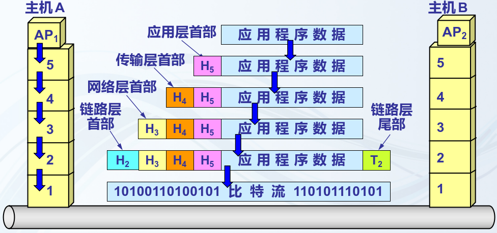
- 在发送方,数据沿着模型各层向下传递.
- 数据以比特的形式传输到接收方. 
- 在接收方,数据沿着模型各层向上传递

**分层设计的好处**
- 通过每一层实现一种相对独立的功能来简化问题.
- 每一层的设计都是独立的,它不必关心下一层是如何实现的,只需知道下一层为我提供的服务,和我必须为上一层提供哪些服务.
- 当由于技术的变化使某层的实现需要变化时,不影响其他的层次.

**常用网络设备**
- 光猫：提供光信号和电信号之间的转换.
- WIFI热点（无线路由器）：提供无线连接服务的设备.提供4口交换机和路由器、无线连接功能
- 集线器：物理层设备,提供对电信号（比特流）广播传输.
- 交换机：数据链路层设备,提供对数据帧的转发功能.
- 路由器：网络层设备,提供对IP数据包的转发和路由选择功能.

**知识点**
- 集线器工作在 物理层,采用广播方式,将收到的数据转发到所有端口,不区分目标设备.
- 集线器的性能低于交换机,原因如下：
  - 集线器无法避免冲突,所有端口共享带宽.
  - 交换机工作在 数据链路层,能够根据 MAC 地址进行数据转发,支持全双工通信,大幅提高网络效率.

---

### 2. 物理层-数据通信基础

**信号**
- 信号：运载消息的工具,是消息的载体,数据的具体表示形式
- **模拟信号**<声音,水波>》》》**编码解码器**》》》**数字信号**<双绞线,光纤>
- 信源：信息的发送端,是发出待传送数据的设备
- 信宿：信息的接收端,是接收所传送数据的设备
- 信道：信号的传输通道    

DCE：Data Communications Equipment数据转换设备（数据通信设备有光猫、交换机）
DTE：DataTerminal Equipment数据终端设备（电脑、路由器）

**数据传输速率**
- 数据传输速率,又称为信息传输速率,是指单位时间内传输的二进制位的位数,单位为比特/秒（bps）以及Kbps、Mbps、Gbps.
- 以太网线：模拟信号
- 电话线：数字信号

**路由器接口**
- Console（配置口） 
   - **功能**：用于设备的初始配置和管理.通过串口电缆连接计算机和设备,直接访问设备的命令行界面（CLI）.  
   - **用途**：  
     - 配置设备的基本参数（IP 地址、路由规则等）.  
     - 排查设备故障.  
   - **对应**：配置口  
- FastEthernet1/0（连接局域网）
   - **功能**：用于连接局域网设备（如交换机、PC 等）,提供高速以太网接口,传输速率一般为 100 Mbps 或更高（如 GigabitEthernet 为 1 Gbps）.  
   - **用途**：  
     - 连接局域网中的主机、交换机或其他网络设备.  
     - 配置 VLAN 或子网以划分网络区域.  
   - **对应**：连接局域网  

- Serial2/0（连接广域网）
   - **功能**：用于广域网连接,通常通过串行线路（如 PPP 或 HDLC 协议）连接其他路由器或远程网络.  
   - **用途**：  
     - 连接广域网（如 ISP 提供的线路、远程分支机构）.  
     - 配置点对点链路或广域网协议.  
   - **对应**：连接广域网  

**带宽**
- 网络中某通道传送数据的能力,即单位时间内网络中的某信道所能通过的“最高数据率”,单位是 bit/s,即 “比特每秒”.
- 如家里装了100M的宽带,是指理论上最大传输速率是100Mb/s,通常指上行带宽和下行带宽之和.

**数据通信方式**
- 串行传输
  - 数据将按照顺序一位一位地在通信设备之间的信道中传输.
- 并行传输
  - 多个数据位同时在信道上传输,并且每个数据位都有自己专用的传输通道. 

- 单工通信
  - 两数据站之间只能沿一个指定的方向进行数据传输. 如：广播
- 半双工通信
  - 信息流可在两个方向上传输,但某一时刻只限于一个方向传输.如：对讲机、无线局域网通信
- 全双工通信 
  - 在两个通信站之间有两条通路,则发送信息和接收信息可以同时进行. 如有线网、打电话、光纤（因实际应用中,上行波长1310nm,下行波长1490nm,一根光纤可同时实现上传和下载数据） 
   
- 基带传输 
  - 数字数据被转换成电信号时,利用原有电信号的固有频率和波形在线路上传输,在局域网中通常使用基带传输技术
- 频带传输（宽带传输）
  - 将二进制脉冲所表示的数据信号,变换成便于在较长的通信线路上传输的交流信号后再进行传输.   
  - 计算机网络的远距离通信通常采用的是频带传输,网络电视信号采用频带传输.

**数字数据用数字信号表示**
- 单极性码（不/归零）
- 双极性码（不/归零）
- **曼彻斯特编码**（Manchester Encoding）
  - 也叫做相位编码(PE)是一个同步时钟编码技术,被物理层用来编码一个同步位流的时钟和数据；常用于局域网传输.在曼彻斯特编码中,每一位的中间有一跳变,位中间的跳变作时钟信号,不存在直流分量,因此具有自同步能力和良好的抗干扰性能.
  - **规则：**
    - 从低到高的跳变表示“0”
    - 从高到低的跳变表示“1”
  - 曼彻斯特编码
    - 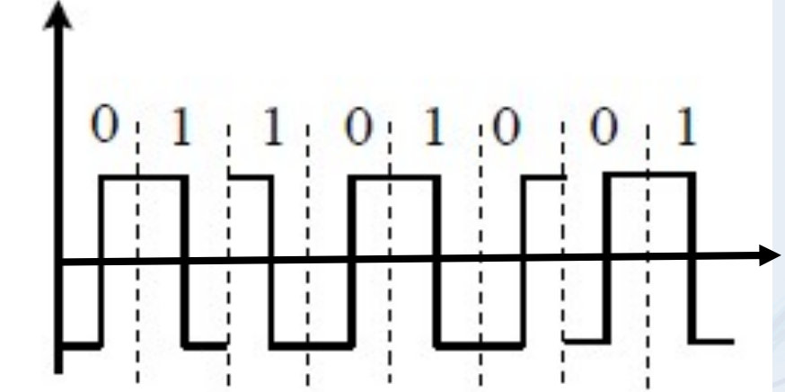
- **差分曼彻斯特编码**
  - 是曼彻斯特编码的改进.差分曼彻斯特编码比曼彻斯特编码的变化要少,因此更适合与传输高速的信息,被广泛用于宽带高速网中
  - 识别差分曼彻斯特编码的方法:
    - 主要看两个相邻的波形,如果后一个波形和前一个的波形相同（有跳变）,则后一个波形表示0,如果波形不同,则表示1.
    - 相对于上一周期,开始时有跳变表示“0”,开始时没有跳变表示“1”.
  - 差分曼切斯特编码
    - 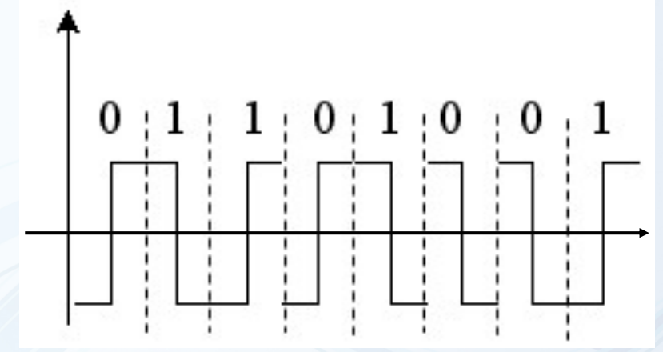


- **数据传输速率**，又称为信息传输速率，指单位时间内传送二进制位数，单位有bps,Kbps,Mbps,Gbps.
  - 误码率是衡量信息传输可靠性的参数，是二进制码元在传输系统中被传错的概率，在计算机网络中，要求误码率范围为10-6-10-11  ，即平均每传输1Mb才允许错1bit或更低。
  - 信道带宽：在模拟通信中，指信号所占频率范围，如人语音信号的带宽在300-3400Hz之间。但数字通信里的带宽指数据传输率，单位bps.
  - 信道容量：信道中的最大数据传输率。
  - 奈奎斯特（Nyquist)定理，理想状态下：C=2Hlog2n， 其中：
    - H---低通为信道带宽（Hz)
    - n---调制电平数
    - C---信道的最大传输率
- **香农公式**：实际应用中，信道必然有噪声和有限带宽的，香农（Shannon)推导出了带宽受限且有高斯白噪声干扰的信道极限速率。
  - 即：C=Hlog2(1+S/N)
    - C---信道容量（bps)；
    - H---信道带宽（Hz)；
    - S---信号功率；
    - N---噪声功率；
    - S/N---信噪比，通常用dB(分贝)。用分贝表示 的信噪比为信噪比=10 lg(S/N)
       - 如：S/N=100,则用分贝表示的信噪比为20dB

**数字信号的模拟表示**
- 调辐、调频、调相
- 脉冲编码调制PCM
  - 脉冲编码调制就是把一个时间连续,取值连续的模拟信号变换成时间离散,取值离散的数字信号后在信道中传输.
  - 采样：就是对模拟信号进行周期性扫描,把时间上连续的信号变成时间上离散的信号,抽样必须遵循奈奎斯特抽样定理(即当采样频率大于信号源最高频率2倍及以上时,可认为已完整保留了原信号内容).
  - 量化：就是把经过抽样得到的瞬时值将其幅度离散,即用一组规定的电平,把瞬时抽样值用最接近的电平值来表示,通常是用二进制表示.
  - 编码：就是用一组二进制码组来表示每一个有固定电平的量化值.然而,实际上量化是在编码过程中同时完成的,故编码过程也称为模/数变换,可记作A/D.

**多路复用技术**
- **多路**是指多个不同的信号源.**复用**是指同一通信介质上同时传输多个不同的信号. 
  - 如：早期通过电话线访问互联网,就是采取了多路复用技术,即将高频的网络数据和低频的语音数据复用后,在同一对电话线上传输.所以你在上网的时候,家人也可以打电话了.
- 根据信号分割参量不同,多路复用可以分为：
  - 频分多路复用(Frequency Division Multiplexing,FDM)
    - 适用于模拟信号传输
    - 按照频率参量的差别来分割信号,是在一个具有较宽带宽的信道上传输多路频率较小的信号.如同多车道高速公路
  - 时分多路复用(Time Division Multiplexing,TDM)
    - 按照时间参量的差别来分割信号的,通过为多个信道分配互不重叠的时间片的方法实现多路复用.
    - 时分多路复用TDM多用来传输数字信号,但并不局限于传输数字信号,有时也可以用来分时传输模拟信号.
    - 另外,对于模拟信号,有时可把TDM和FDM结合起来一起使用,比如4G移动通信标准中,将一个传输系统的可用频带频分成许多子信道,每个子信道再利用时分多路复用来细分给每个打电话的用户.
  - 波分多路复用(Wavelength Division Multiplexing,WDM)
    - 利用波分复用设备将不同信道的信号调制成不同波长的光,并复用到光纤信道上.在接收方,采用波分设备分离不同波长的光.

**数据交换技术**
- 交换
  - 当信源和信宿间之间没有线路直接相连时,信源发出的数据先到达与之相连的中间节点,再从该中间节点传到下一个中间节点,直至到达信宿,这个过程称为交换. 
- 常见交换
  - 报文交换
  - 分组交换（分组交换仍采用“存储—转发”技术）
    - 虚电路交换
      - 虚电路交换的优点是数据传输可靠、迅速,而且保证顺序.缺点是虚电路建立和拆除的时间较长,而且在这期间,电路不能被共享,资源被浪费；另外,当数据量较小时,为建立和拆除虚电路所花的时间得不偿失.因此,虚电路交换适用于系统间要求高质量的大量数据的传输.
    - 数据报交换
      - 将一份较长的报文分解成若干固定长度的“段”,每一段报文加上交换时所需的呼叫控制信息和差错控制信息,形成一个规定格式的交换单位,通常称之为“分组”.
- **三种交换比较**
  - 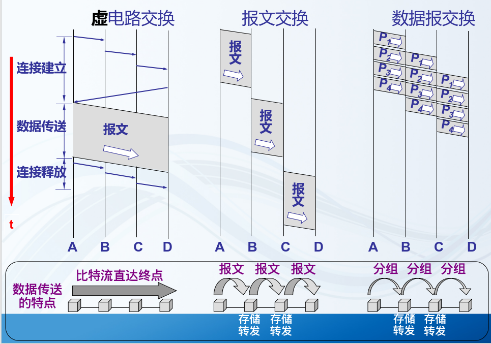

**物理层**
- 物理层：位于OSI/RM参考模型的最低层,向下与传输介质相连,向上为链路层提供服务,传送的是数据单位是比特流.
- 定义：在网络物理实体间通过中间系统,为比特传输所需的物理连接的激活、保持和拆除提供机械、电气、功能、规程特性的手段.
- 注意：物理层并非指连接计算机的物理设备或具体 的传输介质,而是指在物理硬件的基础上,屏蔽具体传输介质的差异,为上层提供透明地传输比特流的服务.  
- 作用：尽可能地屏蔽掉不同传输媒体和通信手段的差异为数据链路层提供一个统一的数据传输服务
- 功能：如何在连接各计算机的传输媒体上传输数据比特流数据链路层将数据比特流传送给物理层物理层将比特流按照传输媒体的需要进行编码然后将信号通过传输媒体传输到下一个节点的物理层
- 物理层（标准化的DTE/DCE接口）具有：
  - 机械特性
    - 涉及接口的物理结构,通常采用接线器来实现机械上的连接
    - 定义接线器的形状和尺寸、引线数目和排列、固定和锁定装置等
  - 电气特性
    - 规定了DTE/DCE之间多条信号线的电气连接及有关电路特性
      - 发送器和接收器的电路特性、负载要求、传输速率和连接距离等
      - 如发送信号电平、发送器和接收器的输出阻抗、平衡特性等
  - 功能特性
    - 描述接口执行的功能,定义接线器的每一引脚(针,Pin)的作用
  - 过程特性
    - 指明对于不同功能的各种可能事件的出现顺序
- 物理层协议是DTE和DCE间的约定,规定了两者之间的接口特性
- 常用标准
  - 点对点通信线路用于直接连接两个结点
    - 点对点通信线路的物理层标准
      - EIA RS-232-C标准
        - 美国电子工业协会(EIA)于1969年颁布
        - 串行、低速、模拟传输设备与计算机之间的物理接口标准
        - 规定了计算机串行通信接口卡与调制解调器之间物理接口的机械、电气、功能和过程的具体参数与工作流程目前很多低速的数据通信设备仍然采用该标准
      - EIA RS-449标准
        - 想取代RS-232-C而开发的，但未被广泛使用
  - 广播通信线路：一条公共通信线路连接多个结点
    - 广播通信线路的物理层标准
      - 传统以太网IEEE 802.3：10BASE-T等
      - 快速以太网
      - 千兆以太网
      - 万兆以太网
      - 无线局域网

**传输介质**
- 有线传输介质
  - 双绞线（双绞线两两绞合提高抗干扰性原理）
    - 各条线作用
      - 5类线的4根线是1，2，3，6其中1-2用来传输，就是TX，3-6用来接收，就是RX。其余上根保留为电话线用。
      - 每头要保证1-2为一对儿线，3-6为一对线，交叉线两头要：
      - 1对3，2对6.其它一一对应即可。
      - 千兆网要求超5类线全双工，4，5也用来做TX，7，8用来做RX。这样才能达到千兆速率。
    - 直通线:用于连接不同种类型设备，如：主机—交换机或集线器，路由器—交换机或集线器。
    - 交叉线:用于连接同种类型的设备，如：主机—主机、路由器—路由器、交换机—交换机、集线器—集线器等。
  - 同轴电缆
  - 光缆
    - 按光在光纤中的传输模式，光纤可分为多模光纤和单模光纤。 
- 无线传输介质
  - 无线电
    - 目前用于无线通信的主要波段有无线电波、微波、红外线和可见光，紫外线和更高的波段还不能用于通信。 
    - 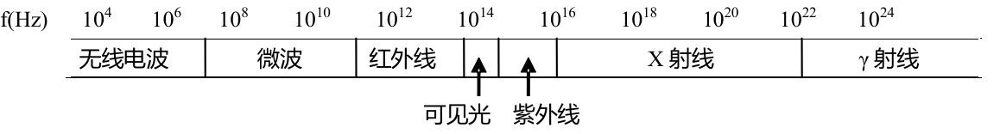
  - 微波
    - 微波适用于长距离的传输系统，微波几乎沿直线传输，微波不能穿透建筑物。传输距离：天线的高度、信号强度。
    - 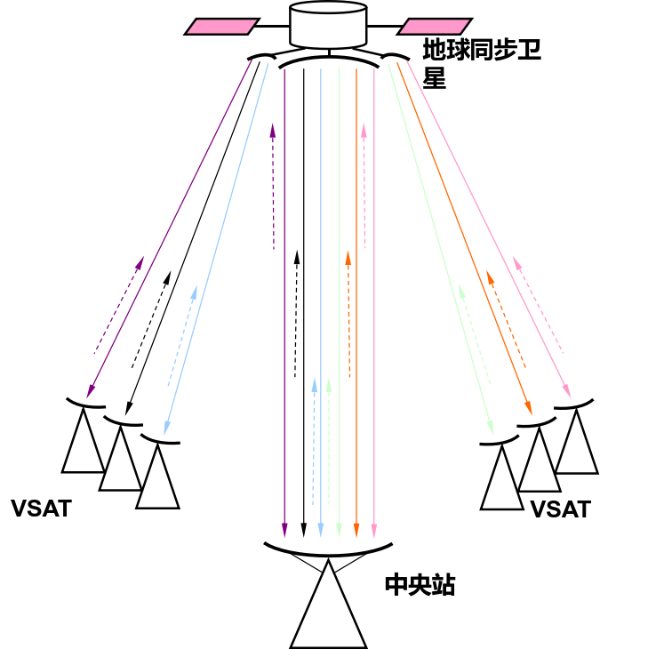
  - 卫星
    - 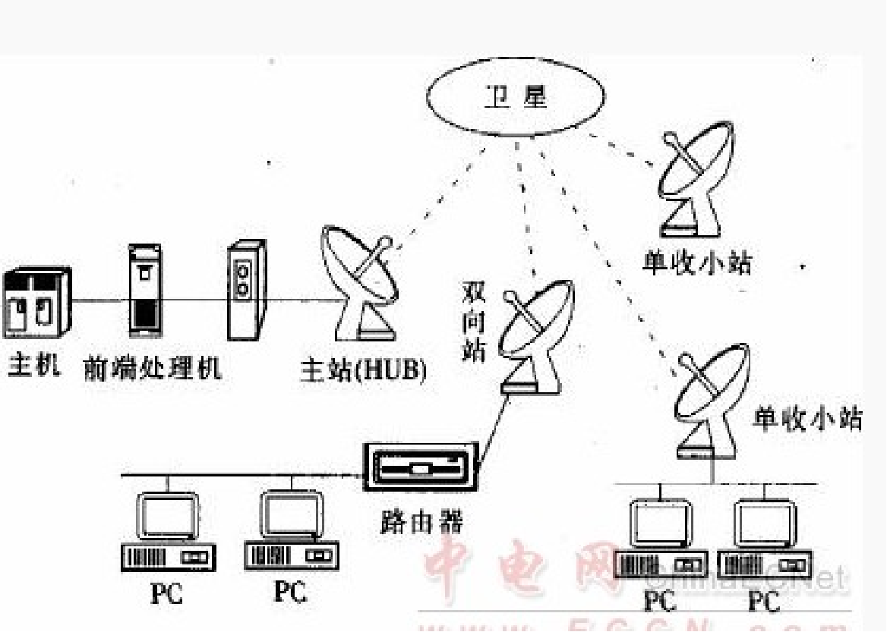
  - 红外线
    - 遥控器、夜视监控、夜视眼镜。
  - 激光

**物理层协议**
- 针对不同的连接与不同介质，物理层协议也是不同的。
- EIA RS-232C协议：定义了DTE与 DCE之间的接口标准。
  - 机械特性：25针或9针；
  - 电气特性：采用负电平，规定1的电平为-15V～-5V, 0的电平为+5V～ +15V; 
  - 功能特性：
    - 计算机与MODEM相连时用**直通双绞线**，即串行通信线缆的两头线序一致
    - 当PC机与PC机直接进行串行通信时，采用交叉的串行通信线缆，即**交叉双绞线**
  - 规程特性：... 
- ...

### 3. 数据链路层

**MAC地址：烧录在网卡上的48位的二进制数。通常用16进制数表示。硬件地址、物理地址可在DOS命令方式下用ipconfig /all查看。**
- **数据链路** = **物理链路** + **控制数据传输的协议**

**数据链路层最重要的作用**
   - 通过一些数据链路层协议（即链路控制规程),在不太可靠的物理链路上实现逻辑上可靠的数据传输。
    - 透明：对网络层的数据没有限制，对其上层（网络层）而言是透明的
    - 可靠：对网络层表现为一条无差错的链路，数据链路屏蔽了物理层的不可靠。

**数据链路层最重要的作用**
- 成帧（发送时）和解封装帧（接收时）
  - 成帧：将上层传来的数据按一定格式组织成数据帧，形成具有语法结构和逻辑含义的数据帧，传给物理层。
  - 解封装帧：把从物理层接收到的帧，进行校验，无误就剥去首部往上层（网络层）交付，若帧有误，则通知上一站重发该帧。
  - **帧是数据链路层的数据传送的基本单位**。每帧包括一个帧头、数据部分和帧尾。帧头标明该帧的目的MAC、源MAC和类型，帧尾用于完成帧的校验。
- 链路管理
  - 数据链路的建立、维持和释放
- 帧同步
  - 目的：识别帧边界、帧中各位采样
  - 方法：面向字符的异步传输、面向比特的同步传输
- 差错控制
  - 位出错，帧丢失，帧重复，帧顺序错等
  - 解决方法：前向纠错和反馈重发，多数链路层用CRC方法检错重发
- 流量控制----避免过载（阻塞）
  - 过载是怎样产生的？
    - 发送数据率＞接收数据率，收方缓冲区溢出，造成阻塞
  - 采用反馈确认机制调节发方数据流量，使发送速率≤接收速率，实现速度匹配。
  - 流量控制并非只是数据链路层特有的功能，由收方控制发方的数据流，是计算机网络中流量控制的一个基本方法
- 透明传输
  - 不管所传数据是什么样的比特组合，都应能在链路上传送

**如何解决信道传输差错问题**
- 通常采用增加冗余信息（或称校验信息）的策略
  - 两种主要策略
    - 检错码（error-detecting code）
      - 在被发送的数据块中，包含一些冗余信息，但这些信息只能使接收方推断是否发生错误，但不能推断哪位发生错误，接收方可以请求发送方重传数据主要用在高可靠、误码率较低的信道上，例如光纤链路偶尔发生的差错，可以通过重传解决差错问题
    - 纠错码（error-correcting code）
      - 发送方在每个数据块中加入足够的冗余信息，使得接收方能够判断接收到的数据是否有错，并能纠正错误（定位出错的位置）主要用于错误发生比较频繁的信道上，如无线链路也经常用于物理层，以及更高层（例如，实时流媒体应用和内容分发）使用纠错码的技术通常称为前向纠错（FEC，Forward Error Correction)
    - 常用的检错码包括：
      - 奇偶检验 (Parity Check)：1位奇偶校验是最简单、最基础的检错码
      - 校验和 (Checksum)：主要用于TCP/IP体系中的网络层和传输层
      - 循环冗余校验 (Cyclic Redundancy Check，CRC)：数据链路层广泛使用的校验方法

- CRC校验码计算示例
  - D = 1010001101
  - n = 5
  - G = 110101 或 G =x5 + x4 + x2 + 1
  - **多项式位数为6,添加6-1=5位0**
  - **余数不够五位前面凑数0**
  - ...
  - ...
  - R = 01110
  - 实际传输数据：101000110101110


**局域网**
  - LAN（Local Area Network）指在一定区域内，将各种计算机、通信设备、外部设备和数据库等互联起来的计算机通信网。
  - 广播式传输的问题是，尽管信号传输时会到达所有站点，但通信通常并不涉及所有站点。
  - 为了实现一对一传输效果，以太网的数据链路层使用MAC地址区分不同接收方。
  - 为保证MAC地址的唯一性，48位地址中前24位（前三个字节）是由生产厂商向IEEE申请的厂商地址，而后24位（后三个字节）由生产厂商自行为不同的网卡设定。
  **MAC帧格式**
  - 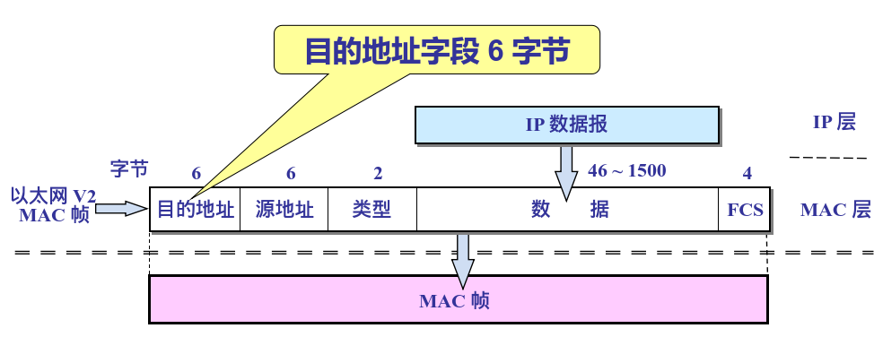
  - 局域网交换机工作原理
    - （1）当交换机初次加电时，其MAC地址表是空的。
    - （2）当交换机从某个接口收到一个数据帧，它先读取帧首部中的源MAC地址，这样它就知道源MAC地址的计算机连接在哪个端口上。然后交换机将读取的源MAC地址和其对应的端口关系添加到MAC地址表中。
    - （3）交换机再去读取的帧首部的目的MAC地址字段，并在地址表中查找对应的端口。
    - （4）如果表中有与目的MAC地址对应的端口，则数据包直接转发到该端口上。
    - （5）如果表中找不到与其对应的端口，则把数据包广播到除进入端口外的所有端口上。当目的计算机对源计算机回应时，交换机就可以学习到该目的MAC地址与哪个端口对应。
    - **NOTICE**
      - 对于广播帧、组播帧、未知的单播帧(即帧的目的MAC地址在交换机MAC地址表中无相应表项)，则交换机将该帧从（除源端口外的）其它端口转发出去。
      - 对于帧的目的MAC地址在MAC地址表中存在， 但表项所关联的端口与接收到帧的端口相同，则交换机对此帧进行过滤，即不转发此帧。

  - 局域网分为：共享介质式局域网和交换式局域网。交换式局域网核心设备：交换机。
    - 交换机的每个端口是一个独立的冲突域。交换机能按帧的目的MAC有目的的转发帧。交换机是数据链路层设备。
    - 交换机可以有效减少冲突。交换机是目前局域网中使用的设备。内部通过高速背板连接所有端口，每个端口都有独立的冲突域，在全双工模式下端口可以同时收发，则不需要CSMA/CD，可以实现并行传输。
    - 注意：用集线器连接的局域网，所有电脑处于同一个冲突域，交换机的每个端口是一个独立的冲突域（即互不影响）。
    - 交换机可以隔离冲突域，但不能隔离广播域，要想隔离局域网广播，可采用路由器进行隔离，即路由器可以隔离广播域。


**广域网**
- 广域网核心设备为路由器，路由器之间通过运营商网络相互连接
- 广域网大部分设备之间通常并非直接相连，一般需要跨越多个网络层设备（路由器）进行连接。
- 路由跟踪命令：tracert

##### 1-3练习题

1. Internet的核心协议是（**TCP/IP**）。  
2. 一个功能完备的计算机网络需要制定一套复杂的协议簇。对于复杂的计算机网络协议来说，最好的组织方式是（**层次结构模型**）。  
3. 网络协议的3个要素是：语法、语义与（**时序**）。  
4. OSI参考模型将整个通信功能划分为7个层次，处于同等层的若干个实体称为（**对等实体**）。  
5. 因特网是目前世界上第一大网络，它起源于美国，其雏形是（**ARPANET**）。  
6. 下面哪一项不是局域网的拓扑结构？（**全互连形**）。  
7. 一座大楼内的一个计算机网络系统，属于（**LAN**）。  
8. 计算机网络中可以共享的资源包括（**硬件、软件、数据**）。  
9. 制定OSI参考模型的是（**ISO**）。  
10. 网络中用集线器或交换机连接各计算机的这种结构属于（**星型结构**）。  
11. 有关计算机网络正确的叙述是（**网络中的计算机应具有独立的功能**）。  
12. 有关服务器叙述错误的是（**服务器是某一类计算机软件**）。  
13. 协议不是（**一类网络设备**）。  
14. 在TCP/IP协议簇的层次中，保证端-端的可靠性是在哪层上完成的？（**传输层**）。  
15. 在OSI七层结构模型中，处于数据链路层与传输层之间的是（**网络层**）。  
16. 在计算机网络中，所有的计算机均连接到一条公共的通信传输线路上，这种连接结构被称为（**总线结构**）。  
17. 哪一条不是使用OSI分层模型的好处（**加强了网络复杂性**）。  
18. 协议是（**不同节点的对等实体**）之间进行通信的规则或约定。  
19. 信息在计算机中是（**二进制数表示**）存储的。  
20. 数据通信系统中多路复用技术一般有（**时分多路复用技术和频分多路复用技术**）。  
21. 数据交换方式一般有（**电路交换、报文交换和分组交换**）。  
22. 找出一个错误的论述（**基带信号是指用低频传输的模拟信号**）。  
23. 电话通信属于（**全双工**）。  
24. 在数据通信中，表示数据传输“数量”与“质量”的指标分别是（**数据传输率和误码率**）。  
25. 电路交换最适用的场合为（**传输信息量较大**）。  
26. 报文的内容可能不按顺序到达目节点的是（**数据报交换**）方式。  
27. 电话交换系统采用的是（**电路交换**）交换技术。  
28. PCM是最典型的对模拟数据进行数字信号编码的方法，其编码过程为：（**采样->量化->编码**）。  
29. 不需要建立连接的是（**报文交换**）。  
30. 如果比特率为10Mb/s，发送1000位需要多长时间：（**100us**）。  
31. 方式需在两站之间建立一条专用物理通路的是（**电路交换**）。  
32. 传输速率单位“bps”代表（**BITS PER SECOND**）。  
33. 关于CRC的特点中，错误的是（**生成多项式G（x）可以随机产生**）。  
34. 下面描述交叉线正确的是（**一边568A一边568B**）。  
35. 双绞线是成对线的扭绞旨在（**使电磁射和外部电磁干扰减到最小**）。  
36. 网络中所有的物理连接介质叫（**网络连接介质**）。  
37. 网络中使用光缆的优点是（**传输速率比同轴电缆或双绞线的传输速率高**）。  
38. 与多模光纤相比，单模光纤（**速度高、距离长、成本高、芯线细**）。  
39. 屏蔽双绞线的缩写为（**STP**）。  
40. 在常用的传输介质中，带宽最宽、传输衰减最小、抗干扰能力最强的是（**光纤**）。  
41. 下列传输介质的传输损耗从低到高排列顺序为：（**光纤、粗同轴电缆、细同轴电缆、双绞线**）。  
42. 下列不属于物理层（接口）特性的是（**抗干扰特性**）。  
43. 数据链路层在OSI模型的（**第2层**）。  
44. 数据链路层中的数据块（单位）常被称为（**帧**）。  
45. 下列功能中，正确描述了OSI模型的数据链路层的是（**保证数据正确的顺序、无差错和完整**）。  
46. 以下关于数据链路层功能的描述中，错误的是（**帧同步的作用是保证收发双方时钟的同步**）。  
47. PPP协议是（**数据链路层**）协议。  
48. 10BaseT以太网的传输介质是（**双绞线**），接口是（**RJ-45接口**）。  
49. 下列关于局域网与广域网的叙述，错误的选项是（**广域网发生故障的概率较小**）。  
50. 交换机如何知道将帧转发到哪个端口（**用MAC地址表**）。  
51. 当一台主机从一个物理网络移到另一个物理网络时，以下说法正确的是（**改变它的IP地址，不改动MAC地址**）。  
52. 在CSMA/CD冲突检测中，错误的是（**常用于交换式局域网**）。  
53. 一台交换机具有24个100Mbps全双工端口和2个1000Mbps全双工端口，如果所有的端口都工作在全双工状态，那么交换机总带宽等于（**8.8Gbps**）。  
- 总带宽计算为：\((24 \times 100 \times 2) + (2 \times 1000 \times 2) = 8.8 \, \text{Gbps}\)。

### 4. 网络层

- **负责引导数据包正确地通过网络找到目的主机。**

**IP地址**
- 在Internet上，要想定位某台机器，以使发给它的信息能够准确到达，就必须分配给这台机器一个地址，这个地址就是IP地址。
- IP地址在计算机内部保存为32位二进制数，为了方便查看与设置，IP地址采用了点分十进制的表示方法。
- IP地址的层次结构

        | 0------ | ------31 |
        | ------- | -------- |
        | NetID   | HostID   |
        | 网络号  | 主机号   |
        | 128.11. | 3.31     |
- 同一网络中主机IP地址的网络号必须相同。
- 同一网络中主机IP地址的主机号必须不同。
- **A,B,C,D,E类**
  - 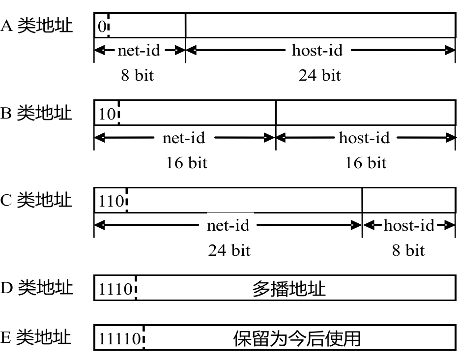
  - A类（占1/2）
    - 前8位是网络号，后24位是主机号；
    - 第一个比特是0；
    - 第一个数0-127；
    - 适用于超大型的网络
  - B类（1/4）
    - 前16位是网络号，后16位是主机号；
    - 前两个比特是10；
    - 第一个数128-191；
    - 适用于大型的网络
  - C类（1/8）
    - 前24位是网络号，后8位是主机号；
    - 前三个比特是110；
    - 第一个数192-223；
    - 适用于小型的网络

**保留地址**
- 网络地址
  - 网络地址是一种特殊的IP地址，用来代表一个网络中所有的IP地址，也可以用来代表一个网络整体。
  - 网络地址因为是专用的，所以不能分配给计算机。
  - 一个网络的广播地址：
     - 网络号为该网络的网络号，主机号为全0
  - 各类地址的网络地址形式如下:
    - A类：N.0.0.0
    - B类：N.N.0.0
    - C类：N.N.N.0
  - **193.2.1.0**不能分配给计算机
- 广播地址
  - 广播地址是一种特殊的IP地址，专门用于向一个网络中每一台主机发送数据。
  - 广播地址因为是专用的，所以不能分配给计算机。
  - 一个网络的广播地址：
     - 网络号为该网络的网络号，主机号为全1
  - 各类地址的广播地址形式如下:
    - A类：N.255.255.255
    - B类：N.N.255.255
    - C类：N.N.N.255
- 回送地址（Loopback Address）：
  - 主机IP协议内部的IP地址，代表本主机。
  - 主要用于网络软件测试以及本地机进程间通信。
  - 无论什么程序，一旦使用回送地址发送数据，协议软件立即返回，不进行任何网络传输
- 未指定地址
  - 0.0.0.0
  - 代表所有“不清楚”的地址。

**子网划分与子网掩码**
- 子网划分：在IP地址中又增加了一个“子网号字段”，使两级的IP地址变成为三级的IP地址
  - 子网号：最少借1位，最多借到主机号剩2位
    - A类网络借位：1—22位
    - B类网络借位：1—14位
    - C类网络借位：1—6位
- 子网掩码：
  - 从主机号中分出几个比特用于子网号是通过子网掩码来识别的。
  - 使用子网掩码可以找出IP地址中的子网号部分
  - 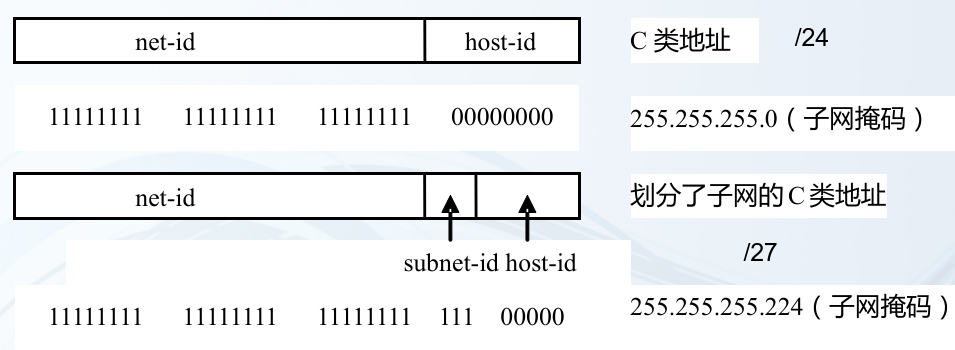
    - subnet-id:子网号
    - host-id:主机号
  - 用IP地址和子网掩码做“与”运算，得到的是网络地址部分
  - 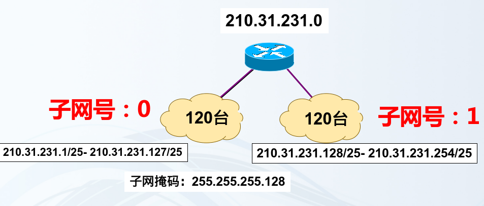
  - 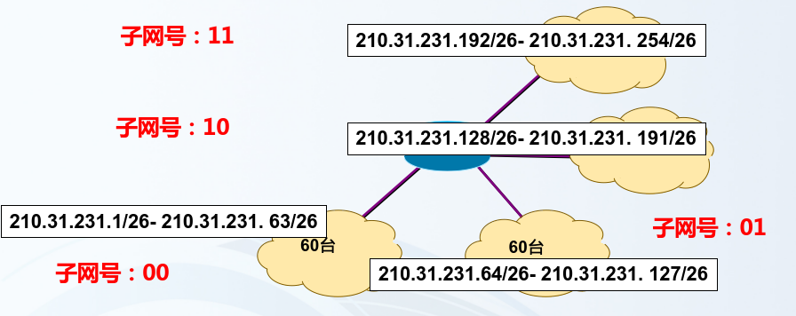

**无分类编址CIDR**
- 分类IP地址（1981年）
- 子网划分（1985年）
- CIDR（1993年）
  - 无分类域间路由选择CIDR（Classless Inter-Domain Routing）
  - CIDR 消除了传统 A 类、B 类和 C 类地址以及划分子网的概念。
  - CIDR使用各种长度的“网络前缀”来代替分类地址中的网络号和子网号。
  - IP地址从三级编址又回到了两级编址
  - **子网划分后的三级IP地址**
    - 
  - **CIDR二级IP地址**
    - 
  - CIDR 使用“**斜线记法**”，又称为CIDR记法，即在 IP 地址后面加上一个斜线“/”，然后写上网络前缀所占的位数
  - CIDR使用32位的地址掩码。地址掩码是有一串1和一串0组成，而1的个数就是网络前缀的长度

> 
> 已知地址块中一个地址是 **140.120.85.24/22**。  
> **/22** 表示子网掩码的前 **22 位** 为网络部分，剩余 **32-22=10 位** 为主机部分。接下来逐步求解：
>
> ---
> 
> 1. 地址掩码  
> **22**表示前 22 位是 **1**，后 10 位是 **0**，写为二进制：  
> `11111111.11111111.11111100.00000000`  
> 转换为十进制为：  
> `255.255.252.0`
>
> ---
> 
> 2. 最小地址  
> 最小地址是网络地址，即主机部分全部为 **0**。
> - 将给定地址 **140.120.85.24** 转为二进制：  
>   `140.120.85.24 = 10001100.01111000.01010101.00011000`
> - 子网掩码 **255.255.252.0** 的网络部分为前 22 位：  
>   `网络部分：10001100.01111000.01010100.00000000`
>   - 将后 10 位（主机部分）清零：  
>     `最小地址（二进制）：10001100.01111000.01010100.00000000`
>   - 转换为十进制：  
>     `最小地址：140.120.84.0`
> 
> ---
> 
> 3. 最大地址  
> 最大地址是广播地址，即主机部分全部为 **1**。
> - 主机部分有 **10 位**，全部设为 **1**：  
>   `最大地址（二进制）：10001100.01111000.01010111.11111111`
>   - 转换为十进制：  
>     `最大地址：140.120.87.255`
> 
> ---
> 
> 4. 地址块中共有多少个地址  
> 地址块中共有地址数量为：  
> `2^(主机位数) = 2^10 = 1024 个地址`
> 
> ---
> 
> 总结答案  
> 1. 最小地址：140.120.84.0  
> 2. 最大地址：140.120.87.255  
> 3. 地址掩码：255.255.252.0  
> 4. 地址块共有地址：1024 个
> 
> ---
> 
> 补充说明  
> - 最小地址（网络地址） 和 最大地址（广播地址） 是不能分配给主机的。  
> - 主机可以使用的地址范围是：  
>   `140.120.84.1 至 140.120.87.254`

**IP分组**
- **IP数据报**
  - 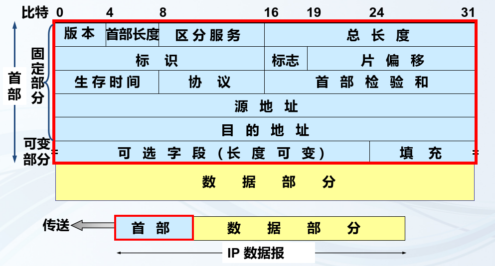
- **IP分组的封装**
  - 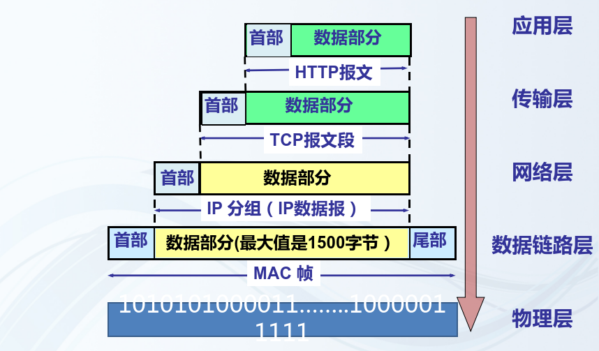
- **IP数据报分片**
  - 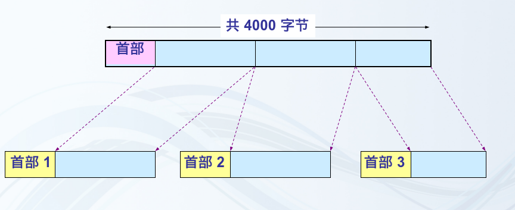
  - 什么是IP分组的分片
    - 当IP分组过大时，超过了下层能接受的最大MTU值，就需要将其分成多个小的IP分组，即分片。
    - 每个IP分片（小IP分组）独立进行发送
  - 分片原因
    - 数据链路层最大传输单元MTU（Maximum Transfer Unit）：帧的数据部分可以容纳的最大数据长度，一般以字节为单位。
  - 分片后的每个IP分组的大小都小于等于MTU
  - 分片过程：
    - 标识
      - 1.发送方每发送一个数据报，标识编号加1 
      - 2.各分片的标识相同 
        - 生存时间(8 bit)记为 TTL (Time To Live)：数据报在网络中的寿命。
    - 标志
      - DF = 0 表示本分组允许分片 
        - = 1 表示本分组必须完整到达，途中不允许分片 
      - MF = 0 表示本片为本分组的最后一个片 
        - = 1 表示本片后面还有更多的分片
    - 片偏移
       - 片偏移(13 bit)：非常精确地指出了分片在原始数据中的确切位置。
       - 片偏移以 8 个字节为单位。
         - 实际偏移量 = 片偏移值 x 8 Byte 

> 已知：  
> - IP数据报长度：3600字节（固定首部长度，假设为20字节）。  
> - MTU：1500字节。  
> - 分片需要满足每个分片的总长度（包括首部）不超过MTU。  
> 
> ---
> 
> 1. 计算应划分的分片数量  
> 每个分片数据部分的最大长度为：  
> `MTU - IP首部长度 = 1500 - 20 = 1480字节`  
> 
> 原始数据部分长度为：  
> `3600 - 20 = 3580字节`  
> 
> 每个分片传输的有效数据长度必须是8的倍数（字节对齐要求），因此分片数据部分长度为1480字节。计算分片数量：  
> `分片数量 = ⌈3580 / 1480⌉ = 3`  
> 
> ---
> 
> 2. 各分片的总长度、MF标志、片偏移量  
> 分片信息如下：  
> 
> - **分片1**  
>   - 数据部分长度：1480字节  
>   - 总长度：`1480 + 20 = 1500字节`  
>   - MF标志：1（还有后续分片）  
>   - 片偏移：`0 / 8 = 0`
> 
> - **分片2**  
>   - 数据部分长度：1480字节  
>   - 总长度：`1480 + 20 = 1500字节`  
>   - MF标志：1（还有后续分片）  
>   - 片偏移：`1480 / 8 = 185`
> 
> - **分片3**  
>   - 数据部分长度：620字节（剩余数据）  
>   - 总长度：`620 + 20 = 640字节`  
>   - MF标志：0（无后续分片）  
>   - 片偏移：`2960 / 8 = 370`
> 
> ---
> 
> 3. 总结分片结果  
> - **分片1**：总长度 = 1500，MF = 1，片偏移 = 0  
> - **分片2**：总长度 = 1500，MF = 1，片偏移 = 185  
> - **分片3**：总长度 = 640，MF = 0，片偏移 = 370  


**IP协议**
- 定义：IP协议（Internet protocol网际协议）是TCP/IP体系中的基本协议、最重要的协议，为传输层提供服务，使互联起来的不同类别的计算机网络能够进行通信。
- 作用：定义了IP数据报的格式、IP地址、生存时间、分片与重组分片机制等内容。
- 特点：IP协议是无连接、不提供可靠传送服务，  采用尽力交付的服务。IP协议提供点-点的传送，即主机到主机的传送。
- 原理：IP协议将上层传来的数据封装成若干个分组（package），各分组独立传送，网络互联是通过路由器实现的。路由器根据路由表转发分组，分组可能不按顺序到达目的主机。

**ICMP-internet控制报文协议**
- ICMP是一个网络层协议。
- IP是尽力传输的网络协议，其提供的数据传输服务是不可靠的、无连接的，不能保证IP数据包能成功地到达目的地。如果在传输过程中出现某种错误，设备便会向信源返回一条ICMP消息，告知它发生的错误类型。
- ping命令和traceRT命令都用到了上述协议。
- ICMP（Internet Control Message Protocol）消息是直接封装在IP分组（Packet）中的，位于网络层，作为IP协议的一部分，用于传递控制信息，例如错误报告和网络诊断（如ping命令）。

**ARP地址解析协议**
- 作用：将主机的IP地址映射为MAC地址
- 应用场景：IP分组向下传到数据链路层，要封装成MAC帧，用到源主机MAC和目的MAC地址。主机只知道目的主机的IP地址，并不知道它的MAC地址。需要通过ARP协议来解析出MAC地址
- ARP表：每一个主机内存会维护有一个 ARP表(ARP cache)，里面有所在的局域网上的各主机（及网关）的IP地址到硬件地址的映射。
- **工作过程**
  - 主机在封装帧的目的MAC前，会先用目的IP与自己的子网掩码做“与”运算得到一个网络地址：
    - 1）得到的网络地址若与自己的相同，则查询本地ARP表，若表中有此IP对应的MAC,则直接封装帧。若表中没有，则发ARP广播找该IP对应的MAC。
    - 2）若“与”之后得到的网络地址为其它网段，仍先在其 ARP 高速缓存中查看有无网关 IP对应的MAC 地址:如有，则直接封装帧，然后发给网关。 若表中没有，就发ARP广播找本网段的一台路由器（网关）的MAC地址。
  - 注：通过ARP请求得到的IP--MAC映射，会先保存在本地ARP缓存表中，以备后期使用。
- ARP的解析请求是（ 广播 ）的，ARP应答是（单播）的。
- 从PC0（210.31.231.1）ping PC1（210.31.232.1）,PC0的ARP需要解析（ PC0的默认网关 ）的MAC地址
    - PC0（210.31.231.1） 和 PC1（210.31.232.1） 属于不同的子网（子网号不同）。因此，PC0无法直接通过二层网络（如以太网）与PC1通信，需要通过路由器转发数据。
    - 在这种情况下，PC0会将数据发送给自己的默认网关（即路由器接口），由路由器代为转发。为了完成这一过程，PC0需要解析出 默认网关的MAC地址，以便将数据封装在二层帧中并发送到网关。
- **ARP步骤：**
  - 查询ARP缓存：首先检查本地是否已有目标IP地址对应的MAC地址记录。
  - 广播ARP请求：如果缓存中没有对应的MAC地址，发送ARP请求以广播形式查询目标设备。
  - 接收ARP响应：目标设备接收到请求后，以单播形式返回ARP响应。
  - 将收到结果记录在ARP缓存中：主机将响应中的IP地址和MAC地址对应关系记录在ARP缓存中，以备后续使用

**路由器和路由表**
- 路由器是连接不同网络的设备，路由器依据自身的路由表转发分组。
- 直连路由： 直接交付。
- 远程路由： 需要查询路由表、通过下一跳路由器间接交付。
- 转发原理：
  - 路由器用于连接多个网络，并把IP分组转发到本地网络或其它网络，属网络层设备。路由器收到数据包（IP分组）后，会解析出目的IP地址，然后“查”路由表，从符合条件的接口或下一跳转发数据包，即通过（拆包-路由选择-封包)的操作实现对分组的传送。
- 路由表：位于路由器内存中的一张缓存表
- 下一跳IP地址：标识IP分组到达目的地所经过的最近的下一个路由器。

### 5. 传输层

- **基于网络层提供的服务，向不同应用程序提供通信服务**
- **提供进程之间本地通信的抽象：即运行在不同终端上的应用进程仿佛是直接连在一起的**

**传输层和网络层的关系**
- 设想A家庭有12个孩子，B家庭也有12个孩子，他们每周通过手写信件进行联系：
  - A家庭推选Ann，B家庭推选Bill，分别负责各自家庭的信件收发
  - Ann和Bill定期收集家庭中其他孩子的信件，投递到门口的邮筒里
  - Ann和Bill定期打开家庭邮箱，取出里面的信件，分发给其他孩子
  - 邮政系统负责将邮筒里的信件投递到收信人的家庭邮箱里
- 类比： 
  - 进程 = 孩子
  - 进程间通信 = 孩子之间通信
  - 应用报文 = 信件
  - 传输层 = Ann 和 Bill（提供人到人的服务）
  - 终端 = 家庭住宅
  - 网络层 = 邮政系统（提供门到门的服务）
- **传输层依赖网络层服务，并扩展网络层服务**

- **因特网的网络层提供“尽力而为”的服务：**
  - 网络层尽最大努力在终端间交付分组，但不提供任何承诺
  - 具体来说，不保证交付，不保证按序交付，不保证数据完整，不保证延迟，不保证带宽等
- **传输层的有所为、有所不为:** 
  - 传输层可以通过差错恢复、重排序等手段提供可靠、按序的交付服务
  - 但传输层无法提供延迟保证、带宽保证等服务
  - 传输层通过UDP协议和TCP协议，向应用层提供两种不同的传输服务：
  - **UDP用户数据协议**：仅提供最低限度的传输服务
    - 最低限度的传输服务：
      - 将终端-终端的数据交付扩展到进程-进程的数据交付
      - 报文检错
  - **TCP传输控制协议**：提供基础服务和增强服务（可靠数据传输、流量控制、拥塞控制）
    - 增强服务：
      - 可靠数据传输
      - 流量控制
      - 拥塞控制

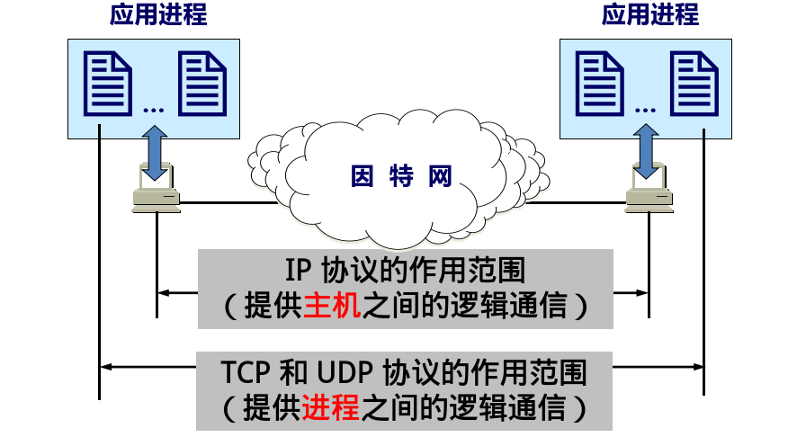
- 端口号
  - 端口号被用来区分同一个主机上的不同进程
  - 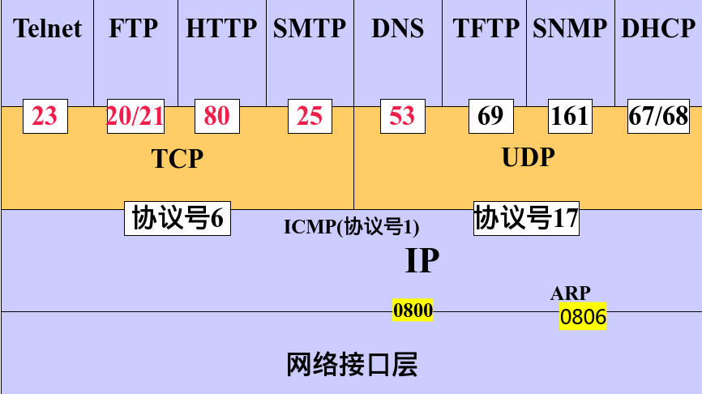

**TCP（三次握手、四次挥手）**
- TCP服务模型：
  - 在一对通信的进程之间提供一条理想的字节流管道
- 点到点通信:
  - 仅涉及一对通信进程 
- **全双工：**
  - 可以同时双向传输数据
- 可靠、有序的字节流：
  - 不保留报文边界
- 需要的机制
  - 建立连接: 
    - 通信双方为本次通信建立数据传输所需的状态（套接字、缓存、变量等）
  - 可靠数据传输：
    - 流水线式发送，报文段检错，丢失重传
  - 流量控制:
    - 发送方不会令接收方缓存溢出
- 
  - **建立TCP连接：三次握手**
  - **释放TCP连接：四次挥手**

**UDP（无连接）**

- 为什么需要UDP？
  - 应用可以尽可能快地发送报文：
    - 无建立连接的延迟
    - 不限制发送速率（不进行拥塞控制和流量控制）
  - 报头开销小
  - 协议处理简单
- UDP适合哪些应用？
  - 容忍丢包但对延迟敏感的应用：
    - 如流媒体
  - 以单次请求/响应为主的应用：
    - 如DNS
  - 若应用要求基于UDP进行可靠传输：
    - 由应用层实现可靠性
  - **UDP 是无连接的，即发送数据之前不需要建立连接。**
  - **UDP 使用尽最大努力交付，即不保证可靠交付。**
  - **UDP 的首部开销小，只有 8 个字节。** 

**端口（区分不同应用）**


**套接字（插口）**
- 把端口号和主机的IP地址结合起来使用，称为插口或套接字（Socket）。
- 插口包括IP地址（32位）和端口号（16位），共48位。
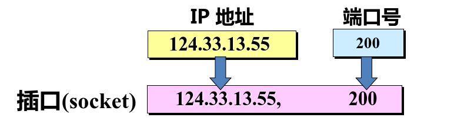
```bash
// 显示所有端口并用数字表示
netstat -a -n
```

### 6. 应用层

**三种模式：**
- 客户端和服务器方式(C/S)；
- 浏览器/服务器（B/S，Browser/Server） 方式
- 对等（P2P，Peer to Peer）方式

**DNS(Domain Name System)**
- 名字和IP地址相互转换的机制
- 基于UDP协议
- 端口53

**域名解析**
- 在DNS中由**域名服务器**（DNS Server）完成域名与IP地址的转换过程，这个过程称为域名解析。（有IP地址到域名的映射）

**电子邮件系统**
- **采用客户/服务器工作模式**
- 用户代理（user agent）——邮件客户端
- 传输代理（message transfer agent）——邮件服务器
- 简单邮件传输协议SMTP（Simple Mail Transfer  Protocol）——邮件服务器之间传递邮件使用的协议
- **用户代理**
  - 是一个程序，用户通过它和电子邮件系统交互
  - 让用户能够阅读和发送电子邮件（email message）
  - 与邮件服务器交互，接收、发送电子邮件
  - 常用的用户代理：Outlook, Thunderbird, iPhone mail client，Web客户端等

**文件传输协议FTP**
- FTP概述
  - 用户从（向）远程主机下载（上传）文件，FTP服务器支持匿名登录，以自己的电子邮件地址为口令
  - TCP/IP体系中的重要协议，可在异构网中任意计  算机间传送文件
  - 双重连接----21（控制端口）、端口20（数据端口）
  - 使用TCP可靠传输，按C/S模式工作

**怎样标志分布在整个因特网上的web文档？**
- 统一资源定位符URL (Uniform Resource  Locator)
  - 格式：
    - ***<协议>://<主机>:<端口>/<路径>/<文档>***
      - 协议：指访问URL的方式，可以是HTTP、FTP等；
      - 主机：是被访问文档所在的主机的域名；
      - 端口：是建立TCP连接的端口号，使用熟知端口时可以省略，如80端口通常可省略；
      - 路径：是文档在主机上的相对存储位置；
      - 文档：是具体的页面文件
  
| 名字  | 用途       | 实例                                 |
| ----- | ---------- | ------------------------------------ |
| http  | 超文本HTML | http://www.xaut.edu.cn/xxgk/xxjj.htm |
| https | 安全超文本 | https://www.overleaf.com/            |

**DHCP**
- DHCP 是 Dynamic Host Configuration Protocol （动态主机配置协议）的缩写
- DHCP采用客户端/服务器（C/S)模式，服务器负责集中管理，客户端向服务器提出配置申请，服务器根据策略返回相应配置信息
- DHCP报文采用UDP封装。服务器所侦听的端口号是 67，客户端的端口号是68
- 可提高IP地址利用率，减少IP地址用量，解决IP地址少，网络用户多的矛盾。

**TELNET**
- Telnet协议使用C/S方式实现。在本地系统运行Telnet客户进程，在远程主机运行Telnet服务器进程
- Telnet协议使用TCP连接通信，服务器进程默认监听TCP23端口，服务器使用主进程等待新的请求，并产生从属进程来处理每一个连接

题目：
1. **DNS协议的作用是进行** **域名** 和 **IP地址** 之间的转换。
2. **指出以下统一资源定位符各部分的名称（从左到右）：**

   URL：`http://home.microsoft.com/main/index.html`

   - 1：协议名称（`http`）
   - 2：主机域名（`home.microsoft.com`）
   - 3：目录名（`main`）
   - 4：文件名（`index.html`）

   所以正确答案是：**B. 1协议名称，2主机域名，3目录名，4文件名**
3. **Internet远程登录使用的协议是：**  
   答案是：**C. Telnet**
4. **SMTP -》** POP3协议
5. 在 TCP 的连接拆除过程中，每个方向都需要发送一个 FIN 报文（用于关闭发送数据），并由对方回复一个 ACK 报文（确认），因此收发双方总共会交换 x 个 FIN 报文
6. 在 TCP/IP 模型中，数据从上层到下层的传输过程如下：
   - 应用层
     - 数据以 **报文或字节流** 的形式生成，依赖于具体的应用协议（如 HTTP、SMTP 等）。
   - 传输层
     - 将报文或字节流划分为 **分段**（Segments），添加传输层头部（如 TCP 或 UDP 头部），用于提供可靠传输或无连接服务。
   - 网络层
     - 将分段封装为 **IP数据分组**（Packets 或 Datagram），添加 IP 头部，用于路由和寻址。
   - 网络接口层
     - 最终将 IP 数据分组封装成 **帧**（Frames），附加链路层的帧头和帧尾，用于在物理网络上传输。
